# Daily Mental Plan & Operating Schedule 🧭⚡

> **الهدف**: جدول ذهني وتشغيلي صارم يوازن بين:
> 1. الشغل الهندسي الصافي (صباحاً).
> 2. التسويق ومبيعات المحل (مساءً).
> 3. تدريب المقابلات بالإنجليزية والتقديمات (أوقات الفراغ بالموبايل).
> 4. النشر المهني على لينكد إن لبناء السمعة الرقمية وجذب مديري التوظيف.

---

## 🕒 الجدول الزمني لليوم (الثلاثاء 2026-09-22)

```mermaid
gantt
    title جدول تشغيل اليوم الثلاثاء
    dateFormat  HH:mm
    axisFormat %H:%M
    section البلوك الهندسي
    تصحيح الكود وبوست لينكد إن :12:15, 13:30
    تقديم وظيفي وتجهيز الغداء :13:30, 15:30
    section التحول والمحل
    التحرك وفتح المحل :15:30, 16:30
    متابعة الشارع ومبيعات العصر :16:30, 18:30
    section التسويق وموبايل
    تصوير المنتجات وصناعة المحتوى :18:30, 20:30
    تدريب إنجليزي على الموبايل وفراغ المحل :20:30, 22:30
    section الإغلاق
    مراجعة الضرائب وتقفيل اليوم :22:30, 24:00
```



---

### 1. البلوك الصباحي وما بعد الظهر (12:15 م – 03:30 م) 💻
- **12:15 م – 01:15 م**:
  - اعتماد تصحيح كود محرك الشحن والتنفيذ النظيف.
  - تجهيز ونسخ منشور لينكد إن اليومي ونشره على الحساب.
- **01:15 م – 02:30 م**:
  - إرسال تقديمين وظيفيين محددين بالسيرة الذاتية المعتمدة (نسخة الفرونت إند أو الفول ستاك).
  - حفظ روابط التقديمات في السجل.
- **02:30 م – 03:30 م**:
  - صلاة الظهر والعصر + وجبة الغداء والاستعداد للنزول.

---

### 2. فترة التحرك وبداية دوام المحل (03:30 م – 06:30 م) 🏪
- **03:30 م – 04:00 م**: الانتقال إلى الوراق وفتح المحل.
- **04:00 م – 06:30 م**:
  - متابعة حركة الشارع، استقبال الزبائن، وتنسيق الفاترينة والمعروضات.
  - ممنوع كتابة كود معقد على اللابتوب في هذه الفترة لمنع الإجهاد الذهني وتشتت الانتباه عن الزبائن.

---

### 3. بلوك التسويق وصناعة المحتوى بالمحل (06:30 م – 08:30 م) 📸
- **الهدف**: إنتاج أصل تسويقي للمحل يجلب مبيعات واقعية.
- **المهام**:
  - تصوير قطعتين حقيقيتين من المحل (مثل تحف الكريستال أو أرفف الورود).
  - استخدام تطبيق:
```text
Photoroom
```
    لعزل الخلفية ووضع المنتجات في بيئات ديكور دافئة تناسب البيوت المصرية.
  - صياغة نص بالعامية البسيطة مع السعر وتفاصيل المقاس.
  - نشر ريلز أو صور على فيسبوك وتيك توك من الموبايل.

---

### 4. أوقات الفراغ بالمحل: تدريب المقابلات بالإنجليزية (08:30 م – 10:30 م) 🎙️📱
- **الهدف**: استغلال أوقات هدوء المحل بدون لابتوب عبر الهاتف الذكي.
- **المهام**:
  - فتح ملف:
```text
engineering-learning/ENGLISH_MASTERY_LOG.md
```
    أو الاستماع لتسجيل المقابلات عبر الهاتف.
  - التدرب بصوت مسموع على الإجابة بالإنجليزية عن:
    - نبذة التعريف بالنفس والربط بخلفية الرياضيات.
    - كيفية حل مشكلة حقيقية باستخدام أنماط التصميم.
  - تصفح لينكد إن والتفاعل مع منشورات 3 مهندسين كبار أو مديري توظيف (Networking).

---

### 5. إغلاق اليوم والراحة (10:30 م – 12:00 ص) 🌙
- **10:30 م – 11:30 م**:
  - فحص سريع لبوابة مصلحة الضرائب لمتابعة الرقم الضريبي لحساب أمازون مصر.
  - تقفيل حسابات مبيعات المحل.
- **11:30 م – 12:00 ص**:
  - مراجعة سريعة مع المنتور وإغلاق اليوم في التراكر.
  - العودة للبيت والنوم في موعد منضبط لحماية استيقاظ الثامنة صباحاً.

---

## 🏛️ القواعد الذهبية لمنع التشتت
1. **الفصل المكاني الصارم**:
   - المنزل صباحاً = هندسة وكود عميق.
   - المحل مساءً = بيزنس، تسويق، ومراجعات خفيفة بالموبايل.
2. **قاعدة الـ 15 دقيقة للتسويق**:
   - لا تصنع محتوى تسويقي معقد يستغرق 3 ساعات. صورة نظيفة + خلفية معزولة + وصف بسعر ورقم واتساب تكفي للبدء.
3. **أصل مهني واحد يومياً على لينكد إن**:
   - منشور واحد مركز عن مشكلة حقيقية وكيف حللتها معمارياً.
