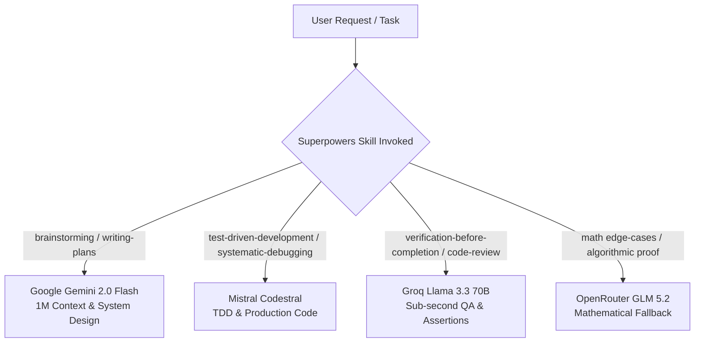

# Compute Engines & Models Registry (Antigravity & OpenCode)

This registry orchestrates the LLM compute engines configured for Abdo's engineering growth workspace, routing tasks based on cost efficiency, rate limits, latency, and context window size.

---

## 1. Active Configured Models

| Model | Provider | Context Window | Free Tier Limits | Primary Superpowers Role |
| :--- | :--- | :--- | :--- | :--- |
| **Mistral Codestral 2501** | Mistral AI | 128,000 tokens | 30 RPM / 1 RPS / 500k TPM | **TDD, Code Generation, Complex Refactoring, Debugging** |
| **Gemini 2.0 Flash** | Google AI Studio | 1,048,576 tokens | 15 RPM / 1,500 RPD / 1M TPM | **Brainstorming, Architecture, Large Plan Writing, Full-Repo Search** |
| **Llama 3.3 70B Versatile** | Groq Cloud | 128,000 tokens | 30 RPM / 14,400 RPD | **Verification Before Completion, Fast Code Review, Test Log Screening** |
| **GLM 5.2 / GLM-4-9B** | OpenRouter | 32,768 tokens | 20 RPM / 50 RPD | **Algorithmic Intuition Fallback, Math Edge Case Verification** |

---

## 2. Superpowers Task Routing Matrix

Each Superpowers protocol is routed to the engine best suited for its cognitive demand and rate constraints:



### Routing Rules:
1. **Never exhaust free-tier limits carelessly:**
   - Gemini handles whole-repo ingestion due to its 1M context window, saving Codestral tokens.
   - Codestral writes production implementation and unit tests.
   - Groq verifies diffs and reviews test logs at lightning speed.
2. **Strict Verification Law:**
   - Every change must pass verification commands via `run_command` before any model claims completion.

---

## 3. How to Add Any New Model (1-Step Protocol)

When adding a new model (e.g. DeepSeek V3, Claude 3.5 Sonnet, Qwen 2.5 Coder, OpenAI o3-mini):

1. Open `C:\Users\A5\.gemini\config\plugins\superpowers\models-registry.json`.
2. Add your model object into the `"models"` array:

```json
{
  "id": "provider/model-id",
  "displayName": "Model Display Name",
  "provider": "Provider Name",
  "enabled": true,
  "tier": "Free / Paid",
  "primaryRole": "Role description (e.g., Frontend Design / Fast TDD)",
  "specs": {
    "contextWindow": 128000,
    "maxOutputTokens": 8192,
    "rateLimits": {
      "rpm": 30,
      "rpd": 1000,
      "tpm": 100000
    }
  },
  "superpowersCompatibility": {
    "skillName": "primary | fallback"
  }
}
```

3. Update `"default_routing"` or `"skill_routing"` if you want this new model to take over specific tasks.

---

## 4. Harness Clean-Up Summary

The following foreign harness files have been purged from the global Superpowers plugin to eliminate dead weight while preserving all 15 core skills:
- Removed: `.claude-plugin`, `.codex-plugin`, `.cursor-plugin`, `.devin-plugin`, `.hermes-plugin`, `.kimi-plugin`, `.muse-plugin`, `.pi`.
- Removed references: `claude-code-tools.md`, `codex-tools.md`, `hermes-tools.md`, `muse-tools.md`, `pi-tools.md`.
- Retained & Optimized: Native Antigravity tools mapping (`antigravity-tools.md`), Gemini CLI support (`gemini-tools.md`), and OpenCode integration (`.opencode`).
