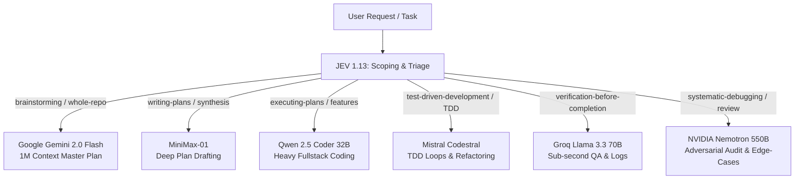

# Compute Engines & Models Registry (Antigravity & OpenCode)

This registry orchestrates the LLM compute engines configured for Abdo's engineering growth workspace, routing tasks based on cost efficiency, rate limits, latency, and context window size across all free tiers.

---

## 1. Active Configured Free Engines (The 7-Model Multi-Agent Matrix)

| Model | Provider | Context Window | Free Tier Limits | Primary Superpowers Role |
| :--- | :--- | :--- | :--- | :--- |
| **Qwen 2.5 Coder 32B** | OpenRouter / Qwen | 131,072 tokens | 20 RPM / 200 RPD | **Heavy Fullstack TS/React Code Generation & Feature Implementation** |
| **MiniMax-01** | OpenCode / MiniMax | 1,000,000 tokens | 30 RPM / 1000 RPD | **Long-Context Flow Synthesis & Implementation Plan Writing** |
| **NVIDIA Nemotron 3 Ultra 550B** | OpenRouter / NVIDIA | 131,072 tokens | 20 RPM / 100 RPD | **Deep Security, Concurrency, Edge-Cases & Adversarial Code Review** |
| **JEV 1.13 (Deterministic)** | OpenCode | 65,536 tokens | 60 RPM / 5000 RPD | **Zero-Cost Task Classification, Scoping & Dependency Triage** |
| **Mistral Codestral 2501** | Mistral AI | 128,000 tokens | 30 RPM / 1 RPS / 500k TPM | **TDD Loops, Subagent Unit Testing & Refactoring** |
| **Google Gemini 2.0 Flash** | Google AI Studio | 1,048,576 tokens | 15 RPM / 1500 RPD / 1M TPM | **Whole-Repo Scanning, Brainstorming & Supreme Orchestration** |
| **Groq Llama 3.3 70B Versatile** | Groq Cloud | 128,000 tokens | 30 RPM / 14,400 RPD | **Sub-Second Linting, Test Log Screening & Verification Before Completion** |

---

## 2. Superpowers Task Routing Matrix

Each Superpowers protocol is routed to the engine best suited for its cognitive demand and rate constraints:

```mermaid
graph TD
    UserReq[User Request / Task] --> Triage[JEV 1.13: Scoping & Triage]
    Triage -->|brainstorming / whole-repo| Gemini[Google Gemini 2.0 Flash<br/>1M Context Master Plan]
    Triage -->|writing-plans / synthesis| MiniMax[MiniMax-01<br/>Deep Plan Drafting]
    Triage -->|executing-plans / features| Qwen[Qwen 2.5 Coder 32B<br/>Heavy Fullstack Coding]
    Triage -->|test-driven-development / TDD| Codestral[Mistral Codestral<br/>TDD Loops & Refactoring]
    Triage -->|verification-before-completion| Groq[Groq Llama 3.3 70B<br/>Sub-second QA & Logs]
    Triage -->|systematic-debugging / review| Nemotron[NVIDIA Nemotron 550B<br/>Adversarial Audit & Edge-Cases]
```

---

## 3. Strict Multi-Agent Rules

1. **Zero Unnecessary Token Waste**:
   - Small inline edits and terminal tasks go to JEV or Codestral.
   - Large architectural synthesis goes to Gemini or MiniMax due to massive context windows.
   - Sub-second assertions and test logs go to Groq.
2. **Evidence Before Assertions**:
   - Regardless of which model drafted the code, Groq / Codestral must verify exit code 0 via `run_command` before any completion claim.
