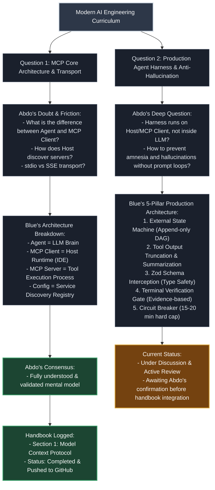

# AI Engineering Curriculum - Dialogue & Question Tree

> شجرة تفاعلية ترصد كل سؤال ونقاش وحسم معماري في رحلة تعلم هندسة الذكاء الاصطناعي.
> متصلة بامتداد ميرو الرسمي لإنتاج المخططات الهندسية مباشرة على لوحات العمل.

---

## 1. Visual Question Graph (Mermaid)



---

## 2. Dialogue Log & Progression Table

| المعرف | السؤال والنقطة المحورية | فرع النقاش والتشكيك | النتيجة والحسم | حالة التوثيق |
| :--- | :--- | :--- | :--- | :--- |
| **Q1** | MCP Architecture & Transports | التفريق الدقيق بين الوكيل والمضيف والسيرفر | تثبيت النموذج الذهني والتمييز بين النقل المحلي والشبكي | موثق في الكتيب الرئيسي |
| **Q2** | Host Agent Harness & Hallucination | كيفية بناء هارنيس صلب على المضيف يمنع التوهان | ركائز الهارنيس الخمس مع حواجز الأمان وفحص المخرجات | قيد المراجعة والنقاش |

---

## 3. Miro AI Extension & MCP Bridge (الربط المباشر مع ميرو)

تم تفعيل وتثبيت حزمة ميرو الرسمية للذكاء الاصطناعي:
`miroapp/miro-ai`

مسارات التثبيت والربط المفعلة في بيئة العمل:

1. مسار الامتداد الرسمي:
`C:\Users\A5\.gemini\extensions\miro\`

2. مسار الإضافة العامة:
`C:\Users\A5\.gemini\config\plugins\miro\`

3. مهارات مساحة العمل المفعلة:
`.agents/skills/miro-code-explain-on-board/`
`.agents/skills/miro-code-review/`
`.agents/skills/miro-code-spec/`

4. عنوان الخادم لبروتوكول السياق:
```text
https://mcp.miro.com/
```

---

## 4. How to Sync Tree to Miro Board (طريقة المزامنة على اللوحة)

### الخيار الأول: المزامنة المباشرة بالرابط

عند تزويد الوكيل برابط اللوحة الخاصة بك في ميرو:
```text
https://miro.com/app/board/<board_id>/
```
يقوم الوكيل بقراءة اللوحة وتوليد عناصر المخطط وتحديث الشجرة مباشرة عبر أداة:
`miro-code-explain-on-board`

### الخيار الثاني: الاستيراد الفوري عبر ميرميد

1. افتح أي لوحة عمل في منصة:
Miro
2. من شريط الأدوات الجانبي، اختر تطبيق:
Mermaid
3. انسخ كود الـ
Mermaid
الموجود في القسم الأول بالكامل وضعه في التطبيق داخل ميرو.
4. سيتم رسم الشجرة التفاعلية فوراً وتستطيع ترتيب العقد والبطاقات بحرية كاملة.
