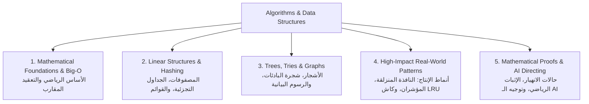

# Master Algorithms & Data Structures Handbook 📐⚡

> **الغرض**: الدليل المرجعي الشامل لهياكل البيانات والخوارزميات للمهندس الرياضي المحترف (Helwan University Math Foundations). تم تصميم هذا الدليل لتراجعه دورياً لترسيخ التفكير الرياضي، فهم كفاءة الحوسبة والتعقيد الزمني والمكاني، وتوجيه الذكاء الاصطناعي بدقة لكتابة خوارزميات الإنتاج عالية الأداء.

---

## 🧭 خريطة الخوارزميات وهياكل البيانات الأساسية



---

# 1. 📐 الأساس الرياضي والتعقيد المقارب (Mathematical Foundations & Big-O)

---

### 🎓 1. الحدس والأساس الرياضي (خريج كلية العلوم - قسم رياضيات):
في التحليل الرياضي الحقيقي (`Real Analysis`):
عندما ندرس سلوك الدوال $f(n)$ عندما تقترب $n$ من اللانهاية ($n \to \infty$):
- **الحد الأعلى المقارب ($Big-O$)**:  
  نقول إن $f(n) = O(g(n))$ إذا وُجد ثابت حقيقي موجب $c > 0$ ورقم صحيح $n_0 \ge 1$ بحيث:
  $$|f(n)| \le c \cdot |g(n)| \quad \forall n \ge n_0$$
  هذا يعني رياضياً أن الدالة $g(n)$ تمثل "السقف الأعلى الحتمي" لنمو الخوارزمية في أسوأ الظروف.
- **التدرج الرياضي للكفاءة**:
  $$O(1) < O(\log n) < O(n) < O(n \log n) < O(n^2) < O(2^n) < O(n!)$$
- **تعقيد الذاكرة والمكدس الرياضي (`Space Complexity & Recursion Stack`)**:
  كل استدعاء تكراري (`Recursive Call`) يستهلك إطاراً في مكدس الذاكرة (`Call Stack Frame`). خوارزمية بعمق استدعاء $N$ تستهلك $O(N)$ مساحة في الذاكرة حتى لو لم تنشئ مصفوفات جديدة!

---

### 💻 2. الكود والمقارنة المعمارية:

| التعقيد الزمني | المثال الحقيقي في الإنتاج | التأثير العملي عند $N = 1,000,000$ |
| :--- | :--- | :--- |
| **$O(1)$** | البحث بالمفتاح في `Map` أو جلب عنصر بمؤشر المصفوفة | لحظي (~1 نانو ثانية) |
| **$O(\log N)$** | البحث الثنائي في مصفوفة مرتبة، أو فهارس قواعد البيانات `B-Tree` | ~20 عملية مقارنة فقط! |
| **$O(N)$** | تصفية مصفوفة `filter()` أو البحث الخطي في جدول بدون فهرس | مليون عملية (~مللي ثوانٍ) |
| **$O(N \log N)$** | الترتيب السريع الفعال (`MergeSort / Timsort`) | ~20 مليون عملية (سريع ومثالي) |
| **$O(N^2)$** | الحلقات المتداخلة `for` داخل `for` للبحث عن التطابق | ترليون عملية (انهيار السيرفر وتجميد المتصفح!) |

---

# 2. 🗃️ هياكل البيانات الخطية وجداول التجزئة (Linear Structures & Hashing)

---

### DP-A01: جداول التجزئة (Hash Maps) — الرياضيات وراء الكفاءة

#### 👶 1. الحدس والتشبيه الواقعي:
في محل الديكور، عندك 10,000 قطعة إكسسوار.
لو حطيتهم في كرتونة واحدة كبيرة وسايبهم عشوائي، عشان تلاقي فازة معينة هتقلب الكرتونة كلها من أولها لآخرها في ساعة ($O(N)$)!
لكن لو جبت دولاب فيه 100 درج مرقمين من 0 لـ 99.
وعملت قاعدة حسابية بسيطة: "أول حرفين من اسم المنتج يحددوا رقم الدرج".
لما زبون يطلب "فازة"، في ثانية بتحسب المعادلة وتفتح الدرج رقم 24 وتطلع الفازة فوراً ($O(1)$)!

#### 💻 2. الميكانيكا الهندسية والرياضية:
- دالة التجزئة (`Hash Function`) تحول المفتاح النصي إلى رقم صحيح ضخم.
- نستخدم عملية باقي القسمة (`Modulo Arithmetic`): `index = hash % array_capacity`.
- **حل التصادمات (`Collision Resolution`)**: إذا أخرجت دالة التجزئة نفس الدرج لمفتاحين مختلفين، نستخدم **السلاسل المترابطة (`Chaining`)** أو **العنونة المفتوحة (`Open Addressing`)**.
- **معامل الامتلاء (`Load Factor`)**: عندما تمتلئ الأدراج بنسبة تتجاوز 75% (`0.75`)، يقوم محرك الجافاسكريبت بمضاعفة حجم المصفوفة وإعادة توزيع العناصر تلقائياً لضمان بقاء وقت البحث $O(1)$.

---

### DP-A02: القوائم المترابطة الثنائية (Doubly Linked Lists)

#### 👶 1. الحدس والتشبيه الواقعي:
طابور أطفال ماسكين إيدين بعض في حديقة.
كل طفل ماسك بإيده اليمين إيد زميله اللي قدامه، وبإيده الشمال إيد زميله اللي وراه.
لو طفل حب يخرج من نص الطابور، مش بنحرك باقي أطفال الحديقة خطوة لقدام؛
الطفل اللي قبله بيمسك في الطفل اللي بعده على طول في ثانية واحدة ($O(1)$)!
المصفوفات العادية لو حذفت العنصر الأول منها، بتضطر تشد كل العناصر خطوة للشمال ($O(N)$). القائمة المترابطة بتفك وتربط المؤشرات في لحظة ($O(1)$).

---

# 3. 🌳 الأشجار والرسوم البيانية في الويب (Trees, Tries & Graphs)

---

### DP-A03: شجرة البادئات للبحث الفوري (The Trie / Prefix Tree)

#### 👶 1. الحدس والتشبيه الواقعي:
شريط البحث الذكي (Autocomplete) في متجر الديكور.
الزبون بيكتب في خانة البحث حرف "ف" -> فيطلع له: "فازة"، "فانوس"، "فرع شجر".
لو كتب "فا" -> يقل الاختيار لـ: "فازة"، "فانوس".
لو كتب "فاز" -> يظهر له: "فازة كريستال"، "فازة سيراميك".
بدل ما نفحص كل أسماء منتجات المتجر في كل ضغطة كيبورد، شجرة الـ Trie بتقسم الكلمات لحروف متسلسلة؛ البحث فيها يعتمد فقط على **طول الكلمة المكتوبة ($L$)**، وليس على عدد منتجات المتجر المليون ($O(L)$)!

#### 💻 2. الميكانيكا الهندسية والكود النموذجي (TypeScript):

```typescript
class TrieNode {
  children = new Map<string, TrieNode>();
  isEndOfWord = false;
}

export class ProductAutocompleteTrie {
  private root = new TrieNode();

  // إدراج اسم منتج في الشجرة - تعقيد زمني O(L) حيث L طول الكلمة
  insert(word: string): void {
    let current = this.root;
    for (const char of word.toLowerCase()) {
      if (!current.children.has(char)) {
        current.children.set(char, new TrieNode());
      }
      current = current.children.get(char)!;
    }
    current.isEndOfWord = true;
  }

  // البحث عن كل المنتجات التي تبدأ ببادئة معينة - فائق السرعة
  findWordsWithPrefix(prefix: string): string[] {
    let current = this.root;
    for (const char of prefix.toLowerCase()) {
      if (!current.children.has(char)) {
        return []; // لا توجد منتجات تبدأ بهذه البادئة
      }
      current = current.children.get(char)!;
    }

    const results: string[] = [];
    this.collectAllWords(current, prefix.toLowerCase(), results);
    return results;
  }

  private collectAllWords(node: TrieNode, currentPrefix: string, results: string[]): void {
    if (node.isEndOfWord) {
      results.push(currentPrefix);
    }
    for (const [char, childNode] of node.children.entries()) {
      this.collectAllWords(childNode, currentPrefix + char, results);
    }
  }
}
```

---

### DP-A04: الرسوم البيانية الموجهة عديمة الحلقات (DAG - Directed Acyclic Graph)

#### 👶 1. الحدس والتشبيه الواقعي:
خريطة المواد الدراسية في كلية العلوم:
مينفعش تاخد مادة "تفاضل متقدم" إلا لما تنجح في "تفاضل 1".
مينفعش تاخد "تحليل حقيقي" إلا لما تنجح في "تفاضل متقدم" و"جبر مجرد".
الأسهم ماشية في اتجاه واحد ومفيش أي حلقة مقفولة مستحيلة (Circular Dependency).
في هندسة البرمجيات: ده نفس الهيكل اللي بيشغل أدوات البناء (`npm/pnpm build tools`) وخطوط المعالجة (`CI/CD Pipelines`)؛ بنستخدم خوارزمية **الترتيب الطوبولوجي (`Topological Sort`)** لتحديد الترتيب الدقيق للتنفيذ.

---

# 4. 🚀 أهم الأنماط الخوارزمية في الإنتاج (High-Impact Real-World Patterns)

---

### DP-A05: خوارزمية كاش الأقل استخداماً مؤخراً (LRU Cache — $O(1)$)

#### 👶 1. الحدس والتشبيه الواقعي:
رف العرض الصغير بجوار كاشير محل الديكور بيشيل 3 قطع بس.
كل ما زبون يشتري فازة معينة، بنحطها في أول الرف.
لو الرف اتملى بـ 3 قطع وجه زبون اشترى قطعة رابعة جديدة؛
بنشيل أقدم قطعة محدش لمسها من زمان من آخر الرف ونرميها في المخزن تحت (`Eviction`).
السر الهندسي: الوصول لأي قطعة وتحديث مكانها لأول الرف بيتم في خطوة واحدة لحظية ($O(1)$) بدمج **جدول تجزئة + قائمة مترابطة ثنائية**.

#### 💻 2. الميكانيكا الهندسية والكود النموذجي (TypeScript):

```typescript
class DListNode {
  constructor(
    public key: string,
    public value: any,
    public prev: DListNode | null = null,
    public next: DListNode | null = null
  ) {}
}

export class LRUCache<T> {
  private capacity: number;
  private map = new Map<string, DListNode>();
  private head: DListNode;
  private tail: DListNode;

  constructor(capacity: number) {
    if (capacity <= 0) throw new Error("Capacity must be positive");
    this.capacity = capacity;

    // عقد وهمية (Sentinel Nodes) لتبسيط عمليات الربط ومنع أخطاء الـ Null
    this.head = new DListNode("__HEAD__", null);
    this.tail = new DListNode("__TAIL__", null);
    this.head.next = this.tail;
    this.tail.prev = this.head;
  }

  get(key: string): T | null {
    const node = this.map.get(key);
    if (!node) return null;

    // تحريك العنصر إلى رأس القائمة لأنه استُخدم مؤخراً
    this.moveToHead(node);
    return node.value as T;
  }

  put(key: string, value: T): void {
    const existingNode = this.map.get(key);

    if (existingNode) {
      existingNode.value = value;
      this.moveToHead(existingNode);
    } else {
      const newNode = new DListNode(key, value);
      this.map.set(key, newNode);
      this.addNodeAtHead(newNode);

      // إذا تجاوزنا السعة القصوى، نحذف العنصر الأقدم عند الذيل
      if (this.map.size > this.capacity) {
        const oldestNode = this.popTail();
        this.map.delete(oldestNode.key);
      }
    }
  }

  private addNodeAtHead(node: DListNode): void {
    node.prev = this.head;
    node.next = this.head.next;
    this.head.next!.prev = node;
    this.head.next = node;
  }

  private removeNode(node: DListNode): void {
    node.prev!.next = node.next;
    node.next!.prev = node.prev;
  }

  private moveToHead(node: DListNode): void {
    this.removeNode(node);
    this.addNodeAtHead(node);
  }

  private popTail(): DListNode {
    const res = this.tail.prev!;
    this.removeNode(res);
    return res;
  }
}
```

---

### DP-A06: خوارزمية النافذة المنزلقة (The Sliding Window Pattern)

#### 👶 1. الحدس والتشبيه الواقعي:
تخيل عندك شريط سينمائي لدرجات حرارة المحل على مدار 24 ساعة.
عاوز تعرف: "إيه أعلى متوسط حرارة في أي 3 ساعات وراء بعض؟"
بدل ما تقف عند كل ساعة وتجمع الساعات التلاتة من الأول ($O(N \times K)$)، أنت بتعمل شباك حجمه 3 ساعات:
لما الشباك يتحرك خطوة لقدام، بتطرح الساعة اللي خرجت من ورا وتزود الساعة الجديدة اللي دخلت قدام في خطوة واحدة ($O(1)$)!
الخوارزمية كلها بتخلص في فحص خطي واحد للمصفوفة ($O(N)$).

#### 💻 2. الميكانيكا الهندسية والكود النموذجي:

```typescript
// إيجاد أطول مقطع نصي لا يحتوي على حروف مكررة - O(N) Time | O(Min(N, M)) Space
export function lengthOfLongestSubstringWithoutRepeats(s: string): number {
  const lastSeenIndex = new Map<string, number>();
  let maxLength = 0;
  let windowStart = 0;

  for (let windowEnd = 0; windowEnd < s.length; windowEnd++) {
    const char = s[windowEnd];

    // إذا تكرر الحرف وكان داخل النافذة الحالية، نسحب بداية النافذة للأمام
    if (lastSeenIndex.has(char) && lastSeenIndex.get(char)! >= windowStart) {
      windowStart = lastSeenIndex.get(char)! + 1;
    }

    lastSeenIndex.set(char, windowEnd);
    maxLength = Math.max(maxLength, windowEnd - windowStart + 1);
  }

  return maxLength;
}
```

---

### DP-A07: تقنين أحداث واجهات المستخدم (Debounce & Throttle)

#### 👶 1. الحدس والتشبيه الواقعي:
- **الـ Debounce (تأخير التنفيذ حتى الهدوء)**:
  زي باب الأسانسير في المحل. كل ما شخص يدخل، الباب يستنى 3 ثواني.
  لو شخص تاني دخل في الثانية 2، العداد يعيد من الأول ويستنى 3 ثواني تانية.
  الباب مش هيقفل ويتحرك إلا لما الناس تبطل تدخل ويهدأ المكان!
  في الكود: خانة البحث في المتجر، مش بنبعت طلب للباك إند مع كل حرف، بنستنى لما المستخدم يبطل كتابة لمدة 300ms!
- **الـ Throttle (تحديد معدل التدفق الدوري)**:
  زي صنبور المياه في ترشيد الاستهلاك؛ مهما دوست عليه، بينزل نقطة واحدة كل ثانية بانتظام.
  في الكود: متابعة حدث الـ `scroll` أو تكبير الشاشة في المتصفح.

#### 💻 2. الميكانيكا الهندسية والكود النموذجي:

```typescript
// Debounce: تنفيذ الوظيفة بعد سكون الأحداث لمدة delayMs
export function debounce<T extends (...args: any[]) => void>(fn: T, delayMs: number): (...args: Parameters<T>) => void {
  let timer: NodeJS.Timeout | null = null;

  return function (...args: Parameters<T>) {
    if (timer) clearTimeout(timer);
    timer = setTimeout(() => {
      fn(...args);
      timer = null;
    }, delayMs);
  };
}

// Throttle: تنفيذ الوظيفة مرة واحدة كحد أقصى كل limitMs
export function throttle<T extends (...args: any[]) => void>(fn: T, limitMs: number): (...args: Parameters<T>) => void {
  let inThrottle = false;

  return function (...args: Parameters<T>) {
    if (!inThrottle) {
      fn(...args);
      inThrottle = true;
      setTimeout(() => {
        inThrottle = false;
      }, limitMs);
    }
  };
}
```

---

# 5. 🎯 حالات الانهيار وتوجيه الذكاء الاصطناعي (AI Directing Protocol)

---

### ⚠️ المصائد الرياضية وحالات الفشل القاتلة:
1. **أخطاء التجاوز بواحد (`Off-by-One Errors`)**: في خوارزميات المؤشرات والبحث الثنائي (`while (low <= high)` مقابل `while (low < high)`). أي لخبطة تؤدي إما لحلقة لانهائية أو تفويت فحص العنصر الأخير.
2. **تجاهل مدخلات الحافة (`Edge Cases`)**: المصفوفة الفارغة (`[]`)، المصفوفة ذات العنصر الواحد (`[1]`)، الأرقام السالبة، أو تكرار جميع العناصر. الذكاء الاصطناعي يكتب خوارزميات تعمل على البيانات المثالية فقط وتنهار عند هذه الحالات.

---

### 🎙️ سكريبت الدفاع في المقابلات بالإنجليزية (Interview Defense):
> "When designing algorithmic pipelines, we analyze trade-offs through the lens of asymptotic complexity. For high-frequency caching, we pair a Hash Map with a Doubly Linked List to achieve strict O(1) read and eviction guarantees in our LRU cache. In the frontend, we prevent redundant network bursts during typeahead search by wrapping the dispatch in a Debounce closure, bounding API pressure to O(1) requests per settled typing burst."

---

### 🤖 بروتوكول توجيه الذكاء الاصطناعي لكتابة الخوارزميات:
- **البرومبت الصارم للـ AI**:
  `"Implement an LRU Cache in TypeScript. The time complexity for both get(key) and put(key, value) MUST be strictly O(1). Use a Hash Map combined with a Doubly Linked List with sentinel head and tail nodes. Handle capacity bounds and write comprehensive Jest unit tests covering cache evictions and edge cases (capacity = 1, empty reads)."`
- **ما يجب أن تدققه كمعماري**:
  - هل استدعى الـ AI دالة `indexOf()` أو `includes()` داخل حلقة تكرار؟ (هذا يرفع التعقيد سراً من $O(N)$ إلى $O(N^2)$!).
  - هل استخدم `Map.keys().next().value` فقط؟ (احذر: هذا قد يعمل في V8 لكنه لا يمثل بنية LRU الموزعة الموثوقة).

---
