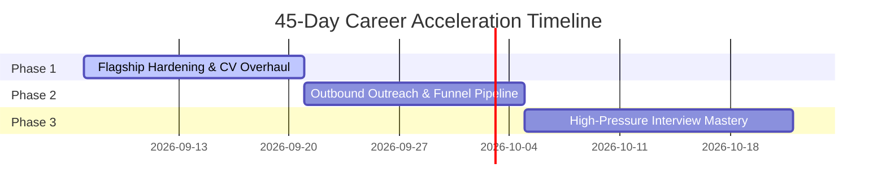

# The 45-Day Engineering & Income Acceleration Master Plan 🚀💼

> 🧭 **الروابط المركزية (Vault Navigation Hub)**:
> 🔗 [خريطة المحتوى الرئيسية (MOC)](../MASTER_KNOWLEDGE_BASE.md) • [لوحة المتابعة والتقدم](../PROGRESS_TRACKER.md) • [مهارة المنتور الهندسية](../.agents/skills/abdo-personal-mentor/SKILL.md) • [سجل الإنجليزية](ENGLISH_MASTERY_LOG.md) • [السير الذاتية المستهدفة](targeted-cvs/README.md)

> **Target**: Secure a High-Paying Frontend/Fullstack Role (Remote / Gulf / Top Egypt Tech) & Maximize Store Cashflow  
> **Candidate**: Abdullah Mahmoud Fawzy (Abdo)  
> **Background**: Mathematics Graduate (Helwan University) | Fullstack Engineer  
> **Date Activated**: 2026-09-06  

---

## 🎯 Executive Summary & The 2026 Market Reality

In the 2026 tech hiring landscape, the market has split into two extremes (The Barbell Effect):
1. **The Saturated Bottom**: Hundreds of junior frontend developers who only know how to build basic React/Tailwind UIs or tutorial clones. AI writes their boilerplate, and recruiters filter them out automatically.
2. **The High-Demand Top**: Engineers who understand **production architecture, system resilience, data modeling, backend integration, and business problem-solving**.

Your background in **Mathematics** combined with your hands-on business experience running a decoration store gives you an unfair competitive edge—**provided we position you correctly**.

---

## 🔍 Critical Audit of Current Assets & CV

### Current Strengths:
- **Mathematics Degree (Oct 2024)**: High analytical rigor, algorithmic capability, and structured problem-solving.
- **Modern Core Stack**: Next.js 15/16, React 19, TypeScript, TanStack Query, Tailwind CSS, Zod, React Hook Form.
- **Working Projects**: Inventory Management Dashboard (live on Vercel), Hotel Management, Chat Application (Socket.IO + Node.js).
- **Recent Architecture Breakthroughs**: Strategy Pattern, Factory Pattern, Single Responsibility Principle (SRP), Rate Limiting, Container Lifecycle caching.

### Severe Bottlenecks to Eliminate Immediately:
1. **Title Positioning**: Tagged as "Junior Frontend Developer"—this triggers automated salary cuts and recruiter dismissals. Must be repositioned to **"Frontend / Fullstack Engineer"**.
2. **Missing Backend in Skills Grid**: You built a full Node/Express/MongoDB chat app and Supabase backend, but Node.js, Express, MongoDB, and Supabase are missing from your top "Skills" section!
3. **Broken / Plain-Text Portfolio Links**: The Hotel Management and Chat App repos lack clean, clickable HTTPS live demos.
4. **Lack of Metrics & Architectural Proof**: Bullet points say "Built a dashboard" rather than "Architected a high-performance inventory system with server-side prefetching and client-side hydration, cutting data fetch latency by 45%".
5. **Passive Job Search Funnel**: Applying blindly to public job postings without direct outreach to Tech Leads and Engineering Managers.

---

## 🛠️ The 5 Missing High-Yield Skills (Added to Curriculum)

To command top-tier salaries (EGP 35,000–60,000+ locally or $1,500–$3,000+ remote/Gulf), we are injecting these 5 capabilities:

### 1. Relational Data Modeling & Fullstack TypeScript (PostgreSQL + Prisma/Drizzle)
- Move beyond mock APIs (DummyJSON) into real relational schemas.
- Master ACID transactions, relational indexing, and type-safe server actions.

### 2. Production Resilience & Security Guardrails
- Rate limiting with in-memory / Redis token buckets.
- Bot prevention via Honeypot patterns.
- Upstream error mapping (distinguishing 429 backpressure from 500 server crashes).
- Cache poisoning prevention in serverless database connections.

### 3. Automated Testing & Verification
- Unit & integration testing using **Vitest** and **React Testing Library**.
- End-to-end user journey tests using **Playwright**.
- Automated CI/CD checks via GitHub Actions.

### 4. Applied AI Workflow & Agentic Integration
- Integrating LLMs with structured outputs (Zod validation).
- Decoupling AI providers via Strategy & Factory patterns.
- Automating operational workflows (n8n, tool calling, webhook dispatch).

### 5. High-Stakes Technical English & Interview Storytelling
- Explaining architectural decisions using the 3-Step Framework (*Context -> Trade-offs -> Outcome*).
- Framing your Math degree as an algorithmic and data-modeling asset.
- Spontaneous English technical discussions without translating in your head.

---

## 📅 The 45-Day Three-Phase Execution Sprint

### 🗓️ Phase 1 (Days 1–14): Flagship Weaponization & CV Rebirth
- **Day 1–4**: Polish **Devfolio AI** into an indisputable flagship project:
  - Connect the real live assistant with the refactored Strategy Pattern.
  - Implement the architecture case studies showing how you solved Mongoose cache poisoning and rate limiting.
  - Deploy with custom domain / clean Vercel URL.
- **Day 5–7**: Audit & Polish the **Inventory Dashboard**:
  - Add optimistic updates with TanStack Query.
  - Add comprehensive README acting as an engineering case study (Problem, Constraints, Architecture, Trade-offs).
- **Day 8–10**: Complete CV & LinkedIn Transformation:
  - Title: **Frontend / Fullstack Engineer (Next.js • TypeScript • Node.js)**.
  - Inject quantifiable engineering metrics into every project bullet.
  - Add Math competitive advantage in professional summary.
- **Day 11–14**: Launch GitHub Case Studies:
  - Pin the 3 top repositories with clean READMEs, architecture diagrams, and live preview badges.

---

### 🗓️ Phase 2 (Days 15–28): The High-Conversion Outbound Machine
- **Daily Target**: 4 High-Quality Direct Outreach Messages + 3 Tailored Applications.
- **Target Channels**:
  - **Gulf Remote / Relocation**: Saudi Arabia (Riyadh tech hubs), UAE (Dubai Silicon Oasis, Hub71).
  - **Egypt Tier-1 Tech**: Cairo FinTech, HealthTech, and scale-ups.
  - **EU/Global Remote**: Platforms like Wellfound, Otta, RemoteOK, Jobgether.
- **The "Direct-to-Lead" Outreach Protocol**:
  - Never click "Easy Apply" and pray.
  - Find the Engineering Manager or Tech Lead on LinkedIn.
  - Send a 3-sentence personalized message with a direct link to a 45-second Loom walkthrough or live demo of a relevant feature.

---

### 🗓️ Phase 3 (Days 29–45): Interview Execution & Offer Negotiation
- **Daily 30-Minute Mock Interview Drill**:
  - Live system architecture walkthroughs in English.
  - React/Next.js internals (Reconciliation, Fiber, Server Components vs Client Components, Hydration).
  - JavaScript runtime (Event loop, Microtasks, Memory Leaks, Closures).
- **Offer Evaluation & Salary Negotiation**:
  - Pushing for the upper band of salary ranges based on proven fullstack competency.

---

## 🏪 Stream B: Evening Cashflow Engine (The Decoration Store)

**Objective**: Generate immediate revenue in Egyptian Pounds during evening hours (4:00 PM – 12:00 AM) to relieve personal financial pressure and give you emotional leverage in job interviews.

1. **Google Business Profile (Week 1)**:
   - Claim and optimize the shop listing in El-Warraq, Giza with high-res photos and keyword tags ("محل ديكورات وتحف بالوراق").
2. **Photoroom + Social Media Flywheel (Ongoing)**:
   - Photograph 2 unique pieces daily during the quiet evening hours (7:00 PM – 8:00 PM).
   - Isolate backgrounds and generate lifestyle scene mockups.
   - Post to Instagram Reels & TikTok with local Egyptian audio and concise pricing.
3. **Automated WhatsApp Business Catalog**:
   - Set up automated greeting, quick replies, and product catalog for walk-ins and online inquiries.
