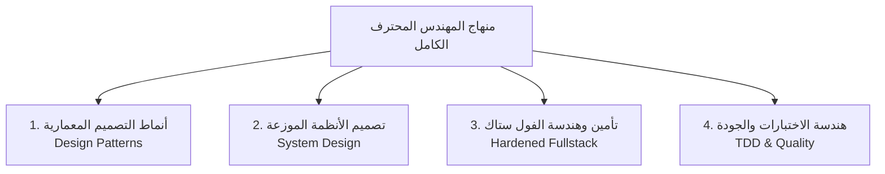
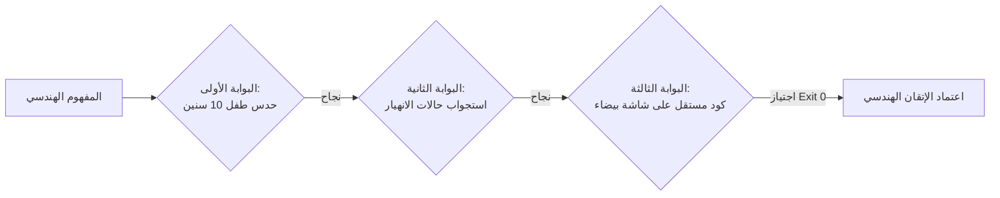

# Master Engineering Curriculum & Strict Execution Schedule 🎯⚡

> **الغرض**: منهاج هندسي صارم يربط النظرية بالإنتاج العملي، مع جدول زمني محدد بالدقيقة ونظام صارم لاحتساب وترحيل الديون (Task Debt)، وبروتوكول تشكيك واستجواب دائم لضمان الفهم العميق ومنع الحفظ السطحي.

---

## 🏛️ المحاور الأربعة الكبرى والمهارات التفصيلية (The 4 Grand Pillars)

---

### المحور الأول: أنماط التصميم المعمارية (Advanced Software Design Patterns)
**الهدف العملي**: كتابة كود مرن، قابل للاختبار، مفصول التبعيات، وجاهز للتوسع دون تعديل الكود القديم.

| المعرف | الموضوع / النمط | المفهوم الهندسي | الربط العملي في المشروع |
| :--- | :--- | :--- | :--- |
| **DP-01** | `The State Pattern` | التخلص من الشروط المتداخلة وإدارة انتقال الحالات ككائنات مستقلة | دورة حياة طلبات متجر الديكور (`Draft -> Paid -> Shipped -> Delivered`) |
| **DP-02** | `The Builder Pattern` | بناء الكائنات المعقدة خطوة بخطوة مع تدقيق البيانات المرحلي | بناء استعلامات تصفية المنتجات وعروض الأسعار المركبة |
| **DP-03** | `The Singleton & Anti-Pattern Trap` | التحكم بنسخة وحيدة متى تكون حتمية ومتى تدمر عزل الاختبارات | إدارة اتصال قاعدة البيانات (`Prisma/Mongoose`) ومنع تسريب الاتصالات |
| **DP-04** | `The Decorator & Proxy Patterns` | تغليف السلوك لإضافة وظائف جديدة دون تعديل الكود الأصلي | تغليف مستودعات البيانات بالتخزين المؤقت وحراسة تدقيق الصلاحيات |
| **DP-05** | `The Facade & Chain of Responsibility` | تبسيط واجهات الأنظمة المعقدة وبناء خطوط معالجة متتالية للطلبات | معمارية سلة الشراء والدفع وبناء خطوط التحقق من صحة الطلب (`Validation Pipeline`) |
| **DP-06** | `The Command Pattern` | تغليف العمليات ككائنات لدعم التراجع وقوائم الانتظار | نظام إلغاء واسترجاع الطلبات وجدولة العمليات المتأخرة |

---

### المحور الثاني: تصميم وبنية الأنظمة الموزعة (Distributed System Design & Data Architecture)
**الهدف العملي**: تصميم أنظمة تتحمل الضغط العالي، تصمد أمام انقطاع الشبكة، وتحمي سلامة البيانات المالية.

| المعرف | الموضوع الهندسي | المفهوم المعماري | الربط العملي في المشروع |
| :--- | :--- | :--- | :--- |
| **SD-01** | `Idempotency Keys & Deduplication` | ضمان تنفيذ العملية لمرة واحدة فقط مهما تكرر إرسال الطلب | منع الخصم المالي المزدوج أو تكرار حجز المخزون عند سقوط الشبكة |
| **SD-02** | `Advanced Caching Strategies (Redis)` | أنماط `Cache-Aside` و `Write-Through` وحل مصيدة `Thundering Herd` | كاش استعلامات المنتجات الأكثر مبيعاً وصفحات المعرض |
| **SD-03** | `Message Queues & Background Workers` | فصل المعالجة اللحظية عن المهام الثقيلة باستخدام `BullMQ / Redis` | إرسال إشعارات الفواتير ومعالجة ضغط صور منتجات الديكور بالخلفية |
| **SD-04** | `Database Indexing & Query Plans` | هيكل الـ `B-Tree`، الفهارس المركبة، وقراءة مخرجات `EXPLAIN ANALYZE` | تحسين استعلامات البحث وتصفية المنتجات ومؤشرات لوحة التحكم |
| **SD-05** | `Transactions & Concurrency (ACID)` | عزل المعاملات وقفل الصفوف (`Row-Level Locking`) ومنع السحب المزدوج | إدارة حجز آخر قطعة في المخزون لمنع البيع الزائد (`Race Conditions`) |
| **SD-06** | `Cloud Event-Driven Systems (AWS EventBridge & SNS)` | ترقية وسيط الأحداث الداخلي (`EventBus`) إلى وسيط أحداث سحابي موزع | توجيه أحداث الطلبات والشحن إلى خدمات مستقلة بدون نقاط فشل موحدة |
| **SD-07** | `Serverless & Workflow Orchestration (AWS Lambda & Step Functions)` | معالجة المهام بدون خوادم دائمة وتنسيق خطوط المعالجة المتسلسلة | أتمتة معالجة صور المحل بالفوتوروم وتوليد الكابشن بالذكاء الاصطناعي |
| **SD-08** | `Production Observability & APM (CloudWatch & Structured Logging)` | مراقبة صحة التطبيق، تتبع اختناقات الأداء، ونظام الإنذار المبكر | تتبع أزمنة استجابة بوابات الدفع ومعدلات استهلاك واجهات الذكاء الاصطناعي |

---

### المحور الثالث: هندسة الفول ستاك وتأمين الواجهات (Hardened Fullstack & Security)
**الهدف العملي**: بناء واجهات وتطبيقات مقاومة للاختراق والاختناق، مع فصل محكم بين العميل والسيرفر.

| المعرف | الموضوع الهندسي | المفهوم المعماري | الربط العملي في المشروع |
| :--- | :--- | :--- | :--- |
| **FS-01** | `Token Rotation & Secure Session Management` | استبدال التوكن الدوري، حماية `HttpOnly Cookies` ضد هجمات `XSS/CSRF` | نظام تسجيل الدخول والصلاحيات في لوحة تحكم المتجر ومساعد ديفوليو |
| **FS-02** | `Next.js RSC Boundaries & Server Actions` | تحسين حدود السيرفر والعميل وتقليل حجم حزمة الجافاسكريبت | معمارية لوحة التحكم وإدارة حالة النماذج والتحقق من الأخطاء |
| **FS-03** | `Real-time Communication (WebSockets vs SSE)` | بروتوكولات الاتصال ثنائي الاتجاه مقابل دفق البيانات أحادي الاتجاه | الشات اللحظي لخدمة العملاء ودفق إجابات الذكاء الاصطناعي (`Streaming`) |
| **FS-04** | `Zero-Trust API Security & Upstream Propagation` | تعقيم المدخلات بـ Zod، الحد من الطلبات، وتمرير الأكواد الصحيحة | حماية واجهات الـ API الخارجية ومنع ابتلاع أكواد الأخطاء |
| **FS-05** | `API Architectures: GraphQL & Apollo Server vs REST` | العقود المعتمدة على المخطط (`Schema-first`) وحل مشكلة الـ `N+1 Problem` | بناء استعلامات مرنة لتطبيق إدارة المعروضات وتصفية منتجات الديكور |
| **FS-06** | `Infrastructure as Code (IaC Basics - Terraform)` | كتابة وتوثيق موارد السيرفرات ككود قابل للتكرار والنشر التلقائي | توثيق البنية التحتية لمشاريع الإنتاج وقواعد بيانات البوستجريس |

---

### المحور الرابع: هندسة الاختبارات ومعايير الجودة (Strict TDD & Quality Assurance)
**الهدف العملي**: ضمان عمل النظام تحت أقسى الظروف دون أي افتراضات غير مثبتة.

| المعرف | الموضوع الهندسي | المفهوم المعماري | الربط العملي في المشروع |
| :--- | :--- | :--- | :--- |
| **QA-01** | `The Strict TDD Red-Green-Refactor Loop` | كتابة الاختبار الفاشل أولاً كعقد إلزامي قبل كتابة كود الإنتاج | كتابة محرك الحالات ومحرك الأسعار من الصفر بنمط TDD |
| **QA-02** | `Isolated Mocking vs Integration Spies` | متى نعزل التبعيات بالاختبارات الوهمية ومتى نختبر السلوك الحقيقي | اختبار بوابات الدفع والشحن دون استهلاك أرصدة حقيقية |
| **QA-03** | `Fault Injection & Chaos Engineering` | حقن الأعطال عمداً (انقطاع اتصال، تأخير شبكة، خطأ 500) | اختبار صمود وسيط الأحداث ومحرك الشحن تحت الانهيار الجزئي |

---

## ⏰ جدول التشغيل اليومي المحسوب ونظام ترحيل الديون (Execution Schedule & Task Debt)

### 1. توزيع البلوكات الزمنية الصارمة:

```mermaid
gantt
    title جدول اليوم الهندسي الصارم
    dateFormat  HH:mm
    axisFormat %H:%M
    section البلوك الصباحي
    العمل الهندسي العميق TDD :08:00, 12:00
    جلسة الاستجواب والتشكيك والتقديم :12:30, 14:30
    section الراحة البدنية
    الجيم والغداء وشحن الطاقة :14:30, 15:30
    section البلوك المسائي
    تشغيل المحل والمبيعات :16:00, 20:00
    صناعة المحتوى والموبايل :20:00, 22:00
    القراءة المعمارية وتقفيل اليوم :22:00, 24:00
```

### 2. مصفوفة المحاسبة بالدقيقة:

| البلوك الزمني | المدة | نوع النشاط | شروط الخروج والاعتماد (Exit Criteria) |
| :--- | :--- | :--- | :--- |
| **08:00 ص - 12:00 م** | 4 ساعات | كود إنتاجي نقي بنمط TDD | كتابة الاختبار أولاً، اجتيازه بنتيجة خضراء، كود خروج صفر |
| **12:30 م - 02:30 م** | ساعتان | استجواب وتشكيك + تقديم وظيفي | اجتياز أسئلة حالات الفشل + إرسال تقديمين وظيفيين رسمياً |
| **02:30 م - 03:30 م** | ساعة | تمرين الجيم والغداء | حماية الطاقة البدنية والذهنية (إجباري) |
| **04:00 م - 08:00 م** | 4 ساعات | تشغيل المحل بالوراق | خدمة الزبائن وتنسيق المعروضات (ممنوع فتح كود على اللابتوب) |
| **08:00 م - 10:00 م** | ساعتان | تسويق المحل بالموبايل | تصوير ونشر 3 قطع ديكور بفوتوروم ومتابعة الضرائب |
| **10:00 م - 12:00 ص** | ساعتان | مراجعة خفيفة ومحادثة إنجليزي | تسجيل 15 دقيقة إنجليزي + مراجعة ديون اليوم وإقفال السجل |

---

## ⚖️ القانون الصارم لاحتساب وترحيل ديون المهام (Task Debt Rollover Law)

1. **ممنوع محو أي مهمة غير مكتملة**:
   - إذا لم تُنجز المهمة في وقتها المحدد، تُسجل فوراً في قسم **ديون المهام (Task Debt)** مع كتابة السبب الجذري للتعثر (Over-scoping / Distraction / Debugging Loop).
2. **سداد الدين إجباري قبل أي موضوع جديد**:
   - المهمة المرحلة تستقطع أول ساعتين من بلوك الصباح التالي (من 8:00 ص إلى 10:00 ص).
   - يُحظر فتح أي درس جديد أو نمط جديد حتى يتم سداد الدين واجتياز اختباره بنسبة 100%.
3. **سقف الديباجينج الذاتي (15 - 20 دقيقة كحد أقصى)**:
   - عند مواجهة خطأ برمجي، تعزل المتغيرات وتبحث بنفسك لمدة لا تتجاوز 20 دقيقة لمنع ضياع اليوم.
   - إذا استمر العطل بعد 20 دقيقة، يتدخل المنتور بتشريح المشكلة معمارياً وتوجيهك لحلها.

---

## 🛡️ بروتوكول التشكيك والاستجواب الاستفزازي (Relentless Grilling Protocol)

للتأكد من الفهم العميق وقتل وهم المعرفة اللحظية، يمر كل موضوع بثلاث بوابات حديدية:

1. **البوابة الأولى: الحدس والتشبيه الواقعي (Mental Intuition)**:
   - تشرح الفلسفة من واقع الحياة والبيزنس (المحل / الطبخ / الميكانيكا) بدون مصطلحات معقدة.
   - الإجابة عن سؤال: *ما الذي ينهار في النظام الحقيقي لو لم نستخدم هذا النمط؟*
2. **البوابة الثانية: استجواب حالات الانهيار (Failure Edge-Cases Grilling)**:
   - يقوم المنتور بالتشكيك في حلك من 3 زوايا:
     - ماذا يحدث لو انقطعت الشبكة في منتصف العملية؟
     - ماذا يحدث لو طلب 1000 مستخدم نفس المورد في نفس الميلي ثانية؟
     - كيف تدافع عن هذا القرار المعماري أمام مهندس رئيسي في مقابلة تقنية صعبة بالإنجليزية؟
3. **البوابة الثالثة: شاشة بيضاء واختبار أخضر (Solo-Authored Verification)**:
   - كتابة الاختبار وكود التنفيذ في ملف فارغ بيدك من الصفر.
   - التحقق من تشغيل الكود عبر الطرفية بنتيجة خروج صفر (`Exit Code 0`).
