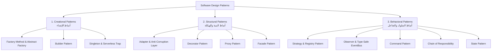

# Master Design Patterns Handbook 🎨🏛️

> **الغرض**: الدليل المرجعي الشامل لأنماط التصميم المعمارية للمهندس المحترف. تم إعداد هذا الملف لتراجعه بشكل دوري لتبني الحدس الهندسي وتوجه الذكاء الاصطناعي بدقة كمهندس معماري وقائد تقني (Tech Lead / Architect).

---

## 🧭 خريطة الأنماط الأساسية (Architecture Map)



---

## 🎯 دورك كمعماري وموجه للذكاء الاصطناعي (The Architect Mindset)

في بيئة التطوير الحديثة المدعومة بالذكاء الاصطناعي:
- كتابة الكود لم تعد العائق الأساسي؛ الذكاء الاصطناعي يكتب الكود في ثوانٍ.
- قيمتك كمهندس تكمن في **اختيار النمط الصحيح**، **تحديد العقد المعماري (Contract)**، و**فحص حالات الانهيار (Failure Modes)** التي يغفل عنها الذكاء الاصطناعي عادة.
- اقرأ هذه الأنماط لتثبيت الحدس الذهني، ثم استخدم قوالب التوجيه المرفقة لإجبار الذكاء الاصطناعي على كتابة كود إنتاجي نظيف وقابل للصيانة والاختبار.

---

# 1. 🏗️ أنماط الإنشاء (Creational Patterns)

---

### DP-C01: The Factory Method & Abstract Factory Pattern

#### 👶 1. الحدس والتشبيه الواقعي (طفل 10 سنين):
تخيل إنك في محل الديكور (أرتيفلورا)، وجالك زبون عاوز "طرد تغليف هدايا".
بدل ما تطلب من الزبون يدخل بنفسه المخزن ويقعد يختار نوع الكرتونة، وشريط الستان، ونوع الفوم العازل، ويلزق بنفسه؛ الزبون بيقولك كلمة واحدة:
"أنا عاوز تغليف كلاسيك"، أو "أنا عاوز تغليف فاخر".
أنت عندك في المحل "قسم التغليف" (المصنع)؛ هو اللي بيعرف مكونات كل نوع وبيسلم الزبون علبة الهدايا جاهزة ومقفولة بأعلى معايير.
الزبون ميعرفش ولا يهمه طريقة تصنيع العلبة؛ يهمه يستلم منتج بيحقق وظيفة التغليف!

#### 💻 2. الميكانيكا الهندسية والكود النموذجي (TypeScript):
عزل مسؤولية إنشاء الكائنات المعقدة عن الكود الذي يستهلكها، مما يمنع الارتباط الوثيق (`Tight Coupling`) بمزود معين.

```typescript
// 1. العقد الموحد للمنتج (Product Contract)
export interface NotificationService {
  readonly channel: string;
  send(recipient: string, message: string): Promise<{ success: boolean; messageId: string }>;
}

// 2. التنفيذ الفعلي لكل قناة
export class WhatsAppNotificationService implements NotificationService {
  readonly channel = "whatsapp";
  constructor(private readonly apiKey: string) {}

  async send(recipient: string, message: string) {
    // استدعاء API الواتساب الفعلي
    return { success: true, messageId: `wa_${Date.now()}` };
  }
}

export class TelegramNotificationService implements NotificationService {
  readonly channel = "telegram";
  constructor(private readonly botToken: string, private readonly chatId: string) {}

  async send(recipient: string, message: string) {
    // استدعاء Telegram Bot API
    return { success: true, messageId: `tg_${Date.now()}` };
  }
}

// 3. المصنع المركزي (Factory)
export class NotificationFactory {
  static create(channel: "whatsapp" | "telegram"): NotificationService {
    switch (channel) {
      case "whatsapp": {
        const apiKey = process.env.WHATSAPP_API_KEY;
        if (!apiKey) throw new Error("Missing WHATSAPP_API_KEY");
        return new WhatsAppNotificationService(apiKey);
      }
      case "telegram": {
        const token = process.env.TELEGRAM_BOT_TOKEN;
        const chatId = process.env.TELEGRAM_CHAT_ID;
        if (!token || !chatId) throw new Error("Missing Telegram configuration");
        return new TelegramNotificationService(token, chatId);
      }
      default:
        throw new Error(`Unsupported notification channel: ${channel}`);
    }
  }
}
```

#### ⚠️ 3. حالات الفشل والمصائد الخفية (Failure Edge-Cases):
1. **تجاهل التحقق من متغيرات البيئة (`Missing Config Trap`)**: إذا تم استدعاء المصنع بدون وجود المفاتيح في `process.env` أثناء تشغيل السيرفر، سينهار التطبيق وقت استلام الريكويست. الحل هو التحقق وقت إقلاع التطبيق (Fail-Fast).
2. **تضخم المصنع (`God Factory Antipattern`)**: إذا كبرت الـ `switch-case` لتشمل 20 مزوداً، يتم استبدالها بنمط السجل الديناميكي (`Registry Pattern`).

#### 🎙️ 4. سكريبت الدفاع في المقابلات بالإنجليزية (Interview Defense):
> "The Factory Pattern encapsulates object instantiation logic, decoupling the client code from concrete implementations. In our commerce engine, instead of hardcoding WhatsApp or Telegram SDK calls inside route handlers, we utilize a NotificationFactory returning a common NotificationService interface. This adheres to SRP and OCP, making the addition of SMS or Email drivers a zero-mutation change to business workflows."

#### 🤖 5. بروتوكول توجيه الذكاء الاصطناعي (AI Prompt & Audit Guide):
- **البرومبت الموجه للـ AI**:
  `"Implement a Factory Pattern for our Payment Gateways (Stripe, Paymob, Fawry). Define a strict TypeScript interface IPaymentGateway first. The factory must validate environment keys and return the contract. Do not instantiate SDKs directly inside controllers."`
- **ما يجب أن تدققه في كود الـ AI**:
  - هل أعاد الـ AI الواجهة (`Interface`) أم أعاد كلاسات محددة (`Concrete Classes`)؟
  - هل قام بمعالجة غياب متغيرات البيئة برمي استثناء واضح؟

---

### DP-C02: The Builder Pattern

#### 👶 1. الحدس والتشبيه الواقعي:
في محل أرتيفلورا، جالك عميل يطلب باقة ورد وديكور مخصوص لحفلة خطوبة.
مينفعش في مكالمة التليفون تديله استمارة فيها 40 خانة إجبارية يملأها مرة واحدة، لأن أغلب التفاصيل اختيارية:
ممكن يحدد نوع الورد الأول، وبعدها بيوم يحدد لون الفازة، وبعدها يطلب كارت إهداء بعبارة خاصة، وممكن ميكنش عاوز إضاءة LED أصلاً.
نمط الـ Builder بيسمح لك تبني الطلب خطوة بخطوة بالترتيب اللي يناسب العميل، وفي النهاية تدوس "تأكيد الطلب" (`build()`) فيتم التحقق من اكتمال الشروط الأساسية فقط.

#### 💻 2. الميكانيكا الهندسية والكود النموذجي (TypeScript):

```typescript
export interface DecorQuotation {
  baseFlowerType: string;
  vaseType: string;
  stemCount: number;
  hasLedLighting: boolean;
  customCardMessage?: string;
  deliveryDate: Date;
}

export class DecorQuotationBuilder {
  private baseFlowerType?: string;
  private vaseType = "standard-ceramic"; // قيمة افتراضية
  private stemCount = 10;
  private hasLedLighting = false;
  private customCardMessage?: string;
  private deliveryDate?: Date;

  setFlower(flower: string, stems: number): this {
    if (stems <= 0) throw new Error("Stem count must be positive");
    this.baseFlowerType = flower;
    this.stemCount = stems;
    return this;
  }

  setVase(vase: string): this {
    this.vaseType = vase;
    return this;
  }

  addLedLighting(): this {
    this.hasLedLighting = true;
    return this;
  }

  setCustomMessage(msg: string): this {
    if (msg.trim().length === 0) throw new Error("Message cannot be empty");
    this.customCardMessage = msg.trim();
    return this;
  }

  scheduleDelivery(date: Date): this {
    if (date.getTime() < Date.now()) throw new Error("Delivery must be in the future");
    this.deliveryDate = date;
    return this;
  }

  build(): DecorQuotation {
    if (!this.baseFlowerType) throw new Error("Base flower type is required to build quotation");
    if (!this.deliveryDate) throw new Error("Delivery date is required to build quotation");

    return {
      baseFlowerType: this.baseFlowerType,
      vaseType: this.vaseType,
      stemCount: this.stemCount,
      hasLedLighting: this.hasLedLighting,
      customCardMessage: this.customCardMessage,
      deliveryDate: this.deliveryDate,
    };
  }
}
```

#### ⚠️ 3. حالات الفشل والمصائد الخفية:
1. **الاستدعاء قبل اكتمال المتطلبات الحتمية**: إذا لم يقم المطور باستدعاء الحقول الإجبارية، يجب أن ترفض دالة `.build()` التوليد برسالة صريحة تمنع الكائنات المشوهة (`Inconsistent Object State`).
2. **تسريب المراجع المباشرة (`Mutable Leak`)**: تجنب إرجاع مراجع داخلية للكائنات بدون نسخها (Clone/Spread) إذا كانت تحتوي كائنات متداخلة.

#### 🎙️ 4. سكريبت الدفاع في المقابلات بالإنجليزية:
> "We leverage the Builder Pattern when constructing complex domain entities or database query filters with numerous optional parameters. It prevents constructor telescoping (e.g. `new Order(a, b, null, null, true, null)`), provides fluent method chaining, and enforces invariant validation centrally inside the `.build()` method before the immutable instance is finalized."

---

### DP-C03: The Singleton & The Serverless Anti-Pattern Trap

#### 👶 1. الحدس والتشبيه الواقعي:
خزنة المحل الرئيسية ومفتاحها.
مينفعش كل كاشير يعمل خزنة خاصة بيه في جيبه ويحط فيها فلوس المحل، وإلا الحسابات هتخرب ومش هنعرف رصيد المحل كام.
الخزنة واحدة في المحل، وأي حد بيقبض أو يدفع بيتعامل مع نفس الخزنة المركزية.
لكن في عالم الحوسبة السحابية الحديثة (السيرفرليس)، الخزنة دي ممكن تسبب كارثة لو اعتبرت إن كل فرع سحابي مفتوح في ثانية هيتعامل مع نفس النسخة في الذاكرة!

#### 💻 2. الميكانيكا الهندسية والكود النموذجي (Next.js / Serverless):
في السيرفرليس (Vercel / AWS Lambda)، يتم تجميد وتشغيل حاويات مستقلة. الـ Singleton الكلاسيكي في الذاكرة العادية يعيد إنشاء نفسه مع كل حاوية جديدة، ويسبب في بيئة التطوير (`Hot Reload`) تراكم اتصالات الداتابيز ومصيدة تسريب الذاكرة (`Connection Leak`). الحل الهندسي هو ربط النسخة بـ `globalThis`:

```typescript
import { MongoClient } from "mongodb";

declare global {
  // منع إعادة إنشاء الاتصال مع Hot Reloading
  var _mongoClientPromise: Promise<MongoClient> | undefined;
}

const uri = process.env.MONGODB_URI;
if (!uri) throw new Error("Missing MONGODB_URI");

let clientPromise: Promise<MongoClient>;

if (process.env.NODE_ENV === "development") {
  if (!globalThis._mongoClientPromise) {
    const client = new MongoClient(uri);
    globalThis._mongoClientPromise = client.connect().catch((err) => {
      // تفريغ الوعد فوراً لمنع تسمم الكاش (Cache Poisoning)
      globalThis._mongoClientPromise = undefined;
      throw err;
    });
  }
  clientPromise = globalThis._mongoClientPromise;
} else {
  // في الإنتاج، كل حاوية تدير دورتها المعزولة
  const client = new MongoClient(uri);
  clientPromise = client.connect();
}

export default clientPromise;
```

#### ⚠️ 3. حالات الفشل والمصائد الخفية:
1. **تسمم الكاش بالوعود الفاشلة (`Cache Poisoning`)**: إذا فشل الاتصال بقاعدة البيانات بسبب انقطاع شبكة وظل الـ Promise الفاشل محفوظاً في الـ Singleton، ستظل كل الطلبات التالية تفشل فوراً دون محاولة الاتصال مجدداً! الحل الحتمي هو تصفير الكاش في `.catch()`.
2. **قتل عزل الاختبارات الآلية (`Test Contamination`)**: إذا شاركت الاختبارات نفس الـ Singleton، سيحدث تداخل في البيانات الوهمية (`State Leak`). يجب توفير دالة `reset()` خاصة ببيئة الاختبارات.

---

# 2. 🏛️ أنماط البنية والهيكلة (Structural Patterns)

---

### DP-S01: The Adapter Pattern & Anti-Corruption Layer (ACL)

#### 👶 1. الحدس والتشبيه الواقعي:
سافرت إنجلترا واشتريت جهاز إضاءة للمحل بفيشة ثلاثية مربعة، لكن المقبس اللي في جدار المحل في مصر بفتحتين دائريتين (ثنائي).
هل هتهد جدار المحل وتغير شبكة الكهرباء عشان تشغل الجهاز؟ مستحيل!
بتشتري "مشترك أو محول" بـ 20 جنيه (`Adapter`).
المحول بيدخل فيه الفيشة الثلاثية من ناحية، ويخرج فتحتين يركبوا في حيطة المحل بسلاسة.
الكود بتاعنا هو جدار المحل النظيف، والمكتبات والشركات الخارجية (زي بوسطة للشحن أو سترايب) هي الفيش الغريبة؛ المحول بيترجم ما بينهم بدون ما يلوث كودنا.

#### 💻 2. الميكانيكا الهندسية والكود النموذجي (TypeScript):

```typescript
// 1. العقد الداخلي لنظامنا (Our Clean Domain Model)
export interface InternalShippingOrder {
  orderId: string;
  customerName: string;
  governorate: string;
  addressDetails: string;
  codAmount: number;
}

export interface ShippingLabelResult {
  trackingNumber: string;
  provider: string;
  labelUrl: string;
}

export interface ShippingCarrierPort {
  dispatchShipment(order: InternalShippingOrder): Promise<ShippingLabelResult>;
}

// 2. SDK الشركة الخارجية (Third-Party Dirty Schema)
interface BostaRawApiResponse {
  _id: string;
  tracking: { number: string };
  dropOffAddress: { firstLine: string; city: string };
  specs: { packageType: string };
  pricing: { cod: number };
}

// 3. المحول وطبقة الحماية (Adapter & ACL)
export class BostaShippingAdapter implements ShippingCarrierPort {
  constructor(private readonly apiKey: string) {}

  async dispatchShipment(order: InternalShippingOrder): Promise<ShippingLabelResult> {
    try {
      // تحويل نموذجنا النظيف إلى هيكل بوسطة الغريب
      const bostaPayload = {
        receiver: { fullName: order.customerName },
        dropOffAddress: {
          firstLine: order.addressDetails,
          city: order.governorate,
        },
        cod: order.codAmount,
        notes: `Internal Order: ${order.orderId}`,
      };

      const rawResponse = await this.callBostaApi(bostaPayload);

      // حماية دومين النظام: ترجمة رد بوسطة إلى عقدنا المعتمد
      return {
        trackingNumber: rawResponse.tracking.number,
        provider: "BOSTA_EGYPT",
        labelUrl: `https://app.bosta.co/deliveries/labels/${rawResponse._id}`,
      };
    } catch (error) {
      // عزل أخطاء المزود الخارجي وترجمتها لأخطاء نظام واضحة
      throw new Error(`Bosta Dispatch Failed for order ${order.orderId}: ${(error as Error).message}`);
    }
  }

  private async callBostaApi(payload: unknown): Promise<BostaRawApiResponse> {
    // محاكاة استدعاء الشبكة
    return {
      _id: "bst_991823",
      tracking: { number: "BST-EG-4912" },
      dropOffAddress: { firstLine: "12 El-Nile St", city: "Giza" },
      specs: { packageType: "Parcel" },
      pricing: { cod: 150 },
    };
  }
}
```

#### ⚠️ 3. حالات الفشل والمصائد الخفية:
1. **تسريب كائنات المزود الخارجي (`Leaky Abstraction`)**: أكبر غلطة أن تعيد دالة الـ Adapter كائن SDK الخارجي كما هو للكنترولر! إذا غيّرت الشركة الخارجية هيكل بياناتها، ستنهار كل صفحات تطبيقك. العقد يجب أن يعيد فقط كائنات الـ Domain النظيفة.
2. **ابتلاع أكواد الأخطاء الأصلية**: تأكد من تسجيل الـ Response الحقيقي للمزود الخارجي في السجلات (`Logs`) لتسهيل تتبع المشاكل مع الدعم الفني، مع رمي خطأ مهذب للعميل.

#### 🎙️ 4. سكريبت الدفاع في المقابلات بالإنجليزية:
> "We implement the Adapter Pattern as an Anti-Corruption Layer (ACL) around third-party vendors like shipping couriers and payment processors. This guarantees our core business domain remains purely decoupled from external schemas, prevents vendor lock-in, and allows us to swap third-party SDKs seamlessly with zero refactoring in our domain services."

---

### DP-S02: The Decorator Pattern

#### 👶 1. الحدس والتشبيه الواقعي:
فازة كريستال شفافة في المحل بـ 200 جنيه.
جه زبون طلب نفس الفازة بس عاوز عليها:
1. شريط إضاءة LED سحري بداخلها (+50 جنيه).
2. بوكيه ورد مجفف مستورد في قلبها (+100 جنيه).
الفازة الأصلية زي ما هي؛ إحنا بنغلفها بطبقات إضافية بتزود قيمتها ومميزاتها بدون ما نكسر الفازة أو نعيد تصنيع الزجاج من الصفر!

#### 💻 2. الميكانيكا الهندسية والكود النموذجي (Caching Repository Decorator):

```typescript
export interface ProductRepository {
  getProductById(id: string): Promise<{ id: string; name: string; price: number } | null>;
}

// المستودع الأساسي المتصل بقاعدة البيانات
export class DatabaseProductRepository implements ProductRepository {
  async getProductById(id: string) {
    // محاكاة استعلام ثقيل لقاعدة البيانات
    console.log(`[DB Query] Fetching product ${id} from PostgreSQL...`);
    return { id, name: "Crystal Vase 30cm", price: 350 };
  }
}

// المغلّف الذي يضيف ميزة الكاش دون تعديل كود قاعدة البيانات الأصلية
export class CachedProductRepositoryDecorator implements ProductRepository {
  private cache = new Map<string, { data: any; expiry: number }>();
  private readonly TTL_MS = 60_000; // دقيقة واحدة

  constructor(private readonly innerRepo: ProductRepository) {}

  async getProductById(id: string) {
    const cached = this.cache.get(id);
    if (cached && Date.now() < cached.expiry) {
      console.log(`[Cache Hit] Serving product ${id} from in-memory cache.`);
      return cached.data;
    }

    const freshData = await this.innerRepo.getProductById(id);
    if (freshData) {
      this.cache.set(id, { data: freshData, expiry: Date.now() + this.TTL_MS });
    }
    return freshData;
  }
}
```

#### ⚠️ 3. حالات الفشل والمصائد الخفية:
1. **تضخم الذاكرة في الديكوريتور الداخلي (`Memory Leak`)**: إذا تم التخزين في `Map` بدون حد أقصى (`Max Size`) أو آلية تفريغ (`Eviction / LRU`)، سيمتلئ الرام وتنهار الخدمة. في الإنتاج، نستخدم Redis كطبقة كاش خارجية.
2. **ترتيب طبقات التغليف (`Decorator Ordering`)**: إذا قمت بوضع ديكوريتور الصلاحيات (`AuthDecorator`) بعد ديكوريتور الكاش (`CacheDecorator`)، سيتمكن أي مستخدم غير مصرح له من قراءة البيانات إذا كانت موجودة في الكاش! الترتيب الأمني: الأمان أولاً ثم الكاش ثم التنفيذ.

---

### DP-S03: The Facade Pattern

#### 👶 1. الحدس والتشبيه الواقعي:
زرار "طلب أوردر بنقرة واحدة" في تطبيق المتجر.
الزبون بيشوف زرار واحد بس، لكن وراء الكواليس بيحصل 6 حاجات معقدة:
1. فحص المخزن والتأكد من توافر القطعة.
2. حجز القطعة وقفل الرصيد.
3. خصم الفلوس من الفيزا عبر بوابة الدفع.
4. إرسال بوليصة الشحن لشركة الشحن واستخراج الباركود.
5. توليد الفاتورة الضريبية بصيغة PDF.
6. إرسال رسالة واتساب للعميل برقم التتبع.
لو سيبنا الفرونت إند ينادي الـ 6 خدمات دول واحدة واحدة، التطبيق هيبقى بطيء وهيفشل عند أي انقطاع في النت. الواجهة الموحدة (`Facade`) بتجمع كل ده في عملية واحدة وراء الستار!

#### 💻 2. الميكانيكا الهندسية والكود النموذجي (TypeScript):

```typescript
export class CheckoutFacade {
  constructor(
    private readonly inventoryService: { reserveStock(sku: string, qty: number): Promise<boolean> },
    private readonly paymentGateway: { charge(amount: number, token: string): Promise<string> },
    private readonly shippingEngine: { createWaybill(orderId: string): Promise<string> },
    private readonly notificationService: { notifyCustomer(orderId: string, track: string): Promise<void> }
  ) {}

  async completeOrder(orderData: { sku: string; qty: number; amount: number; paymentToken: string; orderId: string }) {
    // 1. حجز المخزون
    const reserved = await this.inventoryService.reserveStock(orderData.sku, orderData.qty);
    if (!reserved) throw new Error("Stock unavailable for SKU: " + orderData.sku);

    // 2. التحصيل المالي
    const transactionId = await this.paymentGateway.charge(orderData.amount, orderData.paymentToken);

    // 3. إصدار الشحنة
    const trackingCode = await this.shippingEngine.createWaybill(orderData.orderId);

    // 4. الإشعار بالخلفية
    await this.notificationService.notifyCustomer(orderData.orderId, trackingCode);

    return {
      success: true,
      orderId: orderData.orderId,
      transactionId,
      trackingCode,
    };
  }
}
```

---

# 3. 🧠 أنماط السلوك والتفاعل (Behavioral Patterns)

---

### DP-B01: The Strategy & Registry Pattern

#### 👶 1. الحدس والتشبيه الواقعي:
في محل الديكور، بنحسب خصم الفاتورة بطرق مختلفة حسب الزبون:
- زبون قطاعي عادي: مفيش خصم (سعر الرف).
- مهندسة ديكور أو عروسة بتجهز شقة كاملة: خصم كميات 15%.
- موسم الجمعة البيضاء / عيد الأم: خصم ترويجي بكود 20% بحد أقصى 500 جنيه.
لو كل ما يطلع عرض جديد نفتح سيستم الكاشير ونكتب `if-else` جوه كود الحسابات، الكود هيتعقد ويضرب.
بنعمل "استراتيجيات خصم" منفصلة، والكاشير بيختار كود الاستراتيجية من قائمة مسجلة (`Registry`) في ثانية.

#### 💻 2. الميكانيكا الهندسية والكود النموذجي (TypeScript):

```typescript
// 1. عقد استراتيجية التسعير
export interface PricingStrategy {
  readonly code: string;
  calculatePrice(rawSubtotal: number, itemCount: number): number;
}

// 2. الاستراتيجيات المستقلة
export class StandardRetailPricingStrategy implements PricingStrategy {
  readonly code = "RETAIL";
  calculatePrice(subtotal: number): number {
    return subtotal;
  }
}

export class BulkArchitectPricingStrategy implements PricingStrategy {
  readonly code = "BULK_ARCHITECT";
  calculatePrice(subtotal: number, itemCount: number): number {
    if (itemCount >= 5) {
      return subtotal * 0.85; // خصم 15% لمشاريع الديكور
    }
    return subtotal * 0.95;
  }
}

export class SeasonalPromoPricingStrategy implements PricingStrategy {
  readonly code = "MOTHER_DAY";
  calculatePrice(subtotal: number): number {
    const discount = subtotal * 0.2;
    const cappedDiscount = Math.min(discount, 500); // سقف الخصم 500 جنيه
    return subtotal - cappedDiscount;
  }
}

// 3. السجل المركزي الديناميكي (Strategy Registry)
export class PricingEngineRegistry {
  private static strategies = new Map<string, PricingStrategy>();

  static register(strategy: PricingStrategy): void {
    this.strategies.set(strategy.code, strategy);
  }

  static get(code: string): PricingStrategy {
    const strategy = this.strategies.get(code);
    if (!strategy) {
      throw new Error(`Unregistered pricing strategy code: ${code}`);
    }
    return strategy;
  }
}

// تسجيل الاستراتيجيات عند بدء التشغيل
PricingEngineRegistry.register(new StandardRetailPricingStrategy());
PricingEngineRegistry.register(new BulkArchitectPricingStrategy());
PricingEngineRegistry.register(new SeasonalPromoPricingStrategy());
```

#### ⚠️ 3. حالات الفشل والمصائد الخفية:
1. **كود استراتيجية غير مسجل وقت التنفيذ (`Unregistered Strategy Failure`)**: إذا أرسل العميل كود خصم منتهي أو غير مسجل في السجل (`Registry`)، سينهار الريكويست إذا لم يكن هناك استراتيجية احتياطية افتراضية (`Fallback Default Strategy`).
2. **تداخل المتغيرات المشتركة (`Stateful Leaks`)**: يجب أن تكون الاستراتيجية نقية وخالية من الحالة (`Stateless`). إذا خزنت الاستراتيجية بيانات المستخدم بداخلها، ستحدث أخطاء تسريب بيانات كارثية بين الزبائن في بيئة الـ Concurrency.

---

### DP-B02: The Observer Pattern & Type-Safe EventBus with Fault Isolation

#### 👶 1. الحدس والتشبيه الواقعي:
ميكروفون الإذاعة الداخلية في مول تجاري.
لما يوصل طرد شحن جديد للمول، المذيع بيقول في الميكروفون: "وصل طرد رقم 123 لمحل أرتيفلورا".
المذيع ميعرفش مين سامعه، ومش مهتم يعرف أساميهم.
- موظف الاستلام سمع الإعلان فراح يستلم الكرتونة.
- المحاسب سمع الإعلان فجهز إيصال الدفع.
- عامل النظافة سمع الإعلان لكن ميهمهوش فكمل شغله عادي.
الأهم: لو موظف الاستلام كان عنده مغص ومردش، إعلان الميكروفون مش هيعطل باقي المول؛ باقي الموظفين هيكملوا شغلهم عادي جداً (`عزل الأعطال`).

#### 💻 2. الميكانيكا الهندسية والكود النموذجي (TypeScript):

```typescript
// خريطة الأحداث الصارمة
export interface CommerceEventMap {
  "order:placed": { orderId: string; totalAmount: number; customerEmail: string };
  "stock:low": { sku: string; remainingQuantity: number };
}

type EventCallback<T> = (data: T) => Promise<void> | void;

export class TypeSafeFaultTolerantEventBus {
  private listeners: {
    [K in keyof CommerceEventMap]?: Set<EventCallback<CommerceEventMap[K]>>;
  } = {};

  subscribe<K extends keyof CommerceEventMap>(event: K, handler: EventCallback<CommerceEventMap[K]>): () => void {
    if (!this.listeners[event]) {
      this.listeners[event] = new Set();
    }
    this.listeners[event]!.add(handler);

    // دالة إلغاء الاشتراك النظيفة لمنع Memory Leaks
    return () => {
      this.listeners[event]?.delete(handler);
    };
  }

  async publish<K extends keyof CommerceEventMap>(event: K, payload: CommerceEventMap[K]): Promise<void> {
    const handlers = this.listeners[event];
    if (!handlers || handlers.size === 0) return;

    // حلقة التكرار مع عزل الأعطال (Fault Isolation)
    const executions = Array.from(handlers).map(async (handler) => {
      try {
        await handler(payload);
      } catch (error) {
        // فشل مستمع واحد لا يعطل المستمعين الآخرين ولا يسقط العملية الأصلية
        console.error(`[EventBus Fault Isolated] Handler failed for event "${String(event)}":`, error);
      }
    });

    await Promise.allSettled(executions);
  }
}
```

#### ⚠️ 3. حالات الفشل والمصائد الخفية:
1. **تسريب الذاكرة بعدم إلغاء الاشتراك (`Listener Memory Leak`)**: إذا تم الاشتراك في الـ EventBus داخل مكوّن واجهة مستخدم (React Component) دون استدعاء دالة الإلغاء (`cleanup function in useEffect`)، سيتكرر تنفيذ الحدث 10 مرات وتتضخم الذاكرة.
2. **ابتلاع استثناءات العمليات الحتمية**: عزل الأعطال مخصص للعمليات الثانوية (إرسال إيميل، تحديث إحصائيات). إذا كانت العملية حتمية (مثل خصم الرصيد البنكي)، لا تضعها كمستمع عشوائي بل اجعلها خطوة صريحة داخل Transaction.

---

### DP-B03: The State Pattern

#### 👶 1. الحدس والتشبيه الواقعي:
إشارة المرور، أو دورة حياة أوردر المتجر:
الأوردر بيبدأ كـ `مسودة (Draft)` -> ثم `مدفوع (Paid)` -> ثم `مشحون (Shipped)` -> ثم `تم التسليم (Delivered)`.
مينفعش أوردر في حالة `Draft` يتعمل له "إرجاع واسترداد فلوس" لأنه مطلعش أصلاً ومندفعش تمنه!
بدل ما نكتب 50 شرط `if (status === 'draft' && !isCancelled ...)` وننسى حالات تودينا في داهية، بنعمل كائن مستقل لكل حالة يحدد بنفسه إيه العمليات المسموح بيها وإيه اللي ممنوع!

#### 💻 2. الميكانيكا الهندسية والكود النموذجي (TypeScript):

```typescript
export interface OrderContext {
  setState(newState: OrderState): void;
  status: string;
}

export interface OrderState {
  readonly stateName: string;
  pay(order: OrderContext): void;
  ship(order: OrderContext): void;
  cancel(order: OrderContext): void;
}

export class DraftState implements OrderState {
  readonly stateName = "DRAFT";

  pay(order: OrderContext) {
    console.log("Payment successful. Transitioning to PAID state.");
    order.setState(new PaidState());
  }

  ship(order: OrderContext) {
    throw new Error("Cannot ship a draft unpaid order!");
  }

  cancel(order: OrderContext) {
    console.log("Draft order discarded.");
    order.setState(new CancelledState());
  }
}

export class PaidState implements OrderState {
  readonly stateName = "PAID";

  pay(order: OrderContext) {
    throw new Error("Order is already paid!");
  }

  ship(order: OrderContext) {
    console.log("Order handed to courier. Transitioning to SHIPPED.");
    order.setState(new ShippedState());
  }

  cancel(order: OrderContext) {
    console.log("Refunding payment and cancelling order.");
    order.setState(new CancelledState());
  }
}

export class ShippedState implements OrderState {
  readonly stateName = "SHIPPED";

  pay(order: OrderContext) { throw new Error("Order already fulfilled"); }
  ship(order: OrderContext) { throw new Error("Order already in transit"); }
  cancel(order: OrderContext) {
    throw new Error("Cannot cancel order while in transit. Initiate return request instead.");
  }
}

export class CancelledState implements OrderState {
  readonly stateName = "CANCELLED";
  pay(order: OrderContext) { throw new Error("Cannot pay a cancelled order"); }
  ship(order: OrderContext) { throw new Error("Cannot ship a cancelled order"); }
  cancel(order: OrderContext) { throw new Error("Order is already cancelled"); }
}
```

---

### DP-B04: The Chain of Responsibility Pattern

#### 👶 1. الحدس والتشبيه الواقعي:
خط التفتيش في المطار، أو خط قبول أوردر الديكور:
الأوردر بيمر على سير متحرك فيه 4 محطات تفتيش:
1. المحطة الأولى: التأكد إن العنوان مكتوب صح والتليفون شغال.
2. المحطة الثانية: التأكد إن الكارت الائتماني مش مسروق (فحص الاحتيال).
3. المحطة الثالثة: التأكد إن البضاعة موجودة في المخزن وسليمة.
4. المحطة الرابعة: حساب مصاريف الشحن والضريبة.
لو أي محطة شافت مشكلة، بتوقف السير وترفض الأوردر في ثوانٍ. لو المحطة لقت كله تمام، بتمرر الأوردر للمحطة اللي بعدها تلقائياً. دي فكرة الـ Middleware!

#### 💻 2. الميكانيكا الهندسية والكود النموذجي (TypeScript):

```typescript
export interface OrderPayload {
  orderId: string;
  amount: number;
  phone: string;
  isBlacklisted: boolean;
  stockAvailable: boolean;
}

export abstract class OrderValidationStep {
  private nextStep?: OrderValidationStep;

  setNext(next: OrderValidationStep): OrderValidationStep {
    this.nextStep = next;
    return next; // لدعم الاستدعاء المتسلسل
  }

  async validate(payload: OrderPayload): Promise<boolean> {
    if (this.nextStep) {
      return this.nextStep.validate(payload);
    }
    return true; // نهاية السلسلة بنجاح
  }
}

export class FraudCheckStep extends OrderValidationStep {
  async validate(payload: OrderPayload): Promise<boolean> {
    if (payload.isBlacklisted) {
      throw new Error(`Fraud Alert: Customer is flagged for order ${payload.orderId}`);
    }
    return super.validate(payload);
  }
}

export class InventoryCheckStep extends OrderValidationStep {
  async validate(payload: OrderPayload): Promise<boolean> {
    if (!payload.stockAvailable) {
      throw new Error(`Inventory Insufficient: Out of stock for order ${payload.orderId}`);
    }
    return super.validate(payload);
  }
}
```

---

## 📋 مصفوفة اختيار النمط في مقابلات العمل وتوجيه الـ AI

| المعضلة المعمارية (Architectural Problem) | النمط الأنسب (Best Pattern) | الكلمة المفتاحية لتوجيه الذكاء الاصطناعي |
| :--- | :--- | :--- |
| عزل كود إنشاء الكائنات عن منطق العمل | `Factory Method` | `"Extract instantiation into a factory returning the interface"` |
| بناء كائنات ضخمة باختيارات متعددة وتدقيق مرحلي | `Builder` | `"Use a Builder pattern with step-by-step invariant validation in .build()"` |
| مشاركة اتصال وحيد بقاعدة البيانات ومنع تسريب الاتصالات | `Safe Singleton (globalThis)` | `"Use globalThis caching with failure cache invalidation in .catch()"` |
| ربط واجهة برمجية خارجية غير متوافقة دون تلويث النظام | `Adapter & ACL` | `"Build an Adapter implementing our domain port as an Anti-Corruption Layer"` |
| إضافة كاش أو مراقبة سلوك دون تعديل الكود القديم | `Decorator` | `"Wrap the repository in a caching decorator adhering to the same interface"` |
| تبسيط منظومة معقدة من الخدمات وراء عملية واحدة | `Facade` | `"Expose a high-level checkout Facade coordinating the underlying services"` |
| التخلص من شروط `switch-case` المعقدة وتبديل الخوارزميات | `Strategy & Registry` | `"Refactor the conditional logic into a Strategy pattern with a dynamic Registry"` |
| إرسال إشعارات وتحديثات لعدة أطراف دون ارتباط وثيق | `Observer (EventBus)` | `"Decouple this using a type-safe EventBus with try/catch fault isolation"` |
| إدارة الحالات المعقدة للأوردر والتخلص من الأعلام الشائكة | `State Pattern` | `"Model the entity lifecycle using the State pattern instead of status flags"` |
| بناء خط معالجة متتابع للفحص والتفتيش | `Chain of Responsibility` | `"Implement a pipeline middleware using Chain of Responsibility"` |

---
