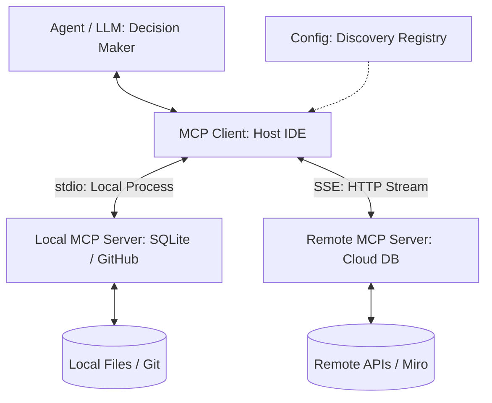
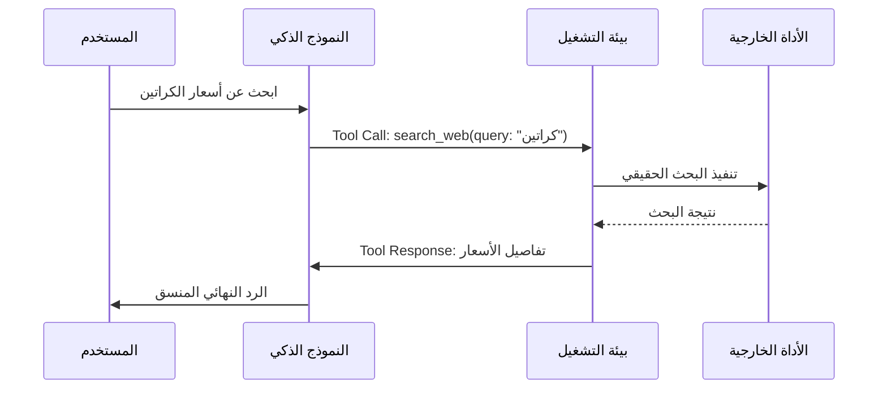
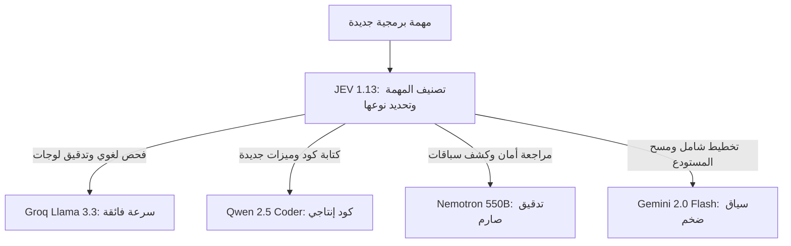

# Modern AI & Agentic Engineering Master Handbook 🤖⚡

> **الغرض**:
> الكتيب المرجعي الشامل لهندسة الذكاء الاصطناعي والأنظمة الوكيلة المستقلة.
> يحتفظ هذا الدليل بكافة المصطلحات التقنية الإنجليزية الأصلية دون تعريب مفتعل أو ترجمات غريبة.
> يشرح المفاهيم وفق منهجيتنا الثلاثية: التشبيه الحياتي البسيط، المعمارية الهندسية، وكود التطبيق والربط الميداني.
> 
> 🌳 شجرة الأسئلة والنقاشات التفاعلية المعمارية:
> [AI_CURRICULUM_QUESTION_TREE.md](AI_CURRICULUM_QUESTION_TREE.md)

---

## 📑 Index & Core Concepts

1. [Model Context Protocol (MCP)](#1-model-context-protocol-mcp)
2. [Agent Harness & Execution Sandbox](#2-agent-harness--execution-sandbox)
3. [Tool Calling & Function Calling](#3-tool-calling--function-calling)
4. [ReAct Loop (Reasoning + Acting)](#4-react-loop-reasoning--acting)
5. [Context Window & Context Compaction](#5-context-window--context-compaction)
6. [Retrieval-Augmented Generation (RAG)](#6-retrieval-augmented-generation-rag)
7. [Subagents & Multi-Agent Orchestration](#7-subagents--multi-agent-orchestration)
8. [System Prompts & Behavioral Steering](#8-system-prompts--behavioral-steering)
9. [Guardrails & Structured Outputs (Evals)](#9-guardrails--structured-outputs-evals)
10. [Human-in-the-Loop (HITL) & Timeboxing](#10-human-in-the-loop-hitl--timeboxing)
11. [Git Worktrees & Workspace Sandboxing](#11-git-worktrees--workspace-sandboxing)
12. [Model Routing Matrix & Compute Cascades](#12-model-routing-matrix--compute-cascades)

---

## 1. Model Context Protocol (MCP)

### التشبيه البسيط
تخيل كابل الشاحن الموحد لكل الموبايلات واللابتوبات:
```text
USB-C
```
زمان كان كل جهاز محتاج كابل وشاحن مخصص ومختلف عن التاني.
الـ
```text
MCP
```
هو نفس الفكرة بالضبط بين الذكاء الاصطناعي ومصادر البيانات:
بدل ما تبرمج كود مخصص عشان يكلم قاعدة بيانات، وكود تاني عشان يكلم ملفات النظام، وكود تالت عشان يكلم جيت هاب؛ البروتوكول بيعمل كابل قياسي موحد يربط النموذج بأي أداة خارجية فوراً.

### المعمارية الهندسية
مبني على معمارية الأركان الأربعة:
```text
The 4-Pillar MCP Architecture:
1. Agent (LLM): محرك الاستنتاج والتفكير واتخاذ القرارات البرمجية.
2. MCP Client (Host): البيئة الحاضنة وتطبيق التطوير (Antigravity IDE, Cursor, Claude Desktop).
3. MCP Config: سجل التكوين والاستكشاف الذي يحدد مسار وأوامر تشغيل كل خدمة.
4. MCP Server: الكود البرمجي التنفيذي المستقل الذي يتصل مباشرة بالأداة أو قاعدة البيانات.
```

- عميل البروتوكول:
```text
MCP Client (Host / IDE / Agent Runtime)
```
هو المسؤول عن:
- قراءة ملف التكوين واكتشاف الخدمات المتاحة.
- تشغيل خوادم البروتوكول عبر وسيلة النقل المناسبة.
- استخراج أسماء الأدوات وحقنها في نافذة سياق النموذج.
- اعتراض طلبات النموذج وتوجيهها للخادم واسترجاع النتائج.

- خادم البروتوكول:
```text
MCP Server (Data Provider / Tool Host)
```
هو خدمة برمجية مستقلة مكتوبة بلغة بايثون أو تايب سكريبت تنفذ المنطق الفعلي لجلب البيانات أو تعديل الموارد.

- وسيلة النقل والتواصل:
```text
Transport Layer:
1. Standard Input / Output (stdio):
   - اتصال محلي بين العمليات على نفس الجهاز (Child Process IPC).
   - الكلاينت يكتب الأوامر في stdin والسيرفر يطبع الردود في stdout.
   - فائق السرعة، أمان محكم، ولا يستهلك شبكة أو بورتات مفتوحة.

2. Server-Sent Events (SSE over HTTP):
   - اتصال شبكي سحابي عبر الإنترنت أو الحاويات المعزولة (Docker).
   - السيرفر يرسل دفق البيانات عبر SSE والكلاينت يرسل الأوامر عبر HTTP POST.
   - مخصص للأدوات البعيدة وقواعد البيانات السحابية المشتركة.
```



### طريقة الربط والتكوين
مثال لربط خادم محلي أو سحابي في ملف الإعدادات:
```json
{
  "mcpServers": {
    "github": {
      "command": "npx",
      "args": ["-y", "@modelcontextprotocol/server-github"],
      "env": {
        "GITHUB_PERSONAL_ACCESS_TOKEN": "ghp_xxxxxxxxxxxx"
      }
    },
    "sqlite": {
      "command": "uvx",
      "args": ["mcp-server-sqlite", "--db-path", "./production.db"]
    }
  }
}
```

### التطبيق الميداني في مساحة العمل
في مساحة عملك، بنستخدم البروتوكول ده للربط المباشر مع:
- مستودع جيت هاب الرسمي لإدارة القضايا والمهام.
- لوحة التخطيط البصري ومخططات المعمارية:
```text
Miro MCP Server
```
- فحص قواعد البيانات دون الحاجة لكتابة سكربت وسيط في كل مرة.

---

## 2. Agent Harness & Execution Sandbox

### التشبيه البسيط
تخيل قفص الأمان وحزام الأمان لسيارة سباق، مع مخرج مسرح ماسك مفاتيح الصوت:
العربية سريعة جداً وقوية، لكن لو سبتها تسوق بدون حلبة ومطبات أمان ومكابح طوارئ هتعمل حادثة.
والممثل على المسرح لو فضل يكرر نفس الجملة في مشهد، المخرج يقدر يقفل المايك ويسدل الستارة في ثانية.
الـ
```text
Agent Harness
```
هو الحلبة وحزام الأمان ومفاتيح التحكم اللي بيتحكم في تشغيل الوكيل الذكي، ويحدد له حدوده ويمنعه من التوهان أو تخريب النظام.

### المعمارية الهندسية وموقع الهارنيس
الهارنيس يعيش حصرياً في طبقة المضيف:
```text
Host Runtime / MCP Client
```
ولا يعيش داخل أوزان النموذج:
```text
LLM Weights
```
النموذج في أصله هو دالة رياضية عديمة الحالة:
```text
Stateless Function: P(Token | Context)
```
الموديل لا ينفذ كود في العالم الحقيقي بنفسه، بل يولد نصوصاً تطلب استدعاء الأدوات، بينما يتولى المضيف تشغيل الأدوات وحقن السياق وقطع البث.

### ركائز الهارنيس الخمس لمنع الهلوسة والنسيان
لبناء هارنيس صناعي صلب يمنع دوران الوكيل في حلقات مفرغة، نعتمد خمس ركائز:

1. **آلة الحالة الخارجية**:
```text
External State Machine (Append-only DAG)
```
تسجيل خطوات تفكير الوكيل كشجرة أحداث متتالية غير قابلة للتعديل خارج نافذة السياق، بحيث إذا حدث انضغاط للذاكرة يظل مسار العمل محفوظاً في قاعدة بيانات أو ملف حالة دائم.

2. **تقليم وتلخيص مخرجات الأدوات**:
```text
Tool Output Truncation & Summarization
```
منع إغراق نافذة السياق بآلاف الأسطر من مخرجات الأوامر التي تفقد النموذج تركيزه وتجعله يهلوس، واقتصار الإدخال على ملخصات دقيقة وأول مائة سطر فقط.

3. **اعتراض وتدقيق المخططات البرمجية**:
```text
Zod Schema Interception (Type Safety)
```
فحص معاملات استدعاء الدوال والتأكد من مطابقة الأنواع برمجياً في المضيف قبل تمريرها لأي أداة أو قاعدة بيانات.

4. **بوابة التحقق الصارمة بالأدلة**:
```text
Terminal Verification Gate (Evidence-based Truth)
```
إلزام الوكيل بتقديم أدلة قطعية من مخرجات الطرفية أو أجنحة الاختبارات قبل إعلان نجاح أي مهمة، ومنع الاعتماد على الافتراض النظري.

5. **قاطع الدائرة والحد الزمني الصارم**:
```text
Circuit Breaker (15-20 Min Cap & Task Debt)
```
منع استنزاف الموارد بفرض حد أقصى للتعامل مع أي مشكلة برمجية، وقطع المهمة تلقائياً وترحيلها كدين مؤجل عند تجاوز الوقت المحدد.

### الحسم المعماري: كيف يكسر المضيف الحلقات التكرارية للموديل؟
الموديل قد يدخل في حلقة تكرارية بسبب تراكم النصوص الفاشلة في نافذة السياق، مما يرفع احتمالية تكرار نفس التوكنز رياضياً.
يمتلك المضيف أربعة أسلحة حاسمة للسيطرة التامة:
- **قطع البث التوليدي الفوري**:
```text
AbortController.abort()
```
- **حجب تنفيذ الأداة عند التكرار**:
```text
Short-Circuit Execution & Tool Denial
```
- **تطهير السياق وتدمير الحوض الاحتمالي**:
```text
Context Eviction & History Pruning
```
- **إنهاء العملية بالكامل وتسجيلها كدين هندسي**:
```text
Process Termination & Task Debt Logging
```

### التطبيق الميداني في مساحة العمل
نطبق هذه المعمارية في مساحة عملك عبر:
- مهارة ضبط المهام والحدود الزمنية:
```text
.agents/skills/autonomous-task-orchestrator/SKILL.md
```
- دستور العمليات وقواعد التحقق الإلزامية:
```text
AGENTS.md
```

---

## 3. Tool Calling & Function Calling

### التشبيه البسيط
لما عميل يدخل محلك ويسألك عن سعر فازة ويطلب فاتورة:
عقلك بيعرف الحسبة، بس إيدك هي اللي بتمسك القلم والدفتر (الأداة) وتكتب الفاتورة.
الذكاء الاصطناعي لوحده هو مجرد عقل بيكتب كلام؛ هو بنفسه مبيعرفش يمسح ملف أو يبعت إيميل.
عشان يعمل كده، بيطلب استخدام أداة، والنظام الخارجي هو اللي بينفذ المهمة فعلياً ويرجع له النتيجة.

### المعمارية الهندسية
النموذج لا ينفذ الأكواد بنفسه، بل يتبع الخطوات الآتية:
1. يقدم المطور مواصفات الأداة بمخطط بيانات قياسي:
```text
JSON Schema
```
2. يقرأ النموذج السؤال ويقرر استدعاء الأداة.
3. يصدر النموذج كائناً يحتوي على اسم الأداة والمدخلات.
4. تلتقط بيئة التشغيل الطلب وتنفذ الكود على الجهاز.
5. تعيد بيئة التشغيل النتيجة للنموذج ليفهم ما حدث ويواصل التفكير.



### مثال عملي لمخطط تعريف الأداة
```json
{
  "name": "calculate_carton_capacity",
  "description": "Calculates how many small boxes fit inside a master carton.",
  "parameters": {
    "type": "object",
    "properties": {
      "master_dimensions": {
        "type": "array",
        "items": { "type": "number" },
        "description": "[length, width, height] in cm"
      },
      "box_dimensions": {
        "type": "array",
        "items": { "type": "number" },
        "description": "[length, width, height] in cm"
      }
    },
    "required": ["master_dimensions", "box_dimensions"]
  }
}
```

---

## 4. ReAct Loop (Reasoning + Acting)

### التشبيه البسيط
طريقة شغل الصنايعي الشاطر لما يفك حنفية بتبوظ:
1. يبص على الحنفية ويلاحظ مكان التسريب (ملاحظة).
2. يفكر في دماغه: التسريب غالباً من الجلدة (تفكير).
3. يمسك المفتاح ويفك الصامولة (تصرف).
4. يبص تاني يشوف الجلدة فعلاً مقطوعة ولا سليمة (ملاحظة جديدة).
5. يكرر الخطوات لحد ما المشكلة تتحل نهائياً.

### المعمارية الهندسية
حلقة مستمرة تتكون من أربع محطات تدور حتى الوصول للحل:
```text
1. Thought (الاستنتاج والتخطيط العقلي)
2. Action (اختيار الأداة والمدخلات)
3. Observation (استلام نتيجة تشغيل الأداة)
4. Synthesis (دمج النتيجة واتخاذ القرار التالي)
```

```text
While Task Not Done:
    Context = Current History + Last Observation
    Thought, Action = Model.Generate(Context)
    Observation = Execute(Action)
    Append to History
```

---

## 5. Context Window & Context Compaction

### التشبيه البسيط
سبورة الفصل في المدرسة:
مساحتها محددة بـ 100 سطر مثلاً.
لو المدرس فضل يشرح ويكتب على السبورة، هتيجي لحظة السبورة تتملي على آخرها ومش هيعرف يكتب حرف زيادة.
الحل إيه؟
المدرس يقف، يمسح الشرح القديم الطويل، ويكتب في أول سطرين ملخص سريع لأهم القوانين (ضغط الذاكرة)، وبعدها يكمل كتابة المسائل الجديدة.

### المعمارية الهندسية
- كل نموذج له حد أقصى من الرموز يمكنه قراءتها في المرة الواحدة:
```text
Token Limit (e.g. 128k, 1M Tokens)
```
- ظاهرة فقدان التركيز في المنتصف:
```text
Lost in the Middle Effect
```
عندما تمتلئ نافذة السياق بمعلومات ضخمة، يقل تركيز النموذج على التفاصيل الموجودة في منتصف المحادثة مقارنة بأولها وآخرها.

- آليات ضغط الذاكرة الحديثة:
1. النافذة المنزلقة:
```text
Sliding Window Context
```
2. التلخيص التكراري التلقائي:
```text
Recursive Summarization
```
3. ضغط السجلات وتفريغ المخرجات الضخمة:
```text
Log Compaction & Truncation
```

---

## 6. Retrieval-Augmented Generation (RAG)

### التشبيه البسيط
طالب داخل امتحان بنظام الكتاب المفتوح:
بدل ما يحفظ في دماغه كتاب القانون اللي حجمه 2000 صفحة، أول ما بيشوف السؤال بيبص في الفهرس، يفتح الصفحتين اللي فيهم المادة القانونية المطلوبة، ويجاوب منها بالمللي.
بدل ما تطلب من الذكاء يحفظ كل ملفات شركتك في تدريبه، بتعمل له فهرس ذكي يسحب الصفحات المناسبة للسؤال بس ويحطها قدامه.

### المعمارية الهندسية


### المصطلحات التقنية المرتبطة
- تحويل النصوص لأرقام متجهة:
```text
Embeddings (High-Dimensional Numerical Vectors)
```
- قواعد البيانات المتخصصة:
```text
Vector Databases (Pinecone, Chroma, pgvector)
```
- مقياس التشابه الزاوي:
```text
Cosine Similarity & Semantic Distance
```

---

## 7. Subagents & Multi-Agent Orchestration

### التشبيه البسيط
مقاول البناء ورجالته في الموقع:
المقاول الكبير مبيشتغلش كل حاجة بإيده.
هو بيستلم الرسمة الهندسية ويقسم الشغل:
- يبعت النجار يعمل الخشب المسلح.
- يبعت السباك يركب مواسير الصرف.
- يبعت الحداد يجهز الحديد.
ولما كل واحد يخلص شغله، المقاول بيستلم منهم ويراجع الشغل بنفسه قبل ما يسلم لصاحب العمارة.

### المعمارية الهندسية
توزيع معقد للمهام يعتمد على:
1. الوكيل الرئيسي أو المشرف:
```text
Lead Orchestrator (Supervisor)
```
2. الوكلاء المتخصصون في مهام فردية:
```text
Domain-Specific Subagents (e.g. Coder, Tester, Reviewer)
```
3. عزل الذاكرة وسياق العمل:
```text
Context Isolation
```
الوكيل الفرعي لا يحمل تاريخ المحادثة الكامل، بل يحصل فقط على المهمة المحددة له لحماية نافذة السياق من التضخم.

4. بوابة المراجعة والاعتماد:
```text
Two-Stage Code Review Gate
```

---

## 8. System Prompts & Behavioral Steering

### التشبيه البسيط
لائحة العمل الداخلية المعلقة على حيطة أي شركة:
مكتوب فيها: المواعيد، الزي الرسمي، طريقة التعامل مع الزباين، وممنوعات العمل.
كل موظف شغال لازم دماغه تفضل واعية باللائحة دي في كل لحظة وبيتحاسب عليها.
دستور النظام هو اللائحة الأساسية اللي بتحدد هوية النموذج، ونبرة صوته، والقواعد الصارمة اللي مستحيل يخالفها.

### المعمارية الهندسية
تقسيم الأدوار الصريح داخل واجهات النماذج:
- رسالة التوجيه العليا:
```text
System Role (Directives, Persona, Hard Constraints)
```
- رسالة المستخدم:
```text
User Role (The dynamic prompt / task)
```
- رسالة المساعد:
```text
Assistant Role (Model output history)
```
- رسالة الأداة:
```text
Tool Role (Execution result returned to model)
```

### مثال من دستور مساحة العمل
قاعدة التنسيق الصارمة لمنع خلط اللغات في سطر واحد:
```text
Hard Constraint:
Every single line must be either 100% Arabic or 100% English.
Never mix English words inside an Arabic sentence.
```

---

## 9. Guardrails & Structured Outputs (Evals)

### التشبيه البسيط
مصفاة العصير وميزان الذهب:
مهما كان اللي طالع من الخلاط شكله عصير، لازم يعدي على مصفاة تحجز أي شوائب أو بذور.
حواجز الأمان هي فلاتر وشبكات فحص تفحص رد الذكاء الاصطناعي برمجياً قبل ما يخرج للشاشة، وتتأكد إنه مطابق لمواصفات الأمان ومافيهوش كلام خطر أو تخريف.

### المعمارية الهندسية
1. فرض الهيكل البرمجي الصارم:
```text
Structured Outputs (JSON Schema / Zod / Pydantic)
```
إجبار النموذج على إنتاج بيانات تطابق نوعاً برمجياً محدداً بنسبة 100%.

2. كشف ومنع الهلوسة:
```text
Hallucination Mitigation & Grounding
```
مقارنة رد النموذج بمصادر الحقيقة الميدانية، ورفض أي رد بدون أدلة.

3. حلقة التصحيح الذاتي التلقائي:
```text
Self-Correction Loop
```
إذا فشل الإخراج في اجتياز الفحص، يتم إعادة رسالة الخطأ للنموذج ليصلح مخرجاته فوراً.

---

## 10. Human-in-the-Loop (HITL) & Timeboxing

### التشبيه البسيط
زرار فرامل الطوارئ في قطار المترو السريع:
القطار شغال بنظام تحكم آلي وسريع جداً، لكن لو ظهر أي خطر مفاجئ أو تعديل على مسار السكة الحديد، النظام بيقف ويطلب تأكيد يدوي من السائق قبل ما يكمل.
الوكيل يشتغل بحرية في القراءة والتحليل، لكن الأوامر الخطيرة (زي مسح داتابيز، دفع فلوس، أو رفع كود للإنتاج) مستحيل تتنفذ بدون موافقة صريحة منك.

### المعمارية الهندسية
- بوابات الموافقة للأوامر الحساسة:
```text
Approval Gates for Destructive Actions:
- File Deletions / Drop Tables
- Git Force Push / Production Deployment
- Payment & Commercial Orders
```
- السقف الزمني الحازم لتصحيح الأخطاء:
```text
15-20 Min Debugging Cap
```
منع النموذج من الدخول في دوامة تجارب فاشلة مستمرة بدون تدخل المعمار الحقيقي.

- بروتوكول ترحيل ديون المهام:
```text
Task Debt Protocol
```
المهمة غير المكتملة لا تختفي، بل ترحل كدين تشغيلي للبلوك القادم لمراجعة أسباب التأخير.

---

## 11. Git Worktrees & Workspace Sandboxing

### التشبيه البسيط
غرفة العمليات المعقمة المستقلة في المستشفى:
الجراح بيعمل العملية في غرفة معزولة تماماً عن ممرات المستشفى وعن باقي المرضى، وبعد ما يطهر كل حاجة ويتأكد من نجاح العملية، بينقل المريض للقسم العام.
الوكيل لما يشتغل على ميزة جديدة، بياخد نسخة معزولة بالكامل من الكود في مجلد منفصل عشان الكود الرئيسي يفضل شغال ونظيف وميتأثرش بأي تجارب وسيطة.

### المعمارية الهندسية
تقنية التفرع المتقدمة في جيت:
```text
git worktree add ../feature-branch feature-branch
```
- كل وكيل يعمل في مجلد مستقل بملفاته الخاصة.
- إمكانية تشغيل أكثر من وكيل في نفس الثانية على نفس المستودع دون أي تعارض في الملفات.
- بعد انتهاء المهمة بنجاح، يتم دمج الفرع وحذف مجلد العمل المعزول بسلاسة.

---

## 12. Model Routing Matrix & Compute Cascades

### التشبيه البسيط
توزيع أسطول النقل في بيزنس المحل:
- لو عندك طرد صغير وخفيف عاوز توصله مشوار قريب في نفس الشارع: بتبعت الصبي بالعجلة أو توك توك سريع ورخيص ومش بيستهلك بنزين.
- لو عندك شحنة كراتين كبيرة رايحة مستودع أمازون في العاشر من رمضان: بتطلب عربية نقل كبيرة ومجهزة.
توجيه النماذج يعني متستخدمش نموذج ذكاء ضخم ومكلف في مهمة بسيطة، بل توجه كل مهمة للموديل الأنسب ليها في السرعة والتكلفة.

### المعمارية الهندسية
نظام التوجيه المعتمد في مساحة عملك للنماذج المجانية السبعة:

```text
The 7-Model Free Compute Matrix:
1. JEV 1.13: فرز وتصنيف المهام وتحديد التبعيات بتكلفة صفرية.
2. Groq Llama 3.3 70B: الفحص اللغوي اللحظي وتدقيق نصوص الأوامر في أجزاء من الثانية.
3. Mistral Codestral: كتابة الاختبارات الفاشلة وتطبيق نمط التطوير الموجه بالاختبارات.
4. Qwen 2.5 Coder 32B: كتابة أكواد الفول ستاك والتايب سكريبت والرياكت الثقيلة.
5. MiniMax-01: قراءة الملفات الضخمة وصياغة خطط التنفيذ بفضل نافذة المليون رمز.
6. NVIDIA Nemotron 550B: التدقيق المعماري، كشف الثغرات، ومراجعة أخطاء التزامن.
7. Google Gemini 2.0 Flash: المسح الشامل للمستودع وإدارة أوركسترا الوكلاء كقائد أعلى.
```



---

> 💡 **دستور الاعتماد المعماري**:
> هذا الكتيب هو المرجع الدائم لاختباراتك ومقابلاتك التقنية. 
> كل مصطلح هنا يجب أن تستخدمه بصيغته الإنجليزية المعتمدة في السوق الدولي، مع فهم كامل لعمقه الهندسي وتطبيقه العملي.
