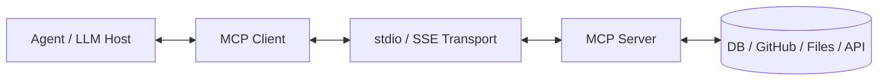
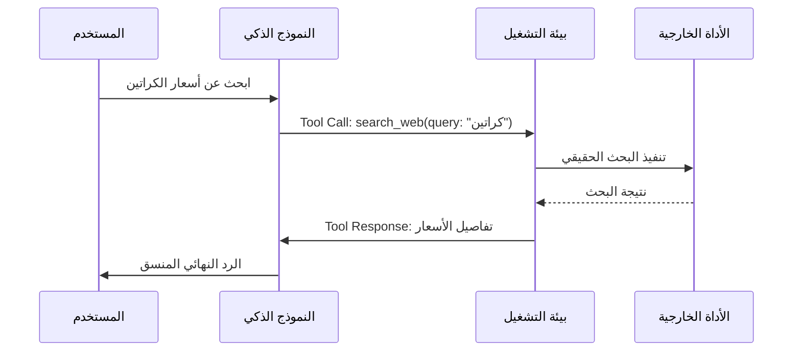
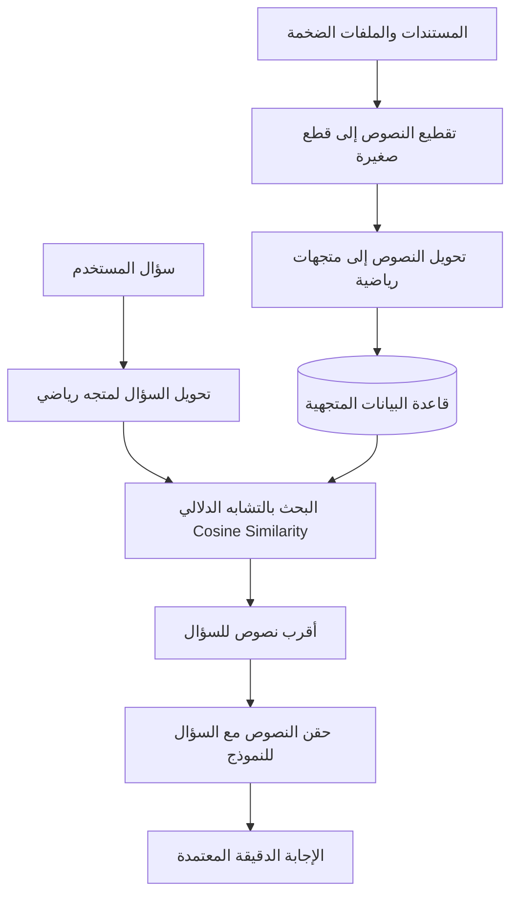
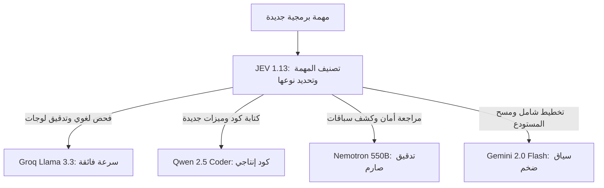

# Modern AI & Agentic Engineering Master Handbook 🤖⚡

> **الغرض**:
> الكتيب المرجعي الشامل لهندسة الذكاء الاصطناعي والأنظمة الوكيلة المستقلة.
> يشرح هذا الدليل كافة المفاهيم الحديثة من الصفر وحتى المعمارية الإنتاجية المتقدمة وفق منهجية الخطوات الثلاث:
> التشبيه الحياتي البسيط، المعمارية الهندسية، وكيفية التطبيق والربط الميداني بالأكواد.

---

## 📑 فهرس المفاهيم والأنظمة الوكيلة

1. [بروتوكول سياق النماذج الموحد](#1-بروتوكول-سياق-النماذج-الموحد)
2. [حواضن ومنصات تشغيل الوكلاء](#2-حواضن-ومنصات-تشغيل-الوكلاء)
3. [استدعاء الأدوات والدوال البرمجية](#3-استدعاء-الأدوات-والدوال-البرمجية)
4. [حلقة التفكير والتصرف الذاتي](#4-حلقة-التفكير-والتصرف-الذاتي)
5. [نافذة السياق وضغط الذاكرة](#5-نافذة-السياق-وضغط-الذاكرة)
6. [التوليد المعزز بالاسترجاع الدلالي](#6-التوليد-المعزز-بالاسترجاع-الدلالي)
7. [الوكلاء الفرعيون وتوزيع المهام](#7-الوكلاء-الفرعيون-وتوزيع-المهام)
8. [دساتير النظام وتوجيه السلوك](#8-دساتير-النظام-وتوجيه-السلوك)
9. [حواجز الأمان وفحص النتائج المخرجة](#9-حواجز-الأمان-وفحص-النتائج-المخرجة)
10. [التدخل البشري والمهام المؤطرة زمنياً](#10-التدخل-البشري-والمهام-المؤطرة-زمنياً)
11. [عزل مساحات العمل والتفرع الآمن](#11-عزل-مساحات-العمل-والتفرع-الآمن)
12. [مصفوفة توجيه النماذج والشلال الحسابي](#12-مصفوفة-توجيه-النماذج-والشلال-الحسابي)

---

## 1. بروتوكول سياق النماذج الموحد

### المفهوم التقني
```text
Model Context Protocol (MCP)
```

### التشبيه البسيط
تخيل كابل الشاحن الموحد لكل الموبايلات واللابتوبات:
```text
USB-C
```
زمان كان كل جهاز محتاج كابل وشاحن مخصص ومختلف عن التاني.
البروتوكول ده هو نفس الفكرة بالضبط لكن بين الذكاء الاصطناعي ومصادر البيانات:
بدل ما تبرمج كود مخصص عشان يكلم قاعدة بيانات، وكود تاني عشان يكلم ملفات النظام، وكود تالت عشان يكلم جيت هاب؛ البروتوكول بيعمل كابل قياسي موحد يربط النموذج بأي أداة خارجية فوراً.

### المعمارية الهندسية
البروتوكول مبني على معمارية العميل والخادم:
```text
Client-Server Architecture
```
- عميل البروتوكول:
```text
MCP Client (Host / IDE / Agent Runtime)
```
- خادم البروتوكول:
```text
MCP Server (Data Provider / Tool Host)
```
- وسيلة النقل والتواصل:
```text
Transport Layer:
1. Standard Input / Output (stdio) - Local Process
2. Server-Sent Events (SSE) - HTTP / Remote
```



### طريقة الربط والتكوين
مثال لربط خادم محلي أو سحابي في ملف الإعدادات:
```json
{
  "mcpServers": {
    "github": {
      "command": "npx",
      "args": ["-y", "@modelcontextprotocol/server-github"],
      "env": {
        "GITHUB_PERSONAL_ACCESS_TOKEN": "ghp_xxxxxxxxxxxx"
      }
    },
    "sqlite": {
      "command": "uvx",
      "args": ["mcp-server-sqlite", "--db-path", "./production.db"]
    }
  }
}
```

### التطبيق الميداني في مساحة العمل
في مساحة عملك، بنستخدم البروتوكول ده للربط المباشر مع:
- مستودع جيت هاب الرسمي لإدارة القضايا والمهام.
- لوحة التخطيط البصري ومخططات المعمارية:
```text
Miro MCP Server
```
- فحص قواعد البيانات دون الحاجة لكتابة سكربت وسيط في كل مرة.

---

## 2. حواضن ومنصات تشغيل الوكلاء

### المفهوم التقني
```text
Agent Execution Harness & Sandbox
```

### التشبيه البسيط
تخيل قفص الأمان وحزام الأمان لسيارة السباق:
العربية سريعة جداً وقوية، لكن لو سبتها تسوق في الشارع بدون حلبة سباق محددة وعلامات طريق ومطبات أمان، هتعمل حادثة وتخبط في الناس.
الحاضنة هي الحلبة وحزام الأمان اللي بيتحكم في سرعة الوكيل الذكي، ويحدد له الأماكن المسموح يروحها ويمنعه من تخريب أي شيء خارجها.

### المعمارية الهندسية
الحاضنة هي الإطار البرمجي الخارجي الذي يحيط بالنموذج ويدير دورة حياته:
- حقن سياق العمل والملفات المطلوبة في الذاكرة.
- التحكم الصارم في الأدوات المسموح بتشغيلها.
- تسجيل كافة المدخلات والمخرجات في سجل تدقيق دائم.
- فرض حدود زمنية وميزانية لاستهلاك الذاكرة والرموز.

```text
Harness Responsibilities:
1. State Management & Memory Injection
2. Tool Gatekeeping & Security Sandbox
3. Timeout & Task Debt Governance
4. Evaluation & Behavioral Verification
```

### الفرق بين حاضنة الاختبار وحاضنة الوكيل
- حاضنة الاختبار:
```text
Test Harness
```
بيئة عزل لتشغيل اختبارات الكود دون لمس قاعدة بيانات الإنتاج أو إجراء عمليات دفع مالية حقيقية.

- حاضنة تشغيل الوكيل:
```text
Agent Harness
```
البيئة التي تدير حلقة تفكير الوكيل وتستقبل طلباته وتنفذ أوامره بأمان.

---

## 3. استدعاء الأدوات والدوال البرمجية

### المفهوم التقني
```text
Tool Calling & Function Calling
```

### التشبيه البسيط
لما عميل يدخل محلك ويسألك عن سعر فازة ويطلب فاتورة:
عقلك بيعرف الحسبة، بس إيدك هي اللي بتمسك القلم والدفتر (الأداة) وتكتب الفاتورة.
الذكاء الاصطناعي لوحده هو مجرد عقل بيكتب كلام؛ هو بنفسه مبيعرفش يمسح ملف أو يبعت إيميل.
عشان يعمل كده، بيطلب استخدام أداة، والنظام الخارجي هو اللي بينفذ المهمة فعلياً ويرجع له النتيجة.

### المعمارية الهندسية
النموذج لا ينفذ الأكواد بنفسه، بل يتبع الخطوات الآتية:
1. يقدم المطور مواصفات الأداة بمخطط بيانات قياسي:
```text
JSON Schema
```
2. يقرأ النموذج السؤال ويقرر استدعاء الأداة.
3. يصدر النموذج كائناً يحتوي على اسم الأداة والمدخلات.
4. تلتقط الحاضنة الطلب وتنفذ الكود على الجهاز.
5. تعيد الحاضنة النتيجة للنموذج ليفهم ما حدث ويواصل التفكير.



### مثال عملي لمخطط تعريف الأداة
```json
{
  "name": "calculate_carton_capacity",
  "description": "Calculates how many small boxes fit inside a master carton.",
  "parameters": {
    "type": "object",
    "properties": {
      "master_dimensions": {
        "type": "array",
        "items": { "type": "number" },
        "description": "[length, width, height] in cm"
      },
      "box_dimensions": {
        "type": "array",
        "items": { "type": "number" },
        "description": "[length, width, height] in cm"
      }
    },
    "required": ["master_dimensions", "box_dimensions"]
  }
}
```

---

## 4. حلقة التفكير والتصرف الذاتي

### المفهوم التقني
```text
ReAct Loop (Reasoning + Acting)
```

### التشبيه البسيط
طريقة شغل الصنايعي الشاطر لما يفك حنفية بتبوظ:
1. يبص على الحنفية ويلاحظ مكان التسريب (ملاحظة).
2. يفكر في دماغه: التسريب غالباً من الجلدة (تفكير).
3. يمسك المفتاح ويفك الصامولة (تصرف).
4. يبص تاني يشوف الجلدة فعلاً مقطوعة ولا سليمة (ملاحظة جديدة).
5. يكرر الخطوات لحد ما المشكلة تتحل نهائياً.

### المعمارية الهندسية
حلقة مستمرة تتكون من أربع محطات تدور حتى الوصول للحل:
```text
1. Thought (الاستنتاج والتخطيط العقلي)
2. Action (اختيار الأداة والمدخلات)
3. Observation (استلام نتيجة تشغيل الأداة)
4. Synthesis (دمج النتيجة واتخاذ القرار التالي)
```

```text
While Task Not Done:
    Context = Current History + Last Observation
    Thought, Action = Model.Generate(Context)
    Observation = Execute(Action)
    Append to History
```

---

## 5. نافذة السياق وضغط الذاكرة

### المفهوم التقني
```text
Context Window & Context Compaction
```

### التشبيه البسيط
سبورة الفصل في المدرسة:
مساحتها محددة بـ 100 سطر مثلاً.
لو المدرس فضل يشرح ويكتب على السبورة، هتيجي لحظة السبورة تتملي على آخرها ومش هيعرف يكتب حرف زيادة.
الحل إيه؟
المدرس يقف، يمسح الشرح القديم الطويل، ويكتب في أول سطرين ملخص سريع لأهم القوانين (ضغط الذاكرة)، وبعدها يكمل كتابة المسائل الجديدة.

### المعمارية الهندسية
- كل نموذج له حد أقصى من الرموز يمكنه قراءتها في المرة الواحدة:
```text
Token Limit (e.g. 128k, 1M Tokens)
```
- ظاهرة فقدان التركيز في المنتصف:
```text
Lost in the Middle Effect
```
عندما تمتلئ نافذة السياق بمعلومات ضخمة، يقل تركيز النموذج على التفاصيل الموجودة في منتصف المحادثة مقارنة بأولها وآخرها.

- آليات ضغط الذاكرة الحديثة:
1. النافذة المنزلقة:
```text
Sliding Window Context
```
2. التلخيص التكراري التلقائي:
```text
Recursive Summarization
```
3. ضغط السجلات وتفريغ المخرجات الضخمة:
```text
Log Compaction & Truncation
```

---

## 6. التوليد المعزز بالاسترجاع الدلالي

### المفهوم التقني
```text
Retrieval-Augmented Generation (RAG)
```

### التشبيه البسيط
طالب داخل امتحان بنظام الكتاب المفتوح:
بدل ما يحفظ في دماغه كتاب القانون اللي حجمه 2000 صفحة، أول ما بيشوف السؤال بيبص في الفهرس، يفتح الصفحتين اللي فيهم المادة القانونية المطلوبة، ويجاوب منها بالمللي.
بدل ما تطلب من الذكاء يحفظ كل ملفات شركتك في تدريبه، بتعمل له فهرس ذكي يسحب الصفحات المناسبة للسؤال بس ويحطها قدامه.

### المعمارية الهندسية


### المصطلحات المرتبطة بالمفهوم
- المتجهات الرياضية:
```text
Embeddings (High-Dimensional Numerical Vectors)
```
- قواعد البيانات المتجهية:
```text
Vector Databases (Pinecone, Chroma, pgvector)
```
- التشابه الدلالي الرياضي:
```text
Cosine Similarity & Semantic Distance
```

---

## 7. الوكلاء الفرعيون وتوزيع المهام

### المفهوم التقني
```text
Subagents & Multi-Agent Orchestration
```

### التشبيه البسيط
مقاول البناء ورجالته في الموقع:
المقاول الكبير مبيشتغلش كل حاجة بإيده.
هو بيستلم الرسمة الهندسية ويقسم الشغل:
- يبعت النجار يعمل الخشب المسلح.
- يبعت السباك يركب مواسير الصرف.
- يبعت الحداد يجهز الحديد.
ولما كل واحد يخلص شغله، المقاول بيستلم منهم ويراجع الشغل بنفسه قبل ما يسلم لصاحب العمارة.

### المعمارية الهندسية
توزيع معقد للمهام يعتمد على:
1. الوكيل الرئيسي أو الموجه:
```text
Lead Orchestrator (Supervisor)
```
2. الوكلاء المتخصصون:
```text
Domain-Specific Subagents (e.g. Coder, Tester, Reviewer)
```
3. عزل الذاكرة وسياق العمل:
```text
Context Isolation
```
الوكيل الفرعي لا يحمل تاريخ المحادثة الكامل، بل يحصل فقط على المهمة المحددة له لحماية نافذة السياق من التضخم.

4. بوابة المراجعة والاعتماد:
```text
Two-Stage Code Review Gate
```

---

## 8. دساتير النظام وتوجيه السلوك

### المفهوم التقني
```text
System Prompts & Behavioral Steering
```

### التشبيه البسيط
لائحة العمل الداخلية المعلقة على حيطة أي شركة:
مكتوب فيها: المواعيد، الزي الرسمي، طريقة التعامل مع الزباين، وممنوعات العمل.
كل موظف شغال لازم دماغه تفضل واعية باللائحة دي في كل لحظة وبيتحاسب عليها.
دستور النظام هو اللائحة الأساسية اللي بتحدد هوية النموذج، ونبرة صوته، والقواعد الصارمة اللي مستحيل يخالفها.

### المعمارية الهندسية
تقسيم الأدوار الصريح داخل واجهات النماذج:
- رسالة النظام:
```text
System Role (Directives, Persona, Hard Constraints)
```
- رسالة المستخدم:
```text
User Role (The dynamic prompt / task)
```
- رسالة المساعد:
```text
Assistant Role (Model output history)
```
- رسالة الأداة:
```text
Tool Role (Execution result returned to model)
```

### مثال من دستور مساحة العمل
قاعدة التنسيق الصارمة لمنع خلط اللغات في سطر واحد:
```text
Hard Constraint:
Every single line must be either 100% Arabic or 100% English.
Never mix English words inside an Arabic sentence.
```

---

## 9. حواجز الأمان وفحص النتائج المخرجة

### المفهوم التقني
```text
Guardrails & Structured Output Evaluation
```

### التشبيه البسيط
مصفاة العصير وميزان الذهب:
مهما كان اللي طالع من الخلاط شكله عصير، لازم يعدي على مصفاة تحجز أي شوائب أو بذور.
حواجز الأمان هي فلاتر وشبكات فحص تفحص رد الذكاء الاصطناعي برمجياً قبل ما يخرج للشاشة، وتتأكد إنه مطابق لمواصفات الأمان ومافيهوش كلام خطر أو تخريف.

### المعمارية الهندسية
1. فرض الهيكل البرمجي الصارم:
```text
Structured Outputs (JSON Schema / Zod / Pydantic)
```
إجبار النموذج على إنتاج بيانات تطابق نوعاً برمجياً محدداً بنسبة 100%.

2. كشف ومنع الهلوسة:
```text
Hallucination Mitigation & Grounding
```
مقارنة رد النموذج بمصادر الحقيقة الميدانية، ورفض أي رد بدون أدلة.

3. حلقة التصحيح الذاتي التلقائي:
```text
Self-Correction Loop
```
إذا فشل الإخراج في اجتياز الفحص، يتم إعادة رسالة الخطأ للنموذج ليصلح مخرجاته فوراً.

---

## 10. التدخل البشري والمهام المؤطرة زمنياً

### المفهوم التقني
```text
Human-in-the-Loop (HITL) & Timeboxed Execution
```

### التشبيه البسيط
زرار فرامل الطوارئ في قطار المترو السريع:
القطار شغال بنظام تحكم آلي وسريع جداً، لكن لو ظهر أي خطر مفاجئ أو تعديل على مسار السكة الحديد، النظام بيقف ويطلب تأكيد يدوي من السائق قبل ما يكمل.
الوكيل يشتغل بحرية في القراءة والتحليل، لكن الأوامر الخطيرة (زي مسح داتابيز، دفع فلوس، أو رفع كود للإنتاج) مستحيل تتنفذ بدون موافقة صريحة منك.

### المعمارية الهندسية
- بوابات الموافقة للأوامر الحساسة:
```text
Approval Gates for Destructive Actions:
- File Deletions / Drop Tables
- Git Force Push / Production Deployment
- Payment & Commercial Orders
```
- السقف الزمني الحازم لتصحيح الأخطاء:
```text
15-20 Min Debugging Cap
```
منع النموذج من الدخول في دوامة تجارب فاشلة مستمرة بدون تدخل المعمار الحقيقي.

- بروتوكول ترحيل ديون المهام:
```text
Task Debt Protocol
```
المهمة غير المكتملة لا تختفي، بل ترحل كدين تشغيلي للبلوك القادم لمراجعة أسباب التأخير.

---

## 11. عزل مساحات العمل والتفرع الآمن

### المفهوم التقني
```text
Git Worktrees & Workspace Sandboxing
```

### التشبيه البسيط
غرفة العمليات المعقمة المستقلة في المستشفى:
الجراح بيعمل العملية في غرفة معزولة تماماً عن ممرات المستشفى وعن باقي المرضى، وبعد ما يطهر كل حاجة ويتأكد من نجاح العملية، بينقل المريض للقسم العام.
الوكيل لما يشتغل على ميزة جديدة، بياخد نسخة معزولة بالكامل من الكود في مجلد منفصل عشان الكود الرئيسي يفضل شغال ونظيف وميتأثرش بأي تجارب وسيطة.

### المعمارية الهندسية
تقنية التفرع المتقدمة في جيت:
```text
git worktree add ../feature-branch feature-branch
```
- كل وكيل يعمل في مجلد مستقل بملفاته الخاصة.
- إمكانية تشغيل أكثر من وكيل في نفس الثانية على نفس المستودع دون أي تعارض في الملفات.
- بعد انتهاء المهمة بنجاح، يتم دمج الفرع وحذف مجلد العمل المعزول بسلاسة.

---

## 12. مصفوفة توجيه النماذج والشلال الحسابي

### المفهوم التقني
```text
Model Routing Matrix & Compute Cascades
```

### التشبيه البسيط
توزيع أسطول النقل في بيزنس المحل:
- لو عندك طرد صغير وخفيف عاوز توصله مشوار قريب في نفس الشارع: بتبعت الصبي بالعجلة أو توك توك سريع ورخيص ومش بيستهلك بنزين.
- لو عندك شحنة كراتين كبيرة رايحة مستودع أمازون في العاشر من رمضان: بتطلب عربية نقل كبيرة ومجهزة.
توجيه النماذج يعني متستخدمش نموذج ذكاء ضخم ومكلف في مهمة بسيطة، بل توجه كل مهمة للموديل الأنسب ليها في السرعة والتكلفة.

### المعمارية الهندسية
نظام التوجيه المعتمد في مساحة عملك للنماذج المجانية السبعة:

```text
The 7-Model Free Compute Matrix:
1. JEV 1.13: فرز وتصنيف المهام وتحديد التبعيات بتكلفة صفرية.
2. Groq Llama 3.3 70B: الفحص اللغوي اللحظي وتدقيق نصوص الأوامر في أجزاء من الثانية.
3. Mistral Codestral: كتابة الاختبارات الفاشلة وتطبيق نمط التطوير الموجه بالاختبارات.
4. Qwen 2.5 Coder 32B: كتابة أكواد الفول ستاك والتايب سكريبت والرياكت الثقيلة.
5. MiniMax-01: قراءة الملفات الضخمة وصياغة خطط التنفيذ بفضل نافذة المليون رمز.
6. NVIDIA Nemotron 550B: التدقيق المعماري، كشف الثغرات، ومراجعة أخطاء التزامن.
7. Google Gemini 2.0 Flash: المسح الشامل للمستودع وإدارة أوركسترا الوكلاء كقائد أعلى.
```



---

> 💡 **دستور الاعتماد المعماري**:
> هذا الكتيب هو المرجع الدائم لاختباراتك ومقابلاتك التقنية. 
> كل مفهوم هنا يجب أن تكون قادراً على شرحه بالتشبيه الحياتي البسيط، والدفاع عن معماريته البرمجية، وتطبيقه في كود إنتاجي حقيقي.
