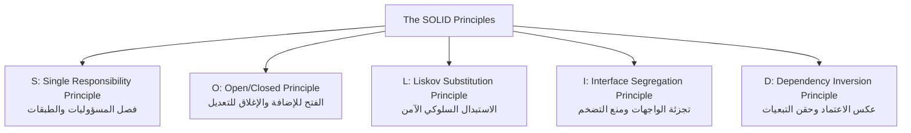

# Master SOLID Principles Handbook 🧱🛡️

> **الغرض**: الدليل المرجعي الشامل لمبادئ التصميم الصلبة (SOLID Principles) للمهندس المعماري المحترف. تم تصميم هذا الدليل لتراجعه بشكل دوري لتبني الحدس الهندسي وتكتشف عيوب الكود التي يولدها الذكاء الاصطناعي وتوجهه لكتابة بنية برمجية تدوم وتتحمل التوسع.

---

## 🧭 خريطة مبادئ SOLID الخمسة



---

## 🎯 دورك كمعماري وموجه للذكاء الاصطناعي (Directing AI)

الذكاء الاصطناعي بطبيعته يميل للحل الأسهل لحظياً:
- يكتب كل شيء في ملف واحد (`God File`).
- يضع كود الداتابيز داخل ملف المسار (`route.ts`).
- يستخدم جمل `switch-case` ضخمة تكسر الـ OCP.
- يرمي استثناءات غير متوقعة في الكلاسات الفرعية تكسر الـ LSP.
دورك كـ **Tech Lead** ليس كتابة كل سطر بنفسك، بل وضع القواعد الصارمة للـ AI ومراجعة الكود قبل قبوله وفق المعايير التالية.

---

# 1. 🧩 S — Single Responsibility Principle (SRP)

> **"A class or module should have one, and only one, reason to change."**  
> (يجب أن يكون للوحدة البرمجية سبب واحد فقط للتغيير، ومسؤولية واحدة محددة).

---

### 👶 1. الحدس والتشبيه الواقعي (طفل 10 سنين):
تخيل في محل الديكور (أرتيفلورا) إن عندك عامل واحد بيعمل كل حاجة:
هو اللي بيقف على الكاشير يقبض الفلوس، وهو اللي بيصمم البوكيهات، وهو اللي بيسوق عربية الشحن يوصل الطلبات، وهو اللي بيعمل الحسابات الضريبية آخر الشهر.
لو العامل ده جاله دور برد أو لخبط في حسابات الضرائب، المحل كله هيقف وتصميم الورد هيتعطل والشحن هيتأخر!
النظام الصح في أي شركة محترفة:
- الكاشير وظيفته الوحيدة: استلام النقدية وإصدار الفاتورة.
- مصمم الورد وظيفته: تنسيق الفازات وتزيين الزهور.
- السائق وظيفته: توصيل الطرود للعنوان المطلوب.
لو غيرنا سيارات الشحن، مصمم الورد ملوش علاقة وشغله مبيتأثرش!

---

### 💻 2. الكود السيئ مقابل الكود الإنتاجي (TypeScript):

#### ❌ الكود السيئ (الذي يميل الذكاء الاصطناعي لتوليده):
دالة واحدة في المسار تفعل كل شيء (Validation + DB + Business Logic + Email Notification):

```typescript
// app/api/orders/route.ts - كود كارثي يجمع كل المسؤوليات
export async function POST(req: Request) {
  const body = await req.json();

  // 1. التحقق من المدخلات (Validation Responsibility)
  if (!body.email || !body.email.includes("@")) return new Response("Invalid email", { status: 400 });
  if (!body.items || body.items.length === 0) return new Response("No items", { status: 400 });

  // 2. منطق الحساب المالي (Business Logic Responsibility)
  let total = 0;
  for (const item of body.items) {
    total += item.price * item.quantity;
  }
  if (total > 1000) total *= 0.9; // خصم عشوائي مدمج بالمسار

  // 3. الاتصال المباشر بقاعدة البيانات (Persistence Responsibility)
  const db = await connectToDatabase();
  const order = await db.collection("orders").insertOne({
    customer: body.email,
    total,
    status: "PENDING",
    createdAt: new Date(),
  });

  // 4. استدعاء خدمات خارجية وإرسال إيميل (Notification Responsibility)
  await fetch("https://api.resend.com/emails", {
    method: "POST",
    headers: { Authorization: "Bearer xyz" },
    body: JSON.stringify({ to: body.email, subject: "Order Confirmed" }),
  });

  return Response.json({ success: true, orderId: order.insertedId });
}
```

#### ✅ الكود المعماري النظيف (The 4-Layer Separation):
فصل المسؤوليات إلى 4 طبقات نقية:
`Controller / Handler -> Validator -> Domain Service -> Repository`

```typescript
// 1. طبقة التحقق من صحة البيانات (Validator Layer - Zod)
import { z } from "zod";

export const CreateOrderSchema = z.object({
  customerEmail: z.string().email(),
  items: z.array(z.object({
    productId: z.string(),
    quantity: z.number().int().positive(),
    unitPrice: z.number().positive(),
  })).min(1),
});
export type CreateOrderDto = z.infer<typeof CreateOrderSchema>;

// 2. طبقة حفظ واسترجاع البيانات (Repository Contract)
export interface OrderRepositoryPort {
  saveOrder(order: { customerEmail: string; totalAmount: number }): Promise<string>;
}

// 3. طبقة منطق العمل المستقل (Domain Service)
export class OrderFulfillmentService {
  constructor(
    private readonly orderRepo: OrderRepositoryPort,
    private readonly notificationPort: { notifyOrderCreated(email: string, id: string): Promise<void> }
  ) {}

  async processOrder(dto: CreateOrderDto): Promise<{ orderId: string; total: number }> {
    // منطق العمل النقي: حساب الإجمالي وتطبيق القواعد
    const total = dto.items.reduce((sum, item) => sum + item.unitPrice * item.quantity, 0);
    const discountedTotal = total > 1000 ? total * 0.9 : total;

    // الحفظ عبر المنفذ المعزول
    const orderId = await this.orderRepo.saveOrder({
      customerEmail: dto.customerEmail,
      totalAmount: discountedTotal,
    });

    // إشعار العميل بشكل غير تزامني
    await this.notificationPort.notifyOrderCreated(dto.customerEmail, orderId);

    return { orderId, total: discountedTotal };
  }
}

// 4. طبقة التحكم والمسار (Controller/Route) - وظيفته توجيه الريكويست فقط
export async function handleCreateOrder(req: Request, service: OrderFulfillmentService) {
  try {
    const rawBody = await req.json();
    const validatedDto = CreateOrderSchema.parse(rawBody); // تفويض الفحص
    const result = await service.processOrder(validatedDto); // تفويض منطق العمل
    return Response.json(result, { status: 201 });
  } catch (error) {
    return Response.json({ error: (error as Error).message }, { status: 400 });
  }
}
```

---

### ⚠️ 3. حالات الفشل والمصائد الخفية (Failure Edge-Cases):
1. **المسؤولية الخفية في التنسيق وتجهيز البيانات (`Hidden Formatting Leak`)**: عندما تقوم الدالة بحساب البيانات وتنسيقها للعرض في الشاشة (`Currency Formatting / Date string`) في نفس الوقت. إذا تغيرت لغة العرض ينهار منطق الحساب المالي!
2. **الارتباط بقاعدة بيانات محددة داخل منطق العمل**: إذا احتوت خدمة الـ Service على دوال خاصة بـ Mongoose أو Prisma مثل `query.$set` أو `findUnique` مباشرة دون فصل المستودع (`Repository`).

---

### 🎙️ 4. سكريبت الدفاع في المقابلات بالإنجليزية (Interview Defense):
> "The Single Responsibility Principle is about cohesion and reason to change. In our engineering stack, we enforce a strict 4-layer architecture: Controllers only handle HTTP orchestration, Validators enforce boundary schemas with Zod, Domain Services execute pure business invariants, and Repositories isolate persistence. This guarantees that migrating from MongoDB to PostgreSQL or changing tax calculation rules never cross-contaminates our route handlers."

---

### 🤖 5. بروتوكول توجيه الذكاء الاصطناعي (AI Prompt & Audit Guide):
- **البرومبت الموجه للـ AI**:
  `"Refactor this route handler according to SRP. Separate it strictly into: 1) Zod validation schema, 2) Pure domain service with constructor injection, 3) Repository interface port, and 4) Thin route controller. No database queries or raw fetch calls inside the controller."`
- **ما يجب أن تدققه في كود الـ AI**:
  - هل استدعى الـ AI قاعدة البيانات مباشرة داخل دالة المسار؟ (ارفض الكود فوراً).
  - هل خلط بين التحقق من صحة النوع (`Type validation`) ومنطق العمل؟

---

# 2. 🔓 O — Open/Closed Principle (OCP)

> **"Software entities should be open for extension, but closed for modification."**  
> (يجب أن تكون البرمجيات مفتوحة للإضافة والميزات الجديدة، لكن مغلقة أمام تعديل الكود القديم المستقر).

---

### 👶 1. الحدس والتشبيه الواقعي:
الهاتف الذكي ومدخل الشاحن أو الـ USB.
لو الشركة المصنعة للهاتف قالتلك: "عشان تركب سماعة أذن أو فلاش ميموري، لازم تفتح ضهر الموبايل وتلحم سلك جديد في المازربورد"، الموبايل هيتحرق!
الموبايل فيه منفذ شحن وسماعة بمواصفات قياسية عالمية (`Interface`).
المنفذ "مغلق للتعديل" (البوردة مقفولة ومحدش بيلمسها)، لكن "مفتوح للإضافة" (تقدر تركب سماعة سلك، شاحن سريع، فلاشة، أو دراع ألعاب في ثانية واحدة دون فتح الجهاز).

---

### 💻 2. الكود السيئ مقابل الكود الإنتاجي (TypeScript):

#### ❌ الكود السيئ:
استخدام جمل `switch-case` التي تتطلب فتح وتعديل الكود القديم كلما تعاقدنا مع شركة جديدة:

```typescript
// كود هش: كل شركة شحن جديدة تجبرنا على تعديل هذه الدالة واختبار كل الحالات السابقة من جديد!
export function calculateShippingFee(carrier: string, weightKg: number): number {
  switch (carrier) {
    case "BOSTA":
      return 50 + weightKg * 5;
    case "ARAMEX":
      return 80 + weightKg * 10;
    case "MINTA":
      return 45 + weightKg * 4;
    // كل إضافة جديدة تتطلب تعديل الكود هنا والمخاطرة بكسر بوسطة وأرامكس القدامى!
    default:
      throw new Error(`Carrier ${carrier} is not supported`);
  }
}
```

#### ✅ الكود المعماري النظيف (Strategy & Registry):

```typescript
// 1. العقد المعماري المغلق للتعديل
export interface ShippingRateStrategy {
  readonly carrierCode: string;
  calculateFee(weightKg: number): number;
}

// 2. الاستراتيجيات المستقلة (مفتوحة للإضافة في ملفات مستقلة تماماً)
export class BostaShippingStrategy implements ShippingRateStrategy {
  readonly carrierCode = "BOSTA";
  calculateFee(weightKg: number): number {
    return 50 + weightKg * 5;
  }
}

export class AramexShippingStrategy implements ShippingRateStrategy {
  readonly carrierCode = "ARAMEX";
  calculateFee(weightKg: number): number {
    return 80 + weightKg * 10;
  }
}

// 3. السجل المركزي الديناميكي
export class ShippingEngine {
  private strategies = new Map<string, ShippingRateStrategy>();

  registerStrategy(strategy: ShippingRateStrategy): void {
    this.strategies.set(strategy.carrierCode, strategy);
  }

  calculate(carrierCode: string, weightKg: number): number {
    const strategy = this.strategies.get(carrierCode);
    if (!strategy) {
      throw new Error(`Carrier ${carrierCode} is not registered in shipping engine.`);
    }
    return strategy.calculateFee(weightKg);
  }
}
```

---

### ⚠️ 3. حالات الفشل والمصائد الخفية:
1. **تعديل الملف المركزي عند إضافة خدمة جديدة**: إذا كان إضافة مزود جديد تتطلب عمل `import` يدوي وتعديل كود ملف `ShippingEngine` نفسه. الحل هو التسجيل الخارجي عند إقلاع التطبيق (Dependency Injection / Module Registration).
2. **تسريب شروط خاصة بمزود واحد داخل العقد المشترك**: مثل إضافة حقل خاص بـ `bostaPickupCityCode` في العقد العام الذي تشاركه أرامكس وفيديكس.

---

### 🎙️ 4. سكريبت الدفاع في المقابلات بالإنجليزية:
> "We satisfy the Open/Closed Principle by replacing polymorphic switch statements with the Strategy and Registry patterns. If our business signs with a new logistics provider like DHL, we simply create a new DHLStrategy class implementing the ShippingRateStrategy interface and register it at runtime. The core calculation engine remains untouched, zero lines of legacy code are modified, and regression risk is completely eliminated."

---

# 3. 🔄 L — Liskov Substitution Principle (LSP)

> **"Subtypes must be substitutable for their base types without altering the correctness of the program."**  
> (يجب أن تكون الفئات أو الكائنات الفرعية قابلة للاستبدال مكان الفئات الأساسية دون كسر سلوك البرنامج أو رمي استثناءات غير متوقعة).

---

### 👶 1. الحدس والتشبيه الواقعي:
في محل أرتيفلورا، اشتريت "مسدس شمع سيليكون" ومصمم الورد متعود يحط فيه "صباع شمع بقطر 11 مم" ويلزق الفازات.
لو نزلت السوق واشتريت صباع شمع جديد شكله حلو ورخيص، لكن لما حطيته في المسدس لقيته بلاستيك ناشف مبيسحش بالحرارة أو سميك 15 مم فكسر المسدس!
الصباع الجديد اسمه في الفاتورة "صباع شمع"، لكنه كسر العقد العملي للمسدس وعطل الشغل في المحل.
في البرمجة: مينفعش تعمل كلاس فرعي بيورث من كلاس أساسي، وتيجي في دالة معينة تقوله: "أنا مبدعمش الدالة دي وهرجع Error"، ده كسر صريح لعقد البرنامج!

---

### 💻 2. الكود السيئ مقابل الكود الإنتاجي (TypeScript):

#### ❌ الكود السيئ (كسر الـ LSP برمي أخطاء في الكلاس الفرعي):

```typescript
// كلاس أساسي يفترض أن كل بوابات الدفع تدعم الدفع واسترداد الأموال (Refund)
export abstract class PaymentGateway {
  abstract charge(amount: number): Promise<string>;
  abstract refund(transactionId: string, amount: number): Promise<boolean>;
}

export class StripeGateway extends PaymentGateway {
  async charge(amount: number) { return "ch_stripe_123"; }
  async refund(id: string, amount: number) { return true; }
}

// الدفع عند الاستلام كاش (COD)
export class CashOnDeliveryGateway extends PaymentGateway {
  async charge(amount: number) { return "cod_collected"; }

  // مصيبة تكسر LSP: رمي استثناء غير متوقع يكسر الكود الذي يستدعي refund!
  async refund(transactionId: string, amount: number): Promise<boolean> {
    throw new Error("Cash on delivery does not support automated refund API!");
  }
}

// الكود المستهلك ينهار أو يضطر لكتابة hack قبيح:
async function processRefund(gateway: PaymentGateway, txId: string) {
  // فخ الـ instanceof القبيح الناتج عن كسر LSP:
  if (gateway instanceof CashOnDeliveryGateway) {
    console.log("Manual cash payout required");
    return;
  }
  await gateway.refund(txId, 100);
}
```

#### ✅ الكود المعماري النظيف (تجزئة الواجهات والتحقق السلوكي الآمن):

```typescript
// 1. عقد التحصيل المالي الأساسي (يدعمه الجميع)
export interface ChargeableGateway {
  charge(amount: number): Promise<string>;
}

// 2. عقد الاسترداد المالي المتقدم (يدعمه فقط من يملك القدرة)
export interface RefundableGateway extends ChargeableGateway {
  refund(transactionId: string, amount: number): Promise<boolean>;
}

// 3. التطبيق الفعلي المتوافق سلوكياً
export class StripeGateway implements RefundableGateway {
  async charge(amount: number) { return "ch_stripe_123"; }
  async refund(id: string, amount: number) { return true; }
}

export class CashOnDeliveryGateway implements ChargeableGateway {
  async charge(amount: number) { return "cod_collected"; }
  // لا توجد دالة refund هنا على الإطلاق، فلا يمكن استدعاؤها بالخطأ في runtime!
}

// دالة المعالجة تستقبل العقد المناسب فقط
export async function executeDigitalRefund(gateway: RefundableGateway, txId: string, amount: number) {
  // تايب سكريبت يمنع تمرير CashOnDeliveryGateway هنا في مرحلة الـ Compile Time!
  return gateway.refund(txId, amount);
}
```

---

### ⚠️ 3. حالات الفشل والمصائد الخفية:
1. **مصيدة الفحص بنوع الكائن (`instanceof Smell`)**: كلما رأيت في الكود `if (x instanceof ChildClass)` فاعلم يقيناً أن مبدأ LSP مكسور وأن الواجهة الأساسية ناقصة أو مشوهة.
2. **تغيير قيود المدخلات والمخرجات (`Preconditions & Postconditions`)**: لا يجوز للكلاس الفرعي أن يطلب مدخلات أكثر تشدداً من الكلاس الأصلي، ولا يجوز أن يرجع قيماً خارج النطاق الذي وعد به الكلاس الأصلي.

---

### 🎙️ 4. سكريبت الدفاع في المقابلات بالإنجليزية:
> "Liskov Substitution Principle mandates behavioral compatibility, not merely syntactic inheritance. If a subclass throws an `UnsupportedOperationException` or forces client code to perform defensive `instanceof` checks, LSP is violated. We adhere to LSP by decomposing bloated base classes into cohesive capability interfaces (e.g., `ChargeableGateway` vs. `RefundableGateway`). Type errors are caught at compile-time by TypeScript rather than triggering runtime crashes in production."

---

# 4. 🪚 I — Interface Segregation Principle (ISP)

> **"Clients should not be forced to depend upon interfaces that they do not use."**  
> (لا تجبر العميل البرمجي على الاعتماد على واجهات تحتوي دوال لا يحتاج إليها).

---

### 👶 1. الحدس والتشبيه الواقعي:
تخيل دخلت مطعم تطلب "سندوتش شاورما"، فالكاشير أصر يديك استمارة تملأ فيها:
نوع البنزين اللي بتحطه في عربيتك، ورقم جواز سفرك، واسم جدتك الرابعة، ولون دهان صالة بيتك!
أنت زبون شاورما، إيه علاقتك بكل البيانات دي؟
المطعم عمل "استمارة عامة عملاقة" لكل الناس وأجبرك تملأ حاجات ملكش دعوة بيها.
في الكود: الواجهة العملاقة الممتلئة بعشرات الدوال تجبر المطور على كتابة دوال فارغة (`dummy empty methods`) لمجرد إرضاء الكومبايلر!

---

### 💻 2. الكود السيئ مقابل الكود الإنتاجي (TypeScript):

#### ❌ الكود السيئ:
واجهة عملاقة متضخمة (`Fat / Bloated Interface`):

```typescript
export interface SmartHomeDevice {
  turnOn(): void;
  turnOff(): void;
  setTemperature(celsius: number): void;
  setVolume(level: number): void;
  streamVideoCamera(): string;
}

// فازة مضيئة أو لمبة ديكور ذكية في المحل:
export class DecorSmartBulb implements SmartHomeDevice {
  turnOn() { console.log("Light on"); }
  turnOff() { console.log("Light off"); }

  // دوال فارغة قبيحة مجبرين على كتابتها بسبب تضخم الواجهة!
  setTemperature() { /* اللمبة ملهاش تكييف! */ }
  setVolume() { /* اللمبة ملهاش سماعات صوت! */ }
  streamVideoCamera() { throw new Error("No camera attached"); }
}
```

#### ✅ الكود المعماري النظيف (Role Interfaces):

```typescript
export interface Switchable {
  turnOn(): void;
  turnOff(): void;
}

export interface ClimateControllable {
  setTemperature(celsius: number): void;
}

export interface AudioPlayable {
  setVolume(level: number): void;
}

// اللمبة تعتمد فقط على ما تحتاجه
export class DecorSmartBulb implements Switchable {
  turnOn() { console.log("Light on"); }
  turnOff() { console.log("Light off"); }
}

// جهاز التكييف يعتمد على التشغيل وضبط الحرارة
export class StoreAirConditioner implements Switchable, ClimateControllable {
  turnOn() { console.log("AC running"); }
  turnOff() { console.log("AC stopped"); }
  setTemperature(c: number) { console.log("Temp set to " + c); }
}
```

---

# 5. 🔌 D — Dependency Inversion Principle (DIP)

> **"High-level modules should not depend on low-level modules. Both should depend on abstractions. Abstractions should not depend on details; details should depend on abstractions."**  
> (الوحدات العليا لمنطق العمل لا تعتمد على وحدات التنفيذ الدنيا مباشرة؛ كلاهما يعتمد على واجهات مجردة).

---

### 👶 1. الحدس والتشبيه الواقعي:
فيش الكهرباء اللي في حيطة المحل.
لو كل ما تشتري مروحة أو كشاف إضاءة للديكور، تجيب الكهربائي يكسر الحيطة ويلحم سلك المروحة مباشرة في الكابل العمومي لشبكة الكهرباء القومية!
ده معناه إنك لو حبيت تنقل المروحة من مكانها، هتهد الحيطة وتطفي كهرباء الشارع كله!
الحل البسيط: فيشة بمواصفات قياسية في الحيطة (`Interface Abstraction`).
المروحة بفيشة قياسية، والجدار فيه مقبس قياسي. تقدر تبدل المروحة بتكييف أو شاحن موبايل في ثانية واحدة لأن الاتنين بيعتمدوا على "عقد الكهرباء الموحد" بدون لحام مباشر!

---

### 💻 2. الكود السيئ مقابل الكود الإنتاجي (TypeScript):

#### ❌ الكود السيئ (الارتباط المباشر بالـ SDK الخارجي):

```typescript
import { Resend } from "resend"; // اعتماد مباشر على مكتبة خارجية منخفضة المستوى

export class MarketingNewsletterService {
  private resendClient: Resend;

  constructor() {
    // كارثة معمارية: إنشاء الكائن الخارجي داخل الـ constructor مباشرة
    this.resendClient = new Resend(process.env.RESEND_API_KEY);
  }

  async sendPromotionalCampaign(emails: string[], message: string) {
    for (const email of emails) {
      // مستحيل عمل Unit Test لهذه الخدمة بدون إرسال إيميلات حقيقية وخصم رصيد!
      await this.resendClient.emails.send({
        from: "artiflora@decor.com",
        to: email,
        subject: "New Collection Offer",
        text: message,
      });
    }
  }
}
```

#### ✅ الكود المعماري النظيف (Dependency Injection via Abstraction):

```typescript
// 1. التجريد المعتمد (The Abstraction)
export interface EmailDeliveryPort {
  sendEmail(to: string, subject: string, content: string): Promise<boolean>;
}

// 2. الكلاس عالي المستوى لمنطق العمل (High-Level Domain Service)
export class MarketingNewsletterService {
  // حقن التبعية عبر الـ Constructor (Dependency Injection)
  constructor(private readonly emailPort: EmailDeliveryPort) {}

  async sendPromotionalCampaign(emails: string[], message: string) {
    for (const email of emails) {
      await this.emailPort.sendEmail(email, "New Collection Offer", message);
    }
  }
}

// 3. التنفيذ الفعلي للإنتاج (Low-Level Driver)
export class ResendEmailAdapter implements EmailDeliveryPort {
  constructor(private readonly apiKey: string) {}

  async sendEmail(to: string, subject: string, content: string): Promise<boolean> {
    // استدعاء مكتبة Resend الحقيقية
    return true;
  }
}

// 4. المحاكي الوهمي للاختبارات (Test Mock Driver)
export class MockEmailAdapter implements EmailDeliveryPort {
  public sentEmails: { to: string; subject: string }[] = [];

  async sendEmail(to: string, subject: string): Promise<boolean> {
    this.sentEmails.push({ to, subject });
    return true; // اختبار فوري سريع بدون استهلاك شبكة أو تكلفة
  }
}
```

---

### ⚠️ 3. حالات الفشل والمصائد الخفية:
1. **استخدام `new` داخل خدمات الـ Business Logic**: كلمة `new ConcreteService()` داخل كلاس الـ Domain تقتل قابلية الاختبار وتخلق ارتباطاً وثيقاً. التكوين يتم في طبقة الربط التجميعية (`Composition Root / Factory`).
2. **تسريب تفاصيل الـ Library داخل الواجهة**: إذا سميت الدالة في الواجهة `sendViaResendSdk()`, فقد كسرت التجريد وأصبح كودك مرتبطاً بالمزود حتى مع وجود واجهة!

---

### 🎙️ 4. سكريبت الدفاع في المقابلات بالإنجليزية:
> "Dependency Inversion decouples our core high-level domain services from volatile low-level infrastructure drivers like database engines and third-party APIs. By injecting contracts (ports) into service constructors rather than instantiating SDKs directly, we unlock frictionless automated unit testing with in-memory mocks, eliminate vendor lock-in, and enable modular architecture."

---

## 📋 مصفوفة تدقيق كود الذكاء الاصطناعي (AI Code Review Checklist)

عند مراجعة أي كود ينتجه الذكاء الاصطناعي، راجع النقاط الخمس التالية:

| المبدأ | الخطأ الشائع الذي يرتكبه الذكاء الاصطناعي | الإجراء التصحيحي الفوري |
| :--- | :--- | :--- |
| **S - Single Responsibility** | وضع كود التحقق وقاعدة البيانات وإرسال الإشعارات داخل المسار | اجبره على نقل التحقق لـ Zod ونقل الحفظ لـ Repository منفصل |
| **O - Open/Closed** | كتابة جمل `switch (type)` ضخمة عند إضافة حالات جديدة | اطلب منه تطبيق نمط الـ Strategy مع Registry لتسجيل الحالات ديناميكياً |
| **L - Liskov Substitution** | رمي استثناء `throw new Error("Method not supported")` في كلاس فرعي | اطلب منه تقسيم الواجهة الأساسية إلى واجهات أصغر (`Interface Segregation`) |
| **I - Interface Segregation** | إنشاء واجهة واحدة تحتوي 15 دالة تجبر الكلاسات على دوال فارغة | قسّم الواجهة لواجهات قدرات منفصلة (`Switchable`, `Refundable`, etc.) |
| **D - Dependency Inversion** | كتابة `new Client()` أو استدعاء المكتبة الخارجية مباشرة داخل الدالة | اجبره على حقن الواجهة في الـ constructor عبر `Dependency Injection` |

---
