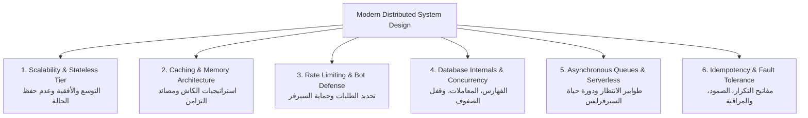

# Master System Design & Cloud Architecture Handbook ☁️⚡

> **الغرض**: الدليل المرجعي الشامل لتصميم وبنية الأنظمة الموزعة والتطبيقات السحابية للمهندس المحترف. تم إعداد هذا الملف لتراجعه بشكل دوري لتبني الحدس المعماري وتدير أنظمة إنتاجية تتحمل الضغط العالي وتصمد أمام انقطاع الشبكات، مع توجيه الذكاء الاصطناعي بدقة في القرارات المعمارية الكبرى.

---

## 🧭 خريطة منظومة تصميم الأنظمة الموزعة



---

# 1. 🌐 التوسع ومعمارية الخوادم عديمة الحالة (Scalability & Stateless Tier)

---

### 👶 1. الحدس والتشبيه الواقعي (طفل 10 سنين):
تخيل محل أرتيفلورا في موسم عيد الأم، بدل ما يجيلك 20 زبون في اليوم، جالك 2000 زبون!
قدامك حلين:
1. **التوسع الرأسي (`Vertical Scaling`)**: تجيب كاشير عملاق وبطل كمال أجسام يشتغل بأربع إيدين وتركب له كراسي كهربائية. الحل ده ليه سقف، وفي النهاية الكاشير هيتعب وهيقع وتكلفته خيالية.
2. **التوسع الأفقي (`Horizontal Scaling`)**: تفتح 5 شبابيك كاشير جنب بعض متطابقة. وتجيب منظم على الباب (`Load Balancer`) يوجه كل زبون للشباك الفاضي.
**الشرط الذهبي**: مينفعش شباك رقم 1 يكتب حسابات الزبون في نوتة خاصة في جيبه! لازم كل الشبابيك تقرأ من قاعدة بيانات مركزية مشتركة. كده أي شباك يقدر يخدم أي زبون في أي لحظة (`Stateless`).

---

### 💻 2. الميكانيكا الهندسية والكود النموذجي:
في Node.js و Next.js، أي تخزين لحالة الجلسة في متغير بالذاكرة (`const userSessions = new Map()`) يكسر التوسع الأفقي فوراً، لأن الريكويست القادم قد يذهب لخادم آخر!
الحل: **جلسات عديمة الحالة عبر JWT موثق أو Redis خارجي مركزي**:

```typescript
// معالجة الجلسات بشكل عديم الحالة تماماً داخل الـ Middleware
import { NextRequest, NextResponse } from "next/server";
import { jwtVerify } from "jose";

export async function middleware(req: NextRequest) {
  const token = req.cookies.get("session_token")?.value;

  if (!token) {
    return NextResponse.json({ error: "Unauthorized" }, { status: 401 });
  }

  try {
    const secret = new TextEncoder().encode(process.env.JWT_SECRET!);
    // التحقق الرياضي المشفر من التوكن دون الحاجة للاستعلام من الداتابيز
    const { payload } = await jwtVerify(token, secret);

    // تمرير هوية المستخدم للخدمات التالية عبر الـ Headers
    const requestHeaders = new Headers(req.headers);
    requestHeaders.set("x-user-id", payload.sub as string);
    requestHeaders.set("x-user-role", payload.role as string);

    return NextResponse.next({ request: { headers: requestHeaders } });
  } catch (error) {
    return NextResponse.json({ error: "Session expired or invalid" }, { status: 401 });
  }
}
```

---

### ⚠️ 3. حالات الفشل والمصائد الخفية:
1. **تسريب الحالة في متغيرات الذاكرة الداخلية (`In-Memory Session Trap`)**: تخزين سلة الشراء أو كود التحقق OTP في مصفوفة داخل كود السيرفر. عند تشغيل التطبيق على عدة خوادم أو بيئة Serverless، سيفشل 50% من المستخدمين لأن طلباتهم ستذهب لحاوية أخرى لا تملك المتغير!
2. **تضخم حجم التوكن (`JWT Bloat`)**: وضع بيانات العميل كاملة داخل الـ JWT، مما يرفع حجم الهيدر في كل ريكويست HTTP ويستهلك الباندويث. خزن فقط `userId` والصلاحيات الأساسية.

---

### 🎙️ 4. سكريبت الدفاع في المقابلات بالإنجليزية:
> "To achieve horizontal scalability, we maintain a strictly stateless application tier. State is never preserved in application process memory. Authentication relies on cryptographically signed, stateless JWTs verified at the edge, or backed by an external high-performance Redis cluster for immediate session revocation. This allows our Next.js containers to scale from 1 to 50 instances behind an ALB without session affinity (sticky sessions) or state desynchronization."

---

# 2. ⚡ استراتيجيات التخزين المؤقت المتقدمة (Advanced Caching Architectures)

---

### 👶 1. الحدس والتشبيه الواقعي:
في محل الديكور، أكثر فازة كريستال بتتباع بنحط كرتونة منها جاهزة على كاونتر الكاشير (`الكاش`).
الزبون لما يطلبها، الكاشير بيمد إيده يديها له في ثانيتين (`Cache Hit`).
لكن لو طلب تحفة نادرة، الكاشير بيضطر يسيب الكاونتر وينزل بدروم المخزن يجيبها ويطلع في 5 دقائق (`Cache Miss`)، وبعدها بيسيب نسخة منها فوق جنب الكاشير عشان لو حد طلبها تاني متتكررش المشوار.
**المصيبة الكبرى (`Cache Stampede`)**: لو الكاشير قال للناس "الفازة خلصت من على الكاونتر"، فـ 100 زبون يجروا في نفس الثانية على باب البدروم! الباب هيتكسر والناس هتدوس على بعض والمخزن كله هيقع!

---

### 💻 2. الميكانيكا الهندسية والكود النموذجي:

#### أ. نمط الـ Cache-Aside:
التطبيق يستعلم من الكاش أولاً؛ إذا وجد البيانات يعيدها فوراً، وإذا لم يجدها يستعلم من قاعدة البيانات ويحفظ النتيجة في الكاش مع وقت صلاحية محدد (`TTL`).

#### ب. حل مصيدة هجوم التزامن وتدافع الطلبات (Cache Stampede & Mutex Lock):
عند انتهاء صلاحية مفتاح الكاش لمنتج شهير، آلاف الطلبات المتزامنة قد تضرب قاعدة البيانات في نفس المللي ثانية وتسبب انهيار الخادم (`Thundering Herd`). الحل هو استخدام قفل موزع (`Distributed Lock / Mutex`) يسمح لطلب واحد فقط بتحديث الكاش بينما ينتظر الآخرون:

```typescript
import { Redis } from "ioredis";

export class ResilientCacheService {
  constructor(private readonly redis: Redis) {}

  async getOrSetWithLock<T>(
    key: string,
    fetchFromDb: () => Promise<T>,
    ttlSeconds = 300
  ): Promise<T> {
    // 1. محاولة القراءة السريعة من الكاش
    const cached = await this.redis.get(key);
    if (cached) {
      return JSON.parse(cached);
    }

    // 2. محاولة الاستحواذ على قفل التحديث الموزع (Mutex Lock)
    const lockKey = `lock:${key}`;
    const acquiredLock = await this.redis.set(lockKey, "locked", "EX", 5, "NX");

    if (acquiredLock) {
      try {
        // الفائز الوحيد بالقفل يستعلم من قاعدة البيانات
        const freshData = await fetchFromDb();
        await this.redis.set(key, JSON.stringify(freshData), "EX", ttlSeconds);
        return freshData;
      } finally {
        // فك القفل فوراً بعد التحديث
        await this.redis.del(lockKey);
      }
    } else {
      // باقي الطلبات تنتظر 50ms ثم تقرأ الكاش الجاهز الذي حدّثه الفائز
      await new Promise((resolve) => setTimeout(resolve, 50));
      const retryCache = await this.redis.get(key);
      if (retryCache) return JSON.parse(retryCache);
      // في أسوأ الأحوال استعلم من الداتابيز
      return fetchFromDb();
    }
  }
}
```

---

### ⚠️ 3. حالات الفشل والمصائد الخفية:
1. **تسمم الكاش بالوعود الفاشلة (`Promise Cache Poisoning`)**: حفظ استجابة فاشلة (مثل خطأ 500 أو انقطاع اتصال الداتابيز) داخل الكاش، مما يجعل السيرفر يعيد الخطأ لكل المستخدمين طوال مدة الـ TTL حتى بعد عودة الداتابيز للعمل!
2. **الكاش بدون وقت انتهاء صلاحية (`Eternal Cache Out of Memory`)**: نسيان وضع `TTL` أو إعداد استراتيجية تفريغ الذاكرة (`MaxMemory Policy: volatile-lru`) في Redis، مما يؤدي لامتلاء الرام وانهيار السيرفر.

---

### 🎙️ 4. سكريبت الدفاع في المقابلات بالإنجليزية:
> "We implement the Cache-Aside pattern with Redis for high-frequency read paths, such as product catalogs. To defend against the Cache Stampede (Thundering Herd) problem where thousands of concurrent requests crush PostgreSQL upon TTL expiry, we acquire an atomic distributed lock via `SET NX EX`. Only the lock owner recomputes the database record and re-populates Redis, while concurrent requests poll the freshly primed cache, protecting database connection pools."

---

# 3. 🛡️ تحديد معدل الطلبات وحماية السيرفر (Rate Limiting & Abuse Throttling)

---

### 👶 1. الحدس والتشبيه الواقعي:
حارس أمن على باب محل الديكور في أوقات التخفيضات الكبرى.
بدل ما يسمح لـ 500 شخص يقتحموا المحل مرة واحدة ويكسروا الفازات الزجاجية، الحارس معاه "ساعة إيقاف":
بيسمح بدخول 5 زبائن في الدقيقة الواحدة.
لو جه شخص وقعد يضغط على جرس المحل 100 مرة في ثانية (بوت سبام)، الحارس بيمسكه ويقفل في وشه الباب الحديدي ويمنعه من الدخول لمدة ساعة!

---

### 💻 2. الميكانيكا الهندسية والكود النموذجي:

#### أ. خوارزمية النافذة المنزلقة (Sliding Window Counter):
أدق خوارزمية تمنع هجمات الاندفاع عند حدود الدقيقة (`Burst Boundary Attacks`). يتم تسجيل الطابع الزمني لكل طلب في قائمة مرتبة في Redis (`ZSET`).

#### ب. مصيدة البوتات الصامتة (The Honeypot Pattern):
حماية النماذج (Contact Forms / Registration) من بوتات السبام بدون إزعاج المستخدم الحقيقي باختبارات الكابتشا (`CAPTCHA`) المعقدة:

```typescript
// مكون الفرونت إند: حقل خفي يراه البوت البرمجي فقط
export function SecureContactForm() {
  return (
    <form action="/api/contact" method="POST">
      <input type="text" name="name" placeholder="Your Name" required />
      <input type="email" name="email" placeholder="Your Email" required />
      <textarea name="message" placeholder="Message" required />

      {/* Honeypot Field: مخفي تماماً عن الإنسان وعن قارئات الشاشة */}
      <div style={{ display: "none", opacity: 0, position: "absolute", left: "-9999px" }} aria-hidden="true">
        <input type="text" name="b_company_fax" tabIndex={-1} autoComplete="off" />
      </div>

      <button type="submit">Send Message</button>
    </form>
  );
}

// معالج السيرفر: إسقاط الطلب بصمت تام إذا قام البوت بملء الحقل المخفي
export async function POST(req: Request) {
  const formData = await req.formData();
  const honeypot = formData.get("b_company_fax");

  // إذا تم ملء الحقل الخفي، فالمتصل بوت 100%!
  if (honeypot && String(honeypot).trim().length > 0) {
    // نرجع رد نجاح وهمي 200 حتى لا يكتشف البوت المصيدة ويغير استراتيجيته
    console.warn("[Security Alert] Bot trapped via Honeypot field.");
    return Response.json({ success: true, message: "Thank you" }, { status: 200 });
  }

  // معالجة طلب المستخدم الحقيقي بأمان...
}
```

---

### ⚠️ 3. حالات الفشل والمصائد الخفية:
1. **ابتلاع أكواد الأخطاء الأصلية للمزود الخارجي (`Upstream 429 vs 500`)**: عند استهلاك API خارجي (مثل Gemini أو OpenAI)، إذا أرجع المزود خطأ تجاوز الحد المسموح `429 Too Many Requests` وقمت بتحويله إلى `500 Internal Server Error`، فلن يعرف الفرونت إند أن المشكلة مؤقتة وسيعتبر تطبيقك معطلاً! مرر كود الـ 429 مع هيدر `Retry-After`.
2. **استخدام عنوان الـ IP فقط للـ Rate Limiting**: في شبكات الموبايل والشركات الكبرى (مثل Vodafone و Orange بمصر)، قد يشترك آلاف المستخدمين في نفس عنوان الـ Public IP عبر تقنية الـ NAT! حظر الـ IP فقط قد يحظر مئات العملاء الأبرياء. اجمع بين الـ IP والـ User ID وبصمة الجهاز (`Device Fingerprint`).

---

# 4. 🗄️ معمارية قواعد البيانات والتزامن (Databases, Indexing & Concurrency)

---

### 👶 1. الحدس والتشبيه الواقعي (الأساس الرياضي لعالم قواعد البيانات):
بصفتك دارساً للرياضيات في كلية العلوم:
- قاعدة البيانات العلائقية (`Relational DB`) هي تطبيق مباشر لنظرية المجموعات (`Set Theory`).
- الجدول هو مجموعة جزئية من الجداء الديكارتي (`Subset of Cartesian Product`) بين المجالات المختلفة.
- الاستعلام (`Query`) هو دالة رياضية منطقية (`Predicate Logic`) ترشح العناصر التي تحقق الشروط.
**الفهرس (`B-Tree Index`)**:
تخيل فهرس كتاب الرياضيات في آخر الكتاب؛ بدل ما تقلب 500 صفحة صفحة صفحة عشان تلاقي "نظرية رول" ($O(N)$)، بتبص في الفهرس المرتب أبجدياً وتفتح الصفحة في ثانية واحدة ($O(\log N)$).
**مصيدة آخر قطعة في المحل (`Race Condition`)**:
عندك فازة واحدة أخيرة في المحل، واثنين زبائن في نفس الثانية داسوا "شراء" في التطبيق. لو السيستم فحص المخزن للاتنين في نفس الوقت، هيلاقي الكمية 1 ويخصم من الاتنين فلوس، لكن في الواقع مفيش غير فازة واحدة! المحل هيقع في مشكلة نصب تجاري!

---

### 💻 2. الميكانيكا الهندسية والكود النموذجي:

#### أ. قفل الصفوف بالمعاملات المصرفية (`Row-Level Locking & ACID`):
لمنع البيع الزائد (`Overselling`)، نستخدم معاملة مصرفية مع قفل حصري للصف في PostgreSQL (`SELECT ... FOR UPDATE`):

```typescript
import { PrismaClient } from "@prisma/client";

const prisma = new PrismaClient();

export async function purchaseLastItemSafely(productId: string, quantity: number, orderId: string) {
  // تنفيذ المعاملة بعزل كامل (Serializable / Row-Level Lock)
  return await prisma.$transaction(async (tx) => {
    // 1. استعلام مع قفل حصري للصف لمنع أي طلب آخر من قراءته حتى تنتهي المعاملة
    const product = await tx.$queryRaw<Array<{ id: string; stock: number }>>`
      SELECT id, stock FROM "Product" 
      WHERE id = ${productId} 
      FOR UPDATE
    `;

    if (!product || product.length === 0) throw new Error("Product not found");

    const currentStock = product[0].stock;
    if (currentStock < quantity) {
      throw new Error(`Insufficient stock: Only ${currentStock} remaining.`);
    }

    // 2. خصم المخزون بأمان تام
    await tx.product.update({
      where: { id: productId },
      data: { stock: { decrement: quantity } },
    });

    // 3. إنشاء سجل الأوردر ضمن نفس المعاملة
    const order = await tx.order.create({
      data: { id: orderId, productId, quantity, status: "PAID" },
    });

    return order;
  });
}
```

#### ب. قراءة خطة الاستعلام (`EXPLAIN ANALYZE`):
في أي مقابلة عمل أو تدقيق أداء:
- `Seq Scan (Sequential Scan)`: كارثة معمارية تعني أن قاعدة البيانات فحصت كل صفوف الجدول بالكامل $O(N)$.
- `Index Scan / Index Only Scan`: قراءة فائقة السرعة عبر شجرة الـ B-Tree بدون لمس الصفوف غير المطلوبة $O(\log N)$.

---

### ⚠️ 3. حالات الفشل والمصائد الخفية:
1. **ترتيب أعمدة الفهرس المركب (`Composite Index Order`)**: إذا أنشأت فهرساً على `(store_id, created_at)`، وقمت بالاستعلام بـ `WHERE created_at = ...` فقط، فلن تستخدم قاعدة البيانات الفهرس على الإطلاق! الترتيب يبدأ دائماً من اليسار لليمين (`Leftmost Prefix Rule`).
2. **الانسداد المتبادل في المعاملات (`Deadlock Trap`)**: إذا حاولت المعاملة A قفل المنتج 1 ثم المنتج 2، بينما حاولت المعاملة B قفل المنتج 2 ثم المنتج 1 في نفس الوقت، سيعلق السيرفران للأبد! الحل الهندسي: فرض ترتيب حتمي صارم لقفل السجلات (مثل الترتيب حسب الـ `id` تصاعدياً).

---

# 5. 📬 طوابير المعالجة الخلفية ودورة حياة السيرفرليس (Queues & Serverless)

---

### 👶 1. الحدس والتشبيه الواقعي:
في مطعم برجر، الكاشير اللي بياخد منك الفلوس مبيقعدش يشوي اللحمة بنفسه وأنت واقف مستني!
الكاشير بياخد الفلوس ويديك رقم إيصال، ويطبع تذكرة المطبخ في ثانية واحدة (`تفريغ المهمة`).
الشيفات في المطبخ وراء الكواليس بيستلموا التذاكر من شاشة المطبخ (`Message Queue`) ويشووا البرجر بهدوء.
لو جه 50 زبون في ثانية، الكاشير هيدخلهم كلهم ويديهم أرقام، والمطبخ هيشتغل بأقصى سرعته بدون ما الكاشير ولا الزبائن يتعطلوا!

---

### 💻 2. الميكانيكا الهندسية والكود النموذجي:

#### أ. استخدام `BullMQ` و `Redis` للمهام الثقيلة (ضغط الصور، إرسال الفواتير):

```typescript
import { Queue, Worker } from "bullmq";
import Redis from "ioredis";

const connection = new Redis(process.env.REDIS_URL!);

// 1. تعريف الطابور لإرسال المهام بسرعة من الـ API
export const imageProcessingQueue = new Queue("image-processing", { connection });

export async function queueProductImageOptimization(imagePath: string, productId: string) {
  // إرسال المهمة للطابور في 2 مللي ثانية دون تعطيل الريكويست للعميل
  await imageProcessingQueue.add("optimize", { imagePath, productId }, {
    attempts: 3, // إعادة المحاولة تلقائياً 3 مرات عند الفشل
    backoff: { type: "exponential", delay: 2000 },
  });
}

// 2. العامل الخلفي المستقل (Worker) الذي ينفذ المهمة الثقيلة
export const imageWorker = new Worker("image-processing", async (job) => {
  console.log(`[Worker] Optimizing image for product ${job.data.productId}...`);
  // استدعاء محرك معالجة الصور وضغطها
  // حفظ الصورة النهائية في S3
}, { connection });
```

#### ب. تجميد الحاويات في السيرفرليس وحل دالة `after()`:
في Next.js 15/16 على Vercel، بمجرد إرسال `return Response.json()`، يقوم السيرفر بتجميد الحاوية فوراً (`Container Freeze`) لتقليل التكلفة! أي كود غير متزامن بدون `await` مثل إرسال إيميل أو إشعار تيليجرام سيتجمد في الذاكرة ولن يصل للعميل!
الحل هو استخدام دالة `after()` الرسمية:

```typescript
import { after } from "next/server";

export async function POST(req: Request) {
  const body = await req.json();

  // تنفيذ العملية الأساسية
  const orderId = await saveOrderToDatabase(body);

  // جدولة العمليات الثانوية بعد إرسال الرد للعميل دون تجميد السيرفرليس
  after(async () => {
    console.log(`[Background Task] Sending Telegram notification for order ${orderId}...`);
    await sendTelegramDispatchNotification(orderId);
  });

  // العميل يستلم الرد فوراً في 50ms بدون انتظار إشعار التيليجرام
  return Response.json({ success: true, orderId });
}
```

---

# 6. 🔄 الصمود، مفاتيح التكرار، والمراقبة (Resilience, Idempotency & APM)

---

### 👶 1. الحدس والتشبيه الواقعي:
جالك زبون في المحل يدفع 1000 جنيه بالفيزا.
الماكينة سحبت الفلوس من حسابه، لكن شبكة الاتصال قطعت في آخر ثانية ومطلعتش إيصال الورق!
الزبون داس على الزرار تاني.
لو ماكينة الدفع غبية، هتخصم منه 1000 جنيه تانية (خصم مزدوج)!
لكن النظام المصرفي الذكي بيولد "رقم عملية فريد" في أول لمسة (`Idempotency Key`).
مهما داس الزبون على الزرار 100 مرة في نفس الدقيقة، البنك بيشوف نفس الرقم وبيقول له: "العملية دي اتخصمت خلاص، اتفضل الإيصال" بدون ما يخصم مليم واحد زيادة!

---

### 💻 2. الميكانيكا الهندسية والكود النموذجي:

```typescript
import { Redis } from "ioredis";

export async function processPaymentWithIdempotency(
  idempotencyKey: string,
  chargeFn: () => Promise<{ transactionId: string; amount: number }>,
  redis: Redis
) {
  const cacheKey = `idempotency:${idempotencyKey}`;

  // 1. فحص هل تمت معالجة هذا المفتاح مسبقاً
  const existingRecord = await redis.get(cacheKey);
  if (existingRecord) {
    console.log(`[Idempotency Hit] Replaying cached response for key: ${idempotencyKey}`);
    return JSON.parse(existingRecord);
  }

  // 2. وضع قفل لمنع الطلبات المتزامنة بنفس المفتاح (In-flight lock)
  const lockAcquired = await redis.set(`lock:${cacheKey}`, "processing", "EX", 10, "NX");
  if (!lockAcquired) {
    throw new Error("Concurrent request in progress for this transaction key.");
  }

  try {
    // 3. تنفيذ العملية المالية الحقيقية
    const chargeResult = await chargeFn();

    // 4. حفظ النتيجة لمدة 24 ساعة لضمان عدم تكرار الخصم
    await redis.set(cacheKey, JSON.stringify(chargeResult), "EX", 86400);

    return chargeResult;
  } finally {
    await redis.del(`lock:${cacheKey}`);
  }
}
```

---

## 📋 مصفوفة تدقيق معماريات الأنظمة للـ AI

عندما يكتب الذكاء الاصطناعي كوداً لمعمارية نظام أو مسار خلفي، راجع النقاط التالية:

| المحور المعماري | الكارثة التي يقع فيها الذكاء الاصطناعي | المعيار الهندسي الإلزامي |
| :--- | :--- | :--- |
| **قواعد البيانات والتزامن** | الاعتماد على `find` ثم `update` منفصلين في الرصيد والمخزون | اجبره على استخدام `SELECT FOR UPDATE` أو معاملة حصرية ذرية |
| **السيرفرليس والخلفية** | تشغيل دوال غير متزامنة بدون `await` بعد الرد على العميل | اجبره على استخدام `after()` في Next.js أو إرسال المهمة لطابور `BullMQ` |
| **الكاش واستقرار السيرفر** | التخزين المؤقت بدون وقت انتهاء (`TTL`) أو معالجة الـ Stampede | اطلب منه تطبيق الـ Mutex Lock أو وضع `TTL` صارم مع تفريغ الذاكرة |
| **العمليات المالية والشبكات** | إرسال طلبات الشحن والخصم بدون مفتاح تكرار فريد | فرض توليد وفحص الـ `Idempotency Key` في الرؤوس `Headers` |
| **الأخطاء والمراقبة** | ابتلاع أخطاء الـ API الخارجي وتحويل الـ 429 لـ 500 عام | فرض تسجيل الأخطاء بـ JSON مهيكل وتمرير كود الحالة الصحيح |

---
