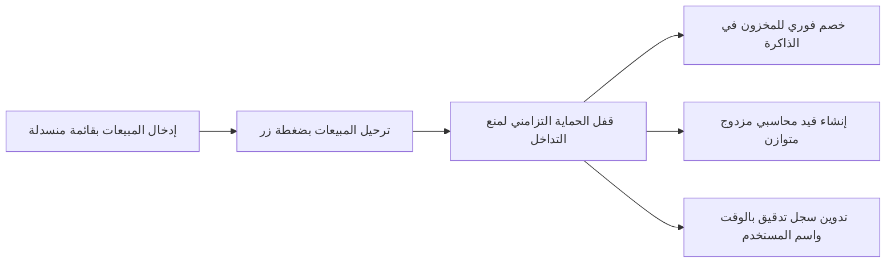

# دليل تشغيل وتفعيل نظام أرتيفلورا المطور

> **الملف المنظف فائق السرعة**:
> `local-business-store/Artiflora_Cleaned_2026.xlsx`
> **ملف السكريبتات المطور**:
> `local-business-store/artiflora_scripts.js`

---

## 1. نتائج جراحة وتطهير الشيت بالأرقام

تم تقليص حجم الملف وتطهير صفوفه المتضخمة بنجاح تام:
- تم حذف 100,085 صَفّاً فارغاً كانت محملة بمعادلات مكررة في شيت المبيعات.
- تم حذف 4,345 صَفّاً فارغاً من شيت لوحة المؤشرات.
- انخفض حجم الملف من 4.88 ميجابايت إلى 0.62 ميجابايت.
- نسبة التخفيض الإجمالية:
  `87.3%`
- جميع البيانات الحقيقية (1,427 حركة بيع، 670 صنف مخزون، 2,551 قيد محاسبي) بقيت سليمة بنسبة 100%.

---

## 2. خطوات تفعيل النسخة المطورة على جوجل درايف

### الخطوة الأولى: رفع النسخة النظيفة
1. افتح
   Google Drive
2. ارفع الملف النظيف الجديد:
   `Artiflora_Cleaned_2026.xlsx`
3. افتح الملف واضغط على:
   `File -> Save as Google Sheets`
   لحفظه كشيت جوجل سحابي سريع.

---

### الخطوة الثانية: تفعيل محرك السكريبتات الجديد
1. من داخل شيت جوجل، اضغط على القائمة العلوية:
   `Extensions -> Apps Script`
2. افتح ملف الكود
   `Code.gs`
   واستبدل محتواه بالكامل بالكود الموجود في:
   `local-business-store/artiflora_scripts.js`
3. اضغط حفظ
   `Ctrl + S`

---

### الخطوة الثالثة: تشغيل النظام والقائمة التلقائية
1. أعد تحميل شيت جوجل في المتصفح.
2. ستظهر قائمة جديدة في الشريط العلوي باسم:
   `🌸 أرتيفلورا ERP`
3. اضغط على خيار:
   `🛡️ تطبيق القوائم المنسدلة لمنع أخطاء الإدخال`
   لتفعيل القائمة الإلزامية التي تمنع تماماً أخطاء الهمزات والمسافات في أسماء المنتجات.
4. أصبح بإمكانك ترحيل المبيعات وحساب الأرباح والقيود بضغطة زر واحدة عبر:
   `⚡ ترحيل المبيعات وتحديث الحسابات والمخزون`

---

## 3. المزايا التشغيلية بعد التطوير

1. **انعدام التعليق والبطء**:
   الشيت يفتح في أقل من ثانيتين ويعمل بكفاءة فائقة على الموبايل والكمبيوتر.
2. **منع الأخطاء الإملائية**:
   لا يمكن تسجيل صنف غير مسجل في المخزون.
3. **أمان الحركات المتزامنة**:
   لا يمكن أن تتداخل حركتان وتسببان فقداناً لرصيد البضاعة بفضل قفل السكريبت.
4. **دقة المحاسبة والتصنيع**:
   تحديث آلي لدفتر اليومية وربط استهلاك الخامات بتكلفة المنتجات المصنعة.
