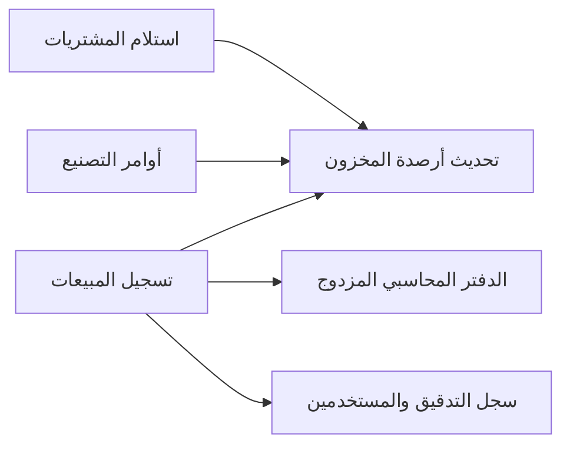

# نظام إدارة المخازن والمحاسبة والتشغيل (ERP & Inventory System) 🌸📊

> **القسم**:
> الأنظمة المحاسبية والإدارية لمتجر أرتيفلورا
> **الحالة**:
> نشط ومطور

---

## 1. فهرس الملفات والأدوات

| الملف | الوصف الفني |
| :--- | :--- |
| `Artiflora_Cleaned_2026.xlsx` | الشيت المنظف فائق السرعة (مخفف بنسبة 87.3% وخالٍ من الصفوف الميتة ومعد للرفع المباشر على درايف) |
| `artiflora_scripts.js` | كود محرك السكريبتات الموحد النهائي (يدعم أقفال التزامن والبحث السريع والقيد المحاسبي المزدوج) |
| `ARTIFLORA_SYSTEM_UPGRADE_SOP.md` | دليل خطوات تفعيل الشيت على جوجل درايف وتركيب الأكواد وتشغيل القائمة المنسدلة |
| `ArtifloraBackup- 24_3_2026 (1).xlsx` | النسخة الاحتياطية الأصلية الكاملة (محفوظة كمرجع تاريخي) |

---

## 2. الدورة التشغيلية للنظام

