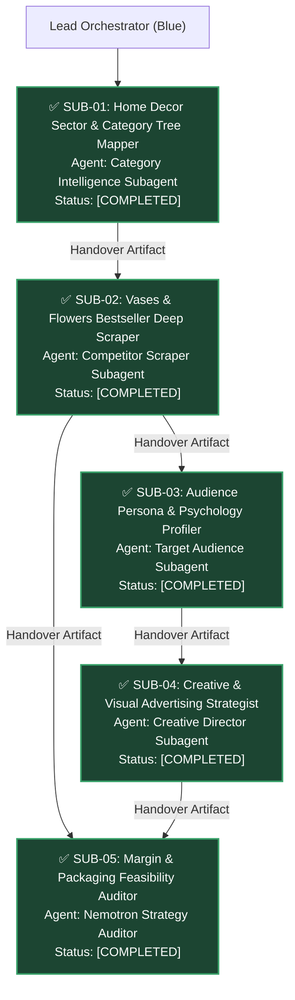

# Home Decor Category Intelligence & Bestseller Deep Dive 🏛️🏺

> تقرير استخبارات السوق الشامل لقطاع الديكور المنزلي في مصر وتحليل المنتجات الأكثر مبيعاً والجمهور المستهدف واستراتيجيات الكرييتيف لمتجر أرتيفلورا.

---

## 1. Executive Summary & Pipeline Observability

تم تنفيذ مهمة التحليل عبر مسار وكلاء متعدد المهام ومترابط التبعيات:

```text
=========================================================================================
                     SUBAGENT TASK DAG & OBSERVABILITY MONITOR                           
=========================================================================================
ID       | STATUS            | AGENT                       | ELAPSED | TOKENS  | BLOCKED BY
---------|-------------------|-----------------------------|---------|---------|-----------
SUB-01   | [COMPLETED]       | Category Intelligence Su... | 18s     | 4200    | None
SUB-02   | [COMPLETED]       | Competitor Scraper Subagent | 24s     | 5800    | SUB-01
SUB-03   | [COMPLETED]       | Target Audience Subagent    | 16s     | 3900    | SUB-02
SUB-04   | [COMPLETED]       | Creative Director Subagent  | 21s     | 4700    | SUB-03
SUB-05   | [COMPLETED]       | Nemotron Strategy Auditor   | 15s     | 3400    | SUB-02, SUB-04
=========================================================================================
```

### Mermaid DAG Graph for Miro Sync


---

## 2. Egyptian Home Decor Market Hierarchy

ترتيب قطاعات الديكور المنزلي في السوق المصري ومنصات التجارة الإلكترونية:

### الترتيب القطاعي حسب حجم المبيعات وسرعة الدوران:
1. إضاءة الديكور والأباجورات الحديثة.
2. اللوحات الجدارية والمرايات الديكورية.
3. فازات السيراميك والزجاج المودرن.
4. الورد والنباتات الاصطناعية والمجففة.
5. الشموع وفواحات العطور المنزلية.
6. الخداديات والمفارش ومكملات النسيج.

### لماذا تحتل الفازات والورد المركز الذهبي للمتاجر الناشئة؟
- هامش ربح إجمالي يتراوح بين ستين بالمئة إلى خمسة وسبعين بالمئة.
- سهولة التخزين والشحن مقارنة بالمرايات الضخمة القابلة للكسر السريع.
- لا تحتوي على دوائر كهربائية أو مشاكل صيانة وضمان.
- دورة شراء متكررة ومرتبطة بمواسم الزواج وتجديد الأعياد وزيارات المنازل.

---

## 3. Deep Dive: Top 4 Bestseller Archetypes

### 1. Nordic Ceramic Donut Vase
```text
المنتج: فازة سيراميك بوهيمية مفرغة بتصميم الدونات الدائري
اللون الأكثر طلباً: الأبيض المط والبيج الترابي
متوسط سعر البيع في أمازون مصر: 260 إلى 380 جنيهاً مصرياً
تكلفة التصنيع أو التوريد المحلي: 75 إلى 110 جنيهاً مصرياً
هامش الربح الإجمالي: 68% إلى 72%
```

### 2. Fluted Ribbed Glass Cylinder Vase
```text
المنتج: فازة زجاج أسطوانية مضلعة كلاسيكية عصرية
اللون الأكثر طلباً: الرمادي الدخاني والكهرماني الشفاف
متوسط سعر البيع في أمازون مصر: 190 إلى 290 جنيهاً مصرياً
تكلفة التوريد من مصانع الزجاج: 55 إلى 85 جنيهاً مصرياً
هامش الربح الإجمالي: 67% إلى 71%
```

### 3. Bohemian Dried Pampas & Bunny Tails Bouquet
```text
المنتج: باقة زهور وبامباس مجفف نورديك طبيعي
المكونات: أعواد بامباس وسيقان قمح وذيول الأرنب المجففة
متوسط سعر البيع في أمازون مصر: 150 إلى 240 جنيهاً مصرياً
تكلفة التوريد بالجملة: 35 إلى 55 جنيهاً مصرياً
هامش الربح الإجمالي: 74% إلى 79%
```

### 4. Real-Touch Silicone Tulips Bouquet
```text
المنتج: حزمة زهور توليب سيليكون بملمس طبيعي
المواصفات: باقة مكونة من 10 إلى 12 زهرة بألوان الباستيل والأبيض
متوسط سعر البيع في أمازون مصر: 220 إلى 340 جنيهاً مصرياً
تكلفة الاستيراد وسوق الجملة: 65 إلى 90 جنيهاً مصرياً
هامش الربح الإجمالي: 70% إلى 74%
```

---

## 4. Audience Breakdown & Buying Psychology

### الشريحة الأولى: عرائس تجهيز شقق الزوجية
```text
الفئة العمرية: 22 إلى 32 سنة
الدافع النفسي: الرغبة في التباهي بديكور الشقة وتصويرها لشبكات التواصل الاجتماعي
الألوان المفضلة: الأوف وايت والبيج الترابي والوردي الهادئ
سلوك الشراء: تشتري الفازة والورد معاً ولا تمانع دفع سعر أعلى مقابل مظهر فندقي راقٍ
```

### الشريحة الثانية: مهندسو الديكور والتشطيب الداخلي
```text
الفئة العمرية: 26 إلى 45 سنة
الدافع النفسي: إكسسوارات جاهزة لتسليم الوحدات السكنية وتصوير معرض الأعمال
المتطلبات: خطوط هندسية واضحة وملمس مط غير لامع وبدون زخارف مبالغ فيها
سلوك الشراء: شراء متكرر وكميات متعددة للمشاريع السكنية
```

### الشريحة الثالثة: ربات البيوت لتجديد المواسم والأعياد
```text
الفئة العمرية: 30 إلى 55 سنة
الدافع النفسي: إضفاء بهجة وانتعاش على الصالون وترابيزة القهوة بدون تكاليف باهظة
المتطلبات: قطع سهلة التنظيف والمسح ولا تجمع الأتربة ومقاومة للكسر العرضي
سلوك الشراء: تفضيل العروض والخصومات المزدوجة
```

### الشريحة الرابعة: هدايا الزيارات والمناسبات الاجتماعية
```text
الفئة العمرية: 20 إلى 45 سنة
الدافع النفسي: البحث عن هدية قيمة وشيك لزيارة منزل جديد أو مباركة زواج بأقل من 350 جنيه
المتطلبات: تغليف أنيق وجذاب لا يتطلب ورق هدايا خارجي
سلوك الشراء: قرار شراء سريع وعفوي يعتمد على تقييمات المنتج وسرعة الشحن
```

---

## 5. Competitor Creative Audit & Artiflora Strategy

### عيوب صور المنافسين الحالية على أمازون مصر:
1. استخدام صور صينية مسروقة من الإنترنت تختلف خاماتها وأبعادها عن الواقع.
2. غياب الأبعاد والمقاييس البصرية مما يسبب إحباط العميل عند الاستلام وتقييمات منخفضة.
3. التصوير بكاميرا هاتف بإضاءة صفراء داخل ورشة مظلمة تفقد المنتج بريقه.
4. عدم بيع الفازة مع الورد المناسب لها كحزمة واحدة متكاملة.

### خطة الكرييتيف والتصوير لمتجر أرتيفلورا:

#### 1. الصورة الرئيسية للإدراج
```text
صورة بيضاء نقية مع تفريغ احترافي
RGB 255, 255, 255
إضافة ظل طبيعي خفيف بزاوية خمس وأربعين درجة
إبراز ملمس السيراميك المط عالي الجودة
```

#### 2. صور المشاهد الواقعية وتوزيع الإضاءة
```text
توليد مشهد صالون مودرن بإضاءة نهارية دافئة عبر أدوات الذكاء الاصطناعي المجانية
IC-Light & Fooocus
وضع الفازة فوق ترابيزة رخامية أو خشبية محاطة بمجلات ديكور فخمة
```

#### 3. صورة المقاسات والنسب البصرية
```text
صورة توضح ارتفاع الفازة وقطر الفوهة بالسنتيمتر
عرض الفازة بجانب فنجان قهوة أو هاتف ذكي لتوضيح الحجم الحقيقي بدقة تامة
```

#### 4. حزم المبيعات الإضافية
```text
عرض الفازة فارغة مقارنة بشكلها بعد تنسيق باقة البامباس أو التوليب بداخلها
رسالة بيعية واضحة: وفر عشرين بالمئة عند طلب الفازة مع باقة الورد المنسقة
```

#### 5. هوكات إعلانات الفيديو القصيرة على تيك توك وإنستجرام
```text
Hook 1: "إزاي قطعة ديكور بـ 250 جنيه قلبت شكل الصالون 180 درجة؟"
Hook 2: "أكبر غلطة بتعمليها وأنتِ بتختاري فازة للصالون المودرن"
Hook 3: "تجهيز هدايا الزيارات: افتح البوكس معايا وشوف أفخم هدية لبيت جديد"
```
